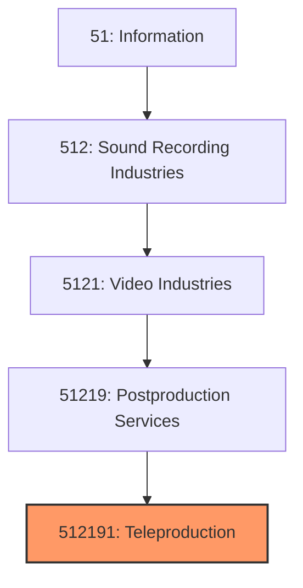
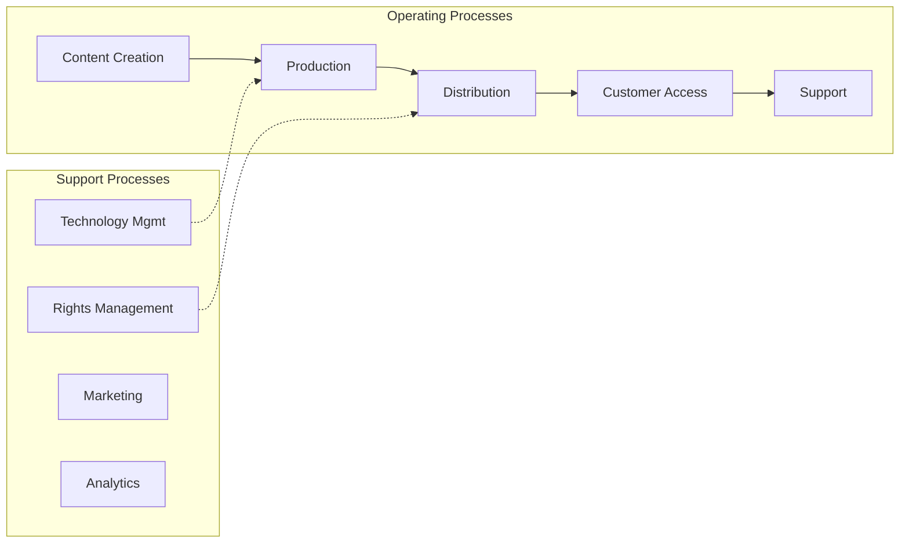

# Teleproduction

> This U.S.

## Overview

Teleproduction represents a specialized segment within the Information sector (NAICS 51). This national industry encompasses establishments primarily engaged in teleproduction.

This U.S. industry comprises establishments primarily engaged in providing specialized motion picture or video postproduction services, such as editing, film/tape transfers, subtitling, credits, closed captioning, and animation and special effects. Cross-References. Establishments primarily engaged in--

## Industry Hierarchy

## Key Statistics

| Metric | Value |
|--------|-------|
| NAICS Code | 512191 |
| Level | National Industry |
| Parent | [Postproduction Services](../) |
| Child Industries | 0 |

## Core Business Processes

## Industry Value Chain

---

*Source: NAICS 512191 - Teleproduction*
