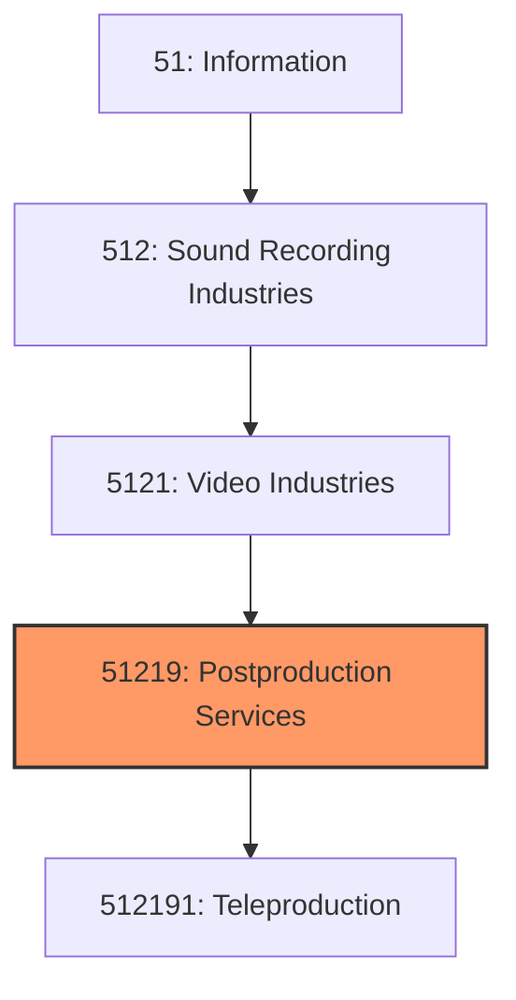
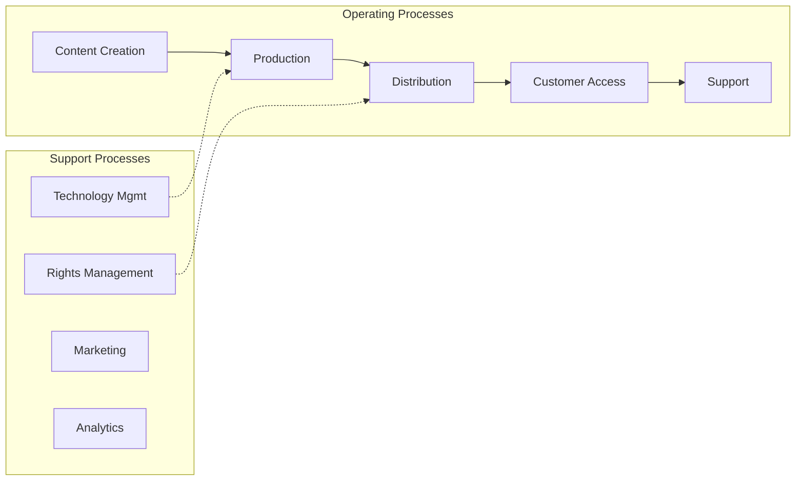

# Postproduction Services

> This industry comprises establishments primarily engaged in providing postproduction services and other services to the motion picture industry, including specialized motion picture or video postproduction services, such as editing, film/tape transfers, titling, subtitling, credits, closed captioning, and computer-produced graphics, animation and special effects, as well as developing and processing motion picture film.

## Overview

Postproduction Services represents an important category within the Information sector (NAICS 51). This industry encompasses establishments primarily engaged in postproduction services.

This industry comprises establishments primarily engaged in providing postproduction services and other services to the motion picture industry, including specialized motion picture or video postproduction services, such as editing, film/tape transfers, titling, subtitling, credits, closed captioning, and computer-produced graphics, animation and special effects, as well as developing and processing motion picture film. Illustrative Examples: Motion picture film laboratories Stock footage film libraries Postproduction facilities Teleproduction services Cross-References. Establishments primarily engaged in--

## Industry Hierarchy

## Key Statistics

| Metric | Value |
|--------|-------|
| NAICS Code | 51219 |
| Level | Industry |
| Parent | [Video Industries](../) |
| Child Industries | 1 |

## Sub-Industries

| Industry | Code | Description |
|----------|------|-------------|
| [Teleproduction](./Teleproduction.mdx) | 512191 | This U |

## Core Business Processes

## Industry Value Chain

## Market Context

Information industries create and distribute content and technology services, with digital transformation and streaming reshaping media consumption.

| Aspect | Details |
|--------|---------|
| Industry Sector | Information |
| NAICS/SIC Code | 51219 |
| Market Segment | Postproduction Services |

## Key Business Processes

- Content creation and curation
- Technology development
- Network operations
- Customer acquisition
- Service delivery

## Common Occupations

- [Computer Systems Managers](/occupations/Management/ComputerAndInformationSystemsManagers)
- [Software Developers](/occupations/Technology/SoftwareDevelopers)
- [Data Scientists](/occupations/Technology/DataScientists)
- [Network Administrators](/occupations/Technology/NetworkAndComputerSystemsAdministrators)

## Regulations and Standards

- FCC communications regulations
- Data privacy laws (CCPA, GDPR)
- Intellectual property protections
- Cybersecurity frameworks
- Net neutrality policies

## Technology and Tools

- Cloud computing platforms
- Content management systems
- Broadcasting equipment
- Network infrastructure
- Streaming technologies

## Industry Trends

- Digital transformation and automation adoption
- Sustainability and environmental compliance focus
- Workforce development and skills training
- Supply chain resilience and optimization
- Customer experience enhancement

---

*Source: NAICS 51219 - Postproduction Services*
