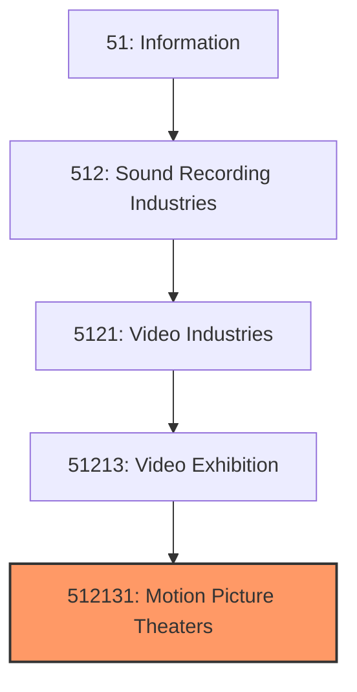
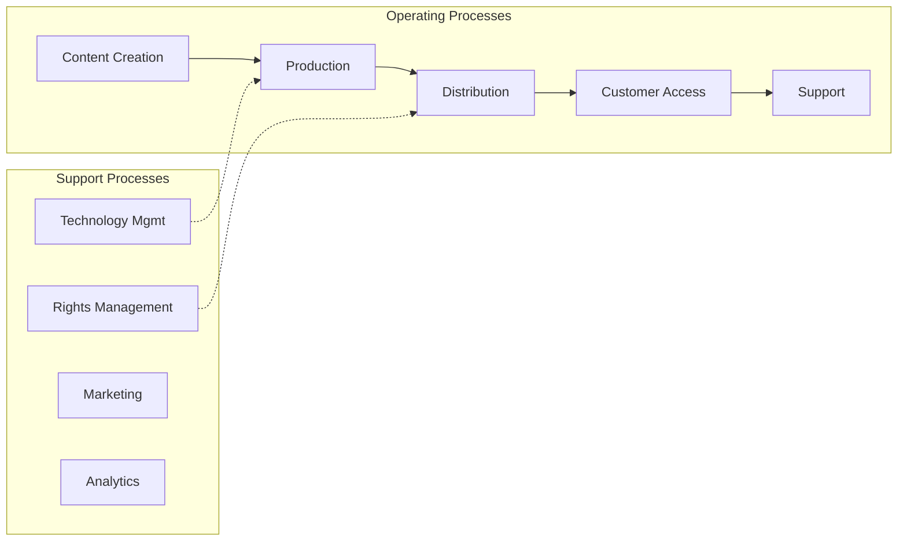

# Motion Picture Theaters

> This U.S. industry comprises establishments primarily engaged in operating motion picture theaters (except drive-ins) and/or exhibiting motion pictures or videos at film festivals, and so forth.
## Overview

Motion Picture Theaters represents a specialized segment within the Information sector (NAICS 51). This national industry encompasses establishments primarily engaged in motion picture theaters.

This U.S. industry comprises establishments primarily engaged in operating motion picture theaters (except drive-ins) and/or exhibiting motion pictures or videos at film festivals, and so forth.

## Industry Hierarchy

## Key Statistics

| Metric | Value |
|--------|-------|
| NAICS Code | 512131 |
| Level | National Industry |
| Parent | [Video Exhibition](../) |
| Child Industries | 0 |

## Core Business Processes

## Industry Value Chain

```mermaid
graph LR
    subgraph Inputs["Inputs"]
        I1["Content"]
        I2["Technology"]
        I3["Talent"]
    end

    subgraph Primary["Primary Activities"]
        A1["Inbound Logistics"]
        A2["Core Operations"]
        A3["Quality Assurance"]
        A4["Outbound/Delivery"]
    end

    subgraph Outputs["Products/Services"]
        O1["Information Products"]
        O2["Software"]
        O3["Media"]
    end

    subgraph Customers["Markets"]
        C1["Businesses"]
        C2["Consumers"]
        C3["Government"]
        C4["Education"]
    end

    Inputs --> Primary --> Outputs --> Customers
```

---

*Source: NAICS 512131 - Motion Picture Theaters*
