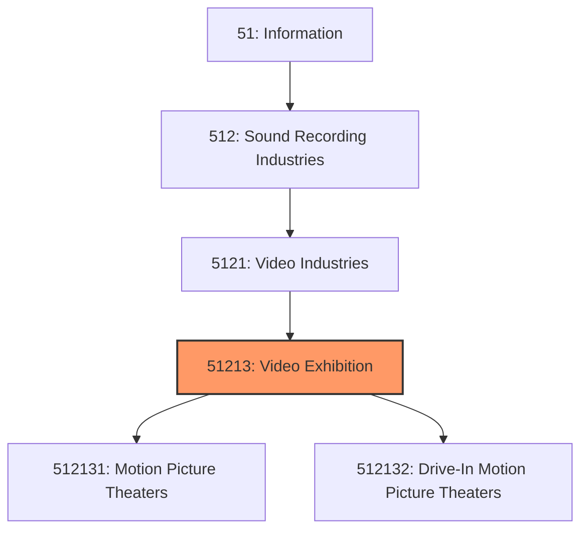
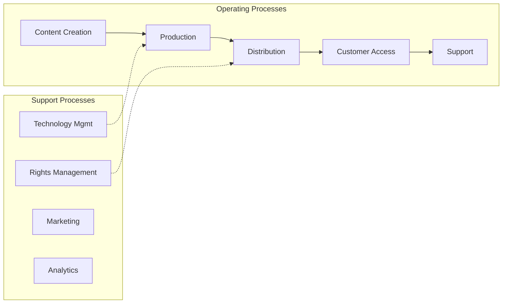

# Video Exhibition

> This industry comprises establishments primarily engaged in operating motion picture theaters and/or exhibiting motion pictures or videos at film festivals, and so forth.

## Overview

Video Exhibition represents an important category within the Information sector (NAICS 51). This industry encompasses establishments primarily engaged in video exhibition.

This industry comprises establishments primarily engaged in operating motion picture theaters and/or exhibiting motion pictures or videos at film festivals, and so forth.

## Industry Hierarchy

## Key Statistics

| Metric | Value |
|--------|-------|
| NAICS Code | 51213 |
| Level | Industry |
| Parent | [Video Industries](../) |
| Child Industries | 2 |

## Sub-Industries

| Industry | Code | Description |
|----------|------|-------------|
| [Motion Picture Theaters](./MotionPictureTheaters.mdx) | 512131 | This U |
| [Drive-In Motion Picture Theaters](./DriveinMotionPictureTheaters.mdx) | 512132 | This U |

## Core Business Processes

## Industry Value Chain

```mermaid
graph LR
    subgraph Inputs["Inputs"]
        I1["Content"]
        I2["Technology"]
        I3["Talent"]
    end

    subgraph Primary["Primary Activities"]
        A1["Inbound Logistics"]
        A2["Core Operations"]
        A3["Quality Assurance"]
        A4["Outbound/Delivery"]
    end

    subgraph Outputs["Products/Services"]
        O1["Information Products"]
        O2["Software"]
        O3["Media"]
    end

    subgraph Customers["Markets"]
        C1["Businesses"]
        C2["Consumers"]
        C3["Government"]
        C4["Education"]
    end

    Inputs --> Primary --> Outputs --> Customers
```

---

*Source: NAICS 51213 - Video Exhibition*
