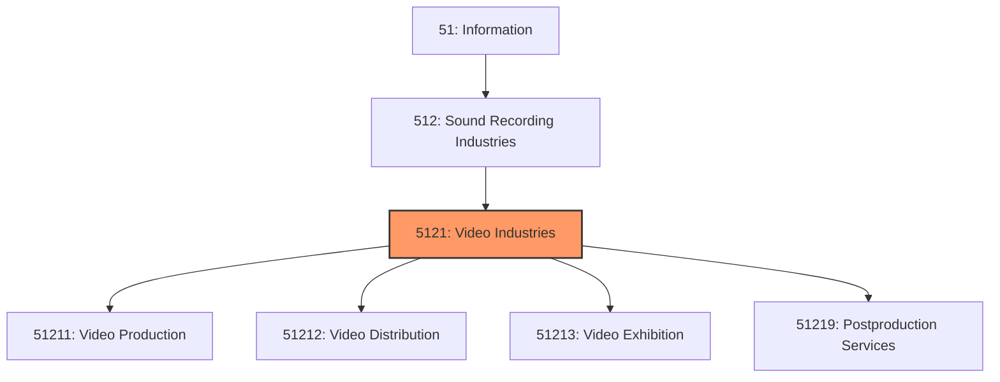
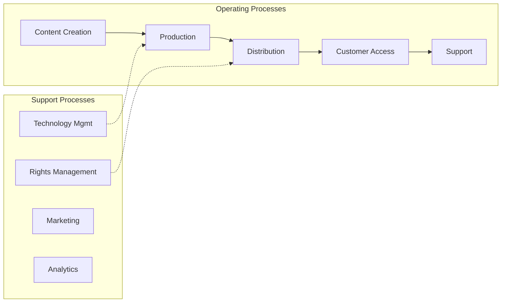

# Video Industries

> This industry group comprises establishments primarily engaged in the production and/or distribution of motion pictures, videos, television programs, or commercials; in the exhibition of motion pictures; or in the provision of postproduction and related services.

## Overview

Video Industries represents an important category within the Information sector (NAICS 51). This industry group encompasses establishments primarily engaged in video industries.

This industry group comprises establishments primarily engaged in the production and/or distribution of motion pictures, videos, television programs, or commercials; in the exhibition of motion pictures; or in the provision of postproduction and related services.

## Industry Hierarchy

## Key Statistics

| Metric | Value |
|--------|-------|
| NAICS Code | 5121 |
| Level | Industry Group |
| Parent | [Sound Recording Industries](../) |
| Child Industries | 4 |

## Sub-Industries

| Industry | Code | Description |
|----------|------|-------------|
| [Video Production](./VideoProduction/) | 51211 | See industry description for 512110 |
| [Video Distribution](./VideoDistribution/) | 51212 | See industry description for 512120 |
| [Video Exhibition](./VideoExhibition/) | 51213 | This industry comprises establishments primarily engaged in operating motion pic |
| [Postproduction Services](./PostproductionServices/) | 51219 | This industry comprises establishments primarily engaged in providing postproduc |

## Core Business Processes

## Industry Value Chain

---

*Source: NAICS 5121 - Video Industries*
