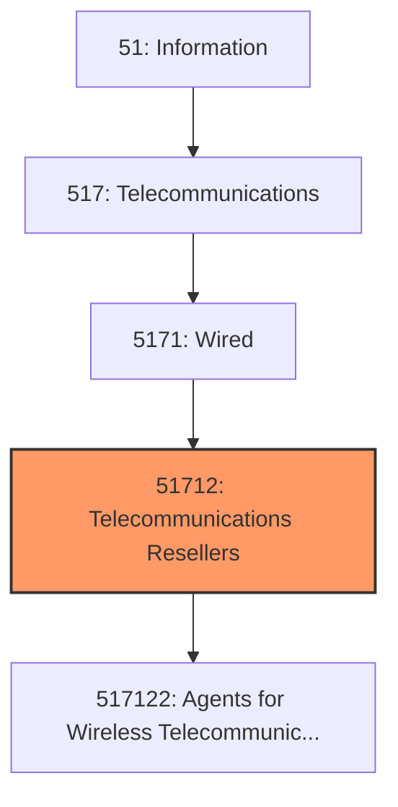
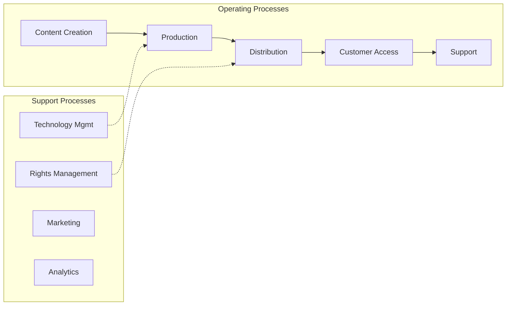

# Telecommunications Resellers

> This industry comprises establishments primarily engaged in (1) purchasing access and network capacity from owners and operators of telecommunications networks and reselling wired and wireless telecommunications services to businesses and households (except satellite telecommunications) or (2) acting as agents for wireless telecommunications carriers and resellers, selling wireless plans on a commission basis.

## Overview

Telecommunications Resellers represents an important category within the Information sector (NAICS 51).

This industry comprises establishments primarily engaged in (1) purchasing access and network capacity from owners and operators of telecommunications networks and reselling wired and wireless telecommunications services to businesses and households (except satellite telecommunications) or (2) acting as agents for wireless telecommunications carriers and resellers, selling wireless plans on a commission basis. Establishments in this industry do not operate as telecommunications carriers. Mobile virtual network operators (MVNOs) are included in this industry. Illustrative Examples: Agents for wireless telecommunications carriers Cellular telephone stores, selling cellular phone service plans on an agent basis Mobile phone stores, selling mobile phone service plans on an agent basis Wired telecommunications resellers Wireless phone service plan sales agents, selling on behalf of wireless telecommunications carriers Wireless telecommunications resellers (except satellite telecommunications) Cross-References. Establishments primarily engaged in--

## Industry Hierarchy

## Key Statistics

| Metric | Value |
|--------|-------|
| NAICS Code | 51712 |
| Level | Industry |
| Parent | [Wired](../) |
| Child Industries | 1 |

## Sub-Industries

| Industry | Code | Description |
|----------|------|-------------|
| [Agents for Wireless Telecommunications Services](./AgentsForWirelessTelecommunicationsServices.mdx) | 517122 | This U |

## Related Occupations

See the [occupations directory](/occupations) for roles commonly found in this industry.

## Core Business Processes

## Industry Value Chain

## Market Context

Information industries create and distribute content and technology services, with digital transformation and streaming reshaping media consumption.

| Aspect | Details |
|--------|---------|
| Industry Sector | Information |
| NAICS/SIC Code | 51712 |
| Market Segment | Telecommunications Resellers |

## Key Business Processes

- Content creation and curation
- Technology development
- Network operations
- Customer acquisition
- Service delivery

## Common Occupations

- [Computer Systems Managers](/occupations/Management/ComputerAndInformationSystemsManagers)
- [Software Developers](/occupations/Technology/SoftwareDevelopers)
- [Data Scientists](/occupations/Technology/DataScientists)
- [Network Administrators](/occupations/Technology/NetworkAndComputerSystemsAdministrators)

## Regulations and Standards

- FCC communications regulations
- Data privacy laws (CCPA, GDPR)
- Intellectual property protections
- Cybersecurity frameworks
- Net neutrality policies

## Technology and Tools

- Cloud computing platforms
- Content management systems
- Broadcasting equipment
- Network infrastructure
- Streaming technologies

## Industry Trends

- Digital transformation and automation adoption
- Sustainability and environmental compliance focus
- Workforce development and skills training
- Supply chain resilience and optimization
- Customer experience enhancement

---

*Source: NAICS 51712 - Telecommunications Resellers*
