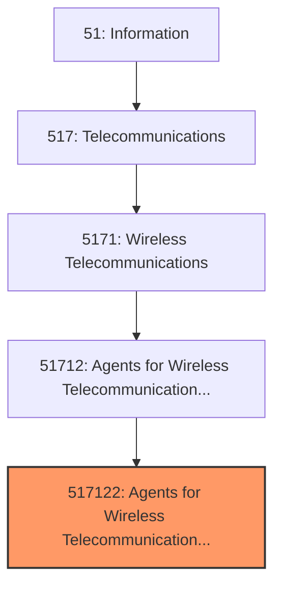
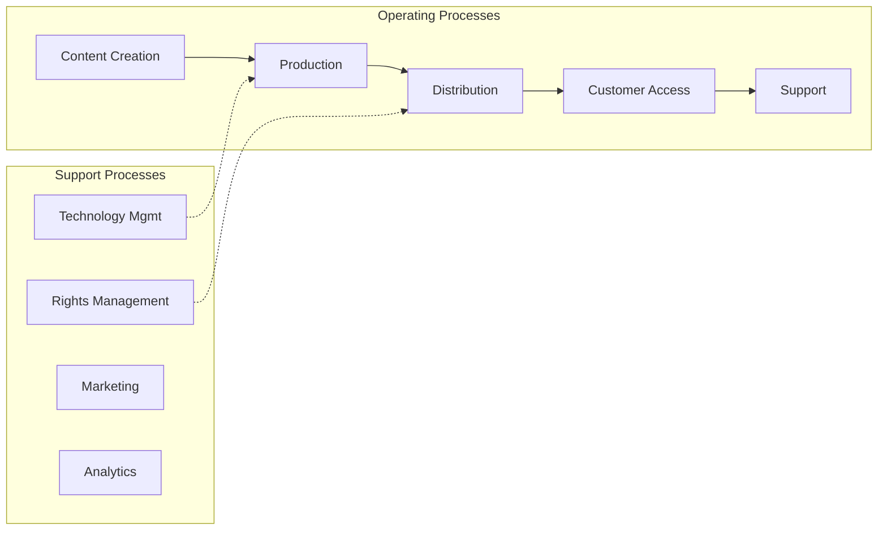

# Agents for Wireless Telecommunications Services

> This U.S. industry comprises establishments primarily engaged in acting as agents for wireless telecommunications carriers and resellers, selling wireless plans on a commission basis.
## Overview

Agents for Wireless Telecommunications Services represents a specialized segment within the Information sector (NAICS 51). This national industry encompasses establishments primarily engaged in agents for wireless telecommunications services.

This U.S. industry comprises establishments primarily engaged in acting as agents for wireless telecommunications carriers and resellers, selling wireless plans on a commission basis. Illustrative Examples: Agents for mobile virtual network operators (MVNOs) Agents for wireless telecommunications carriers Cellular telephone stores, selling cellular phone service plans on an agent basis Mobile phone stores, selling mobile phone service plans on an agent basis Wireless phone service plan sales agents, selling on behalf of wireless telecommunications carriers Cross-References. Establishments primarily engaged in--

## Industry Hierarchy

## Key Statistics

| Metric | Value |
|--------|-------|
| NAICS Code | 517122 |
| Level | National Industry |
| Parent | [Agents for Wireless Telecommunication Services](../) |
| Child Industries | 0 |

## Core Business Processes

## Industry Value Chain

```mermaid
graph LR
    subgraph Inputs["Inputs"]
        I1["Content"]
        I2["Technology"]
        I3["Talent"]
    end

    subgraph Primary["Primary Activities"]
        A1["Inbound Logistics"]
        A2["Core Operations"]
        A3["Quality Assurance"]
        A4["Outbound/Delivery"]
    end

    subgraph Outputs["Products/Services"]
        O1["Information Products"]
        O2["Software"]
        O3["Media"]
    end

    subgraph Customers["Markets"]
        C1["Businesses"]
        C2["Consumers"]
        C3["Government"]
        C4["Education"]
    end

    Inputs --> Primary --> Outputs --> Customers
```

## Market Context

Information industries create and distribute content and technology services, with digital transformation and streaming reshaping media consumption.

| Aspect | Details |
|--------|---------|
| Industry Sector | Information |
| NAICS/SIC Code | 517122 |
| Market Segment | Agents for Wireless Telecommunications Services |

## Key Business Processes

- Content creation and curation
- Technology development
- Network operations
- Customer acquisition
- Service delivery

## Common Occupations

- [Computer Systems Managers](/occupations/Management/ComputerAndInformationSystemsManagers)
- [Software Developers](/occupations/Technology/SoftwareDevelopers)
- [Data Scientists](/occupations/Technology/DataScientists)
- [Network Administrators](/occupations/Technology/NetworkAndComputerSystemsAdministrators)

## Regulations and Standards

- FCC communications regulations
- Data privacy laws (CCPA, GDPR)
- Intellectual property protections
- Cybersecurity frameworks
- Net neutrality policies

## Technology and Tools

- Cloud computing platforms
- Content management systems
- Broadcasting equipment
- Network infrastructure
- Streaming technologies

## Industry Trends

- Digital transformation and automation adoption
- Sustainability and environmental compliance focus
- Workforce development and skills training
- Supply chain resilience and optimization
- Customer experience enhancement

---

*Source: NAICS 517122 - Agents for Wireless Telecommunications Services*
