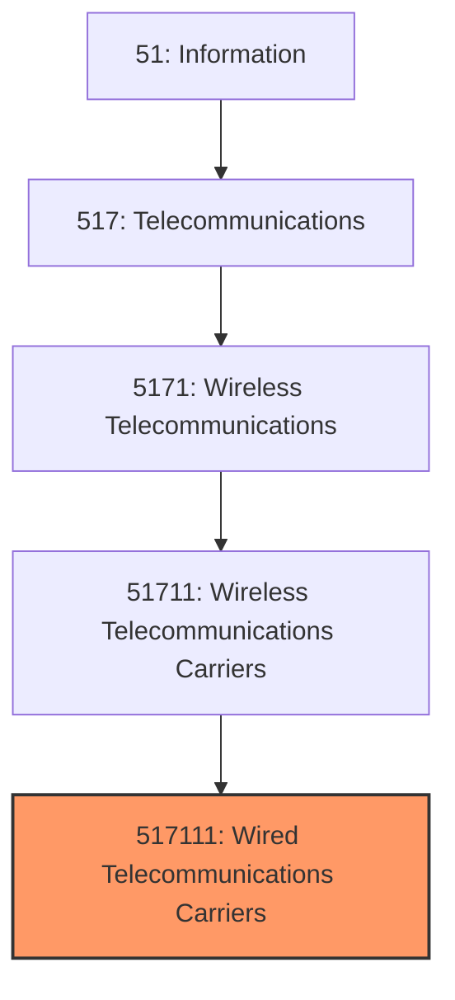
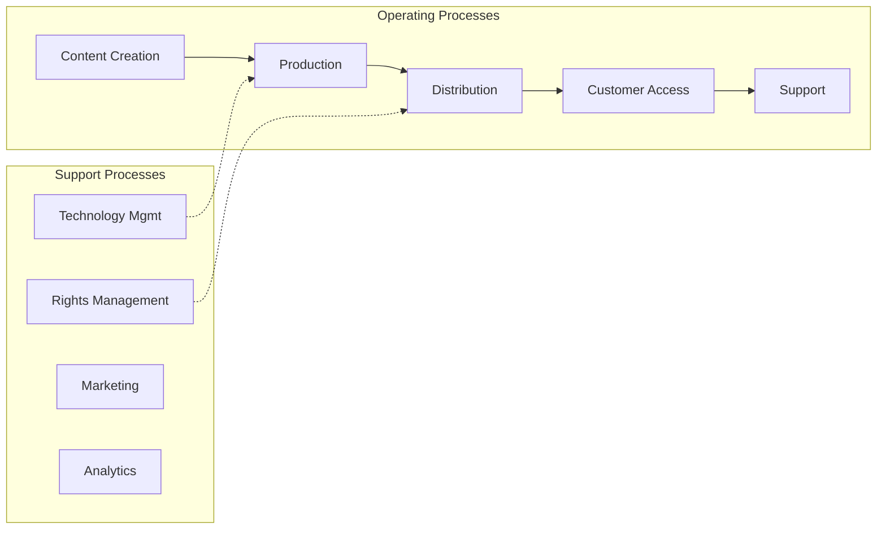

# Wired Telecommunications Carriers

> This U.S. industry comprises establishments primarily engaged in operating, maintaining, and/or providing access to transmission facilities and infrastructure that they own and/or lease for the transmission of voice, data, text, sound, and video using wired telecommunications networks.
## Overview

Wired Telecommunications Carriers represents a specialized segment within the Information sector (NAICS 51). This national industry encompasses establishments primarily engaged in wired telecommunications carriers.

This U.S. industry comprises establishments primarily engaged in operating, maintaining, and/or providing access to transmission facilities and infrastructure that they own and/or lease for the transmission of voice, data, text, sound, and video using wired telecommunications networks. Transmission facilities may be based on a single technology or a combination of technologies. Establishments in this industry use the wired telecommunications network facilities that they operate to provide a variety of services, such as wired telephony services, including VoIP services; wired (cable) audio and video programming distribution; and wired broadband Internet services. By exception, establishments providing satellite television distribution services using facilities and infrastructure that they operate are included in this industry. Illustrative Examples: Broadband Internet service providers, wired (e.g., cable, DSL) Cable television distribution services Closed-circuit television (CCTV) services Direct-to-home satellite system (DTH) services Local telephone carriers, wired Long-distance telephone carriers, wired Multichannel multipoint distribution services (MMDS) Satellite television distribution systems Telecommunications carriers, wired VoIP service providers, using own operated wired telecommunications infrastructure Cross-References. Establishments primarily engaged in--

## Industry Hierarchy

## Key Statistics

| Metric | Value |
|--------|-------|
| NAICS Code | 517111 |
| Level | National Industry |
| Parent | [Wireless Telecommunications Carriers](../) |
| Child Industries | 0 |

## Core Business Processes

## Industry Value Chain

---

*Source: NAICS 517111 - Wired Telecommunications Carriers*
