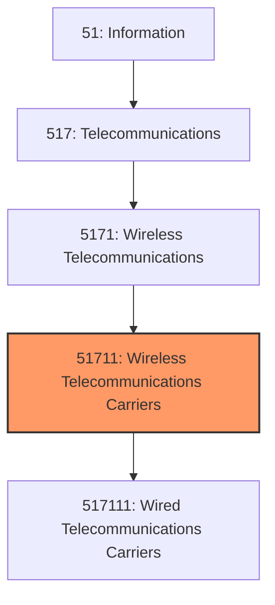
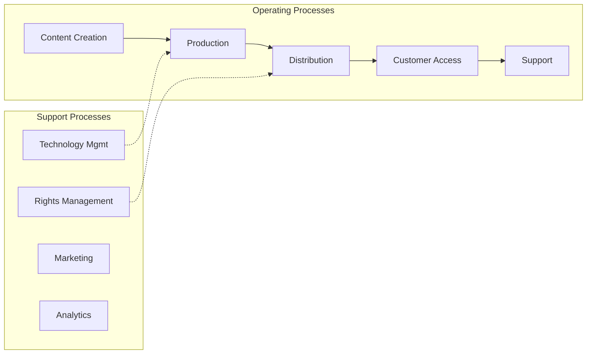

# Wireless Telecommunications Carriers

> This industry comprises establishments primarily engaged in operating, maintaining, and/or providing access to switching and transmission facilities and infrastructure that they own and/or lease for the transmission of voice, data, text, sound, and video using wired and wireless telecommunications networks (except satellite).

## Overview

Wireless Telecommunications Carriers represents an important category within the Information sector (NAICS 51). This industry encompasses establishments primarily engaged in wireless telecommunications carriers.

This industry comprises establishments primarily engaged in operating, maintaining, and/or providing access to switching and transmission facilities and infrastructure that they own and/or lease for the transmission of voice, data, text, sound, and video using wired and wireless telecommunications networks (except satellite). Transmission facilities may be based on a single technology or a combination of technologies. By exception, establishments providing satellite television distribution services using facilities and infrastructure that they operate are included in this industry. Illustrative Examples: Broadband Internet service providers, wired (e.g., cable, DSL) Cable television distribution services Cellular telephone service carriers Direct-to-home satellite system (DTH) services Satellite television distribution systems Telecommunications carriers, wired and wireless VoIP service providers, using own operated wired telecommunications infrastructure Wireless Internet service providers, except satellite Wireless telecommunications carriers, except satellite Wireless telephone communications carriers, except satellite Cross-References. Establishments primarily engaged in--

## Industry Hierarchy

## Key Statistics

| Metric | Value |
|--------|-------|
| NAICS Code | 51711 |
| Level | Industry |
| Parent | [Wireless Telecommunications](../) |
| Child Industries | 1 |

## Sub-Industries

| Industry | Code | Description |
|----------|------|-------------|
| [Wired Telecommunications Carriers](./WiredTelecommunicationsCarriers.mdx) | 517111 | This U |

## Core Business Processes

## Industry Value Chain

---

*Source: NAICS 51711 - Wireless Telecommunications Carriers*
