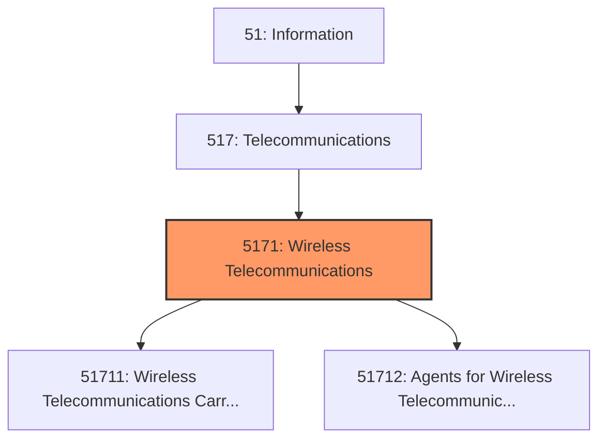
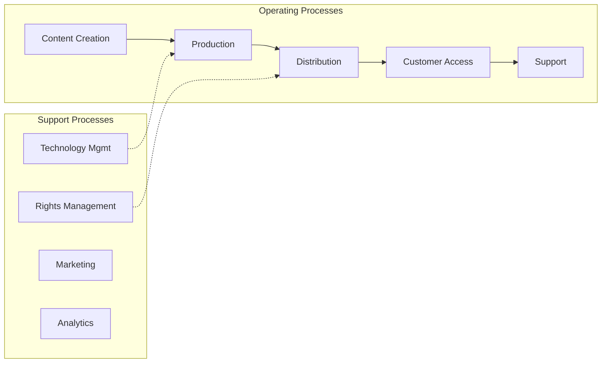

# Wireless Telecommunications

> This industry group comprises establishments primarily engaged in (1) operating transmission facilities and infrastructure that they own and/or lease, and providing telecommunications services using wired and wireless telecommunications networks; (2) reselling wired and wireless telecommunications services (except satellite); and (3) acting as agents for wireless telecommunications services.

## Overview

Wireless Telecommunications represents an important category within the Information sector (NAICS 51). This industry group encompasses establishments primarily engaged in wireless telecommunications.

This industry group comprises establishments primarily engaged in (1) operating transmission facilities and infrastructure that they own and/or lease, and providing telecommunications services using wired and wireless telecommunications networks; (2) reselling wired and wireless telecommunications services (except satellite); and (3) acting as agents for wireless telecommunications services.

## Industry Hierarchy

## Key Statistics

| Metric | Value |
|--------|-------|
| NAICS Code | 5171 |
| Level | Industry Group |
| Parent | [Telecommunications](../) |
| Child Industries | 2 |

## Sub-Industries

| Industry | Code | Description |
|----------|------|-------------|
| [Wireless Telecommunications Carriers](./WirelessTelecommunicationsCarriers/) | 51711 | This industry comprises establishments primarily engaged in operating, maintaini |
| [Agents for Wireless Telecommunication Services](./AgentsForWirelessTelecommunicationServices/) | 51712 | This industry comprises establishments primarily engaged in (1) purchasing acces |

## Core Business Processes

## Industry Value Chain

```mermaid
graph LR
    subgraph Inputs["Inputs"]
        I1["Content"]
        I2["Technology"]
        I3["Talent"]
    end

    subgraph Primary["Primary Activities"]
        A1["Inbound Logistics"]
        A2["Core Operations"]
        A3["Quality Assurance"]
        A4["Outbound/Delivery"]
    end

    subgraph Outputs["Products/Services"]
        O1["Information Products"]
        O2["Software"]
        O3["Media"]
    end

    subgraph Customers["Markets"]
        C1["Businesses"]
        C2["Consumers"]
        C3["Government"]
        C4["Education"]
    end

    Inputs --> Primary --> Outputs --> Customers
```

---

*Source: NAICS 5171 - Wireless Telecommunications*
