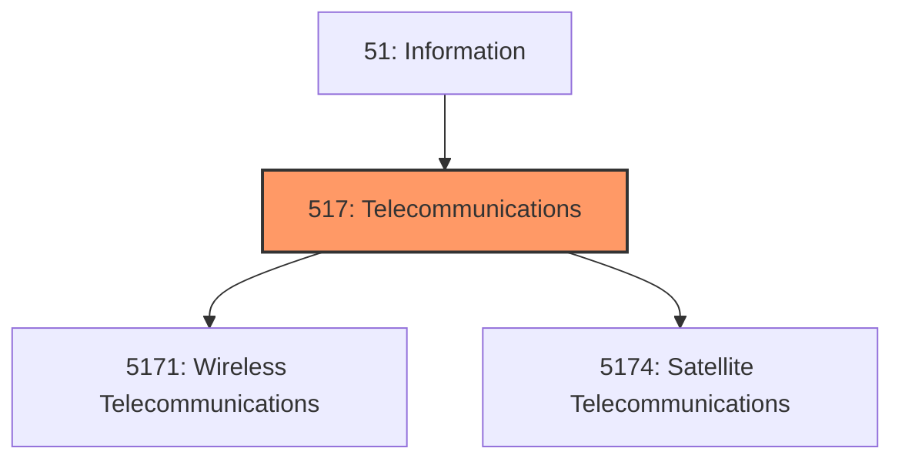
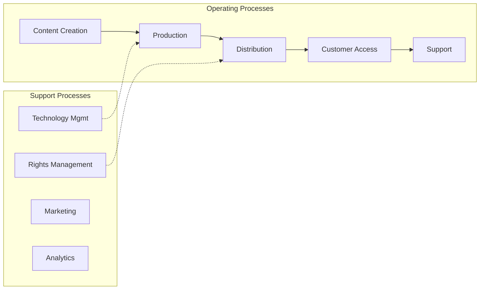

# Telecommunications

> Industries in the Telecommunications subsector group establishments that provide telecommunications and the services related to that activity (e.

## Overview

Telecommunications represents an important category within the Information sector (NAICS 51). This subsector encompasses establishments primarily engaged in telecommunications.

Industries in the Telecommunications subsector group establishments that provide telecommunications and the services related to that activity (e.g., telephony, including Voice over Internet Protocol (VoIP); cable and satellite television distribution services; Internet access; telecommunications reselling services). The Telecommunications subsector is primarily engaged in operating and/or providing access to facilities for the transmission of voice, data, text, sound, and video. Transmission facilities may be based on a single technology or a combination of technologies. Establishments primarily engaged as independent contractors in the installation and maintenance of telecommunications systems are classified in Sector 23, Construction.

## Industry Hierarchy

## Key Statistics

| Metric | Value |
|--------|-------|
| NAICS Code | 517 |
| Level | Subsector |
| Parent | [Information](../) |
| Child Industries | 2 |

## Sub-Industries

| Industry | Code | Description |
|----------|------|-------------|
| [Wireless Telecommunications](./WirelessTelecommunications/) | 5171 | This industry group comprises establishments primarily engaged in (1) operating  |
| [Satellite Telecommunications](./SatelliteTelecommunications/) | 5174 | Satellite Telecommunications |

## Core Business Processes

## Industry Value Chain

## Market Context

Information industries create and distribute content and technology services, with digital transformation and streaming reshaping media consumption.

| Aspect | Details |
|--------|---------|
| Industry Sector | Information |
| NAICS/SIC Code | 517 |
| Market Segment | Telecommunications |

## Key Business Processes

- Content creation and curation
- Technology development
- Network operations
- Customer acquisition
- Service delivery

## Common Occupations

- [Computer Systems Managers](/occupations/Management/ComputerAndInformationSystemsManagers)
- [Software Developers](/occupations/Technology/SoftwareDevelopers)
- [Data Scientists](/occupations/Technology/DataScientists)
- [Network Administrators](/occupations/Technology/NetworkAndComputerSystemsAdministrators)

## Regulations and Standards

- FCC communications regulations
- Data privacy laws (CCPA, GDPR)
- Intellectual property protections
- Cybersecurity frameworks
- Net neutrality policies

## Technology and Tools

- Cloud computing platforms
- Content management systems
- Broadcasting equipment
- Network infrastructure
- Streaming technologies

## Industry Trends

- Digital transformation and automation adoption
- Sustainability and environmental compliance focus
- Workforce development and skills training
- Supply chain resilience and optimization
- Customer experience enhancement

---

*Source: NAICS 517 - Telecommunications*
