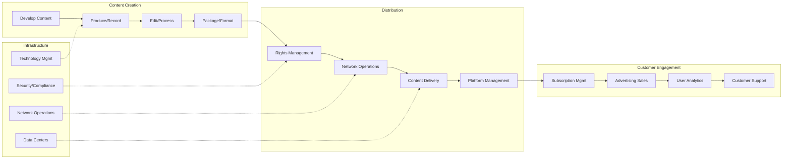
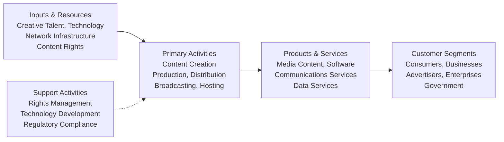
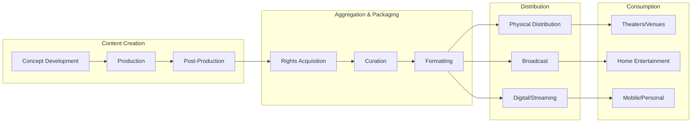
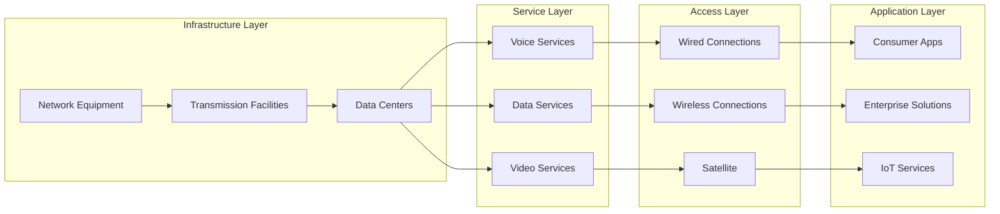

# Information

> The Information sector comprises establishments engaged in producing and distributing information and cultural products, providing the means to transmit or distribute these products as well as data or communications, and processing data.

## Overview

This sector encompasses a diverse range of industries united by their focus on information and cultural products. The main components include:

1. **Motion Picture and Sound Recording Industries**: Production and distribution of films, videos, television programs, and sound recordings
2. **Publishing Industries**: Newspapers, magazines, books, directories, and software publishing
3. **Broadcasting and Content Providers**: Radio and television broadcasting, streaming services, and content networks
4. **Telecommunications**: Wired, wireless, and satellite communications infrastructure and services
5. **Computing Infrastructure**: Data processing, web hosting, and cloud computing services
6. **Information Services**: Web search portals, libraries, archives, and other information services

Unlike traditional goods and services, information and cultural products have unique characteristics:

- **Intangible value**: The value lies in informational, educational, cultural, or entertainment content rather than physical form
- **Format flexibility**: Products can be delivered through multiple channels (theatrical, broadcast, streaming, physical media)
- **No direct contact required**: Delivery does not require direct supplier-consumer interaction
- **Copyright protection**: Most products are protected by intellectual property rights
- **Value addition**: Distributors can easily add value (e.g., advertising, search capabilities)

## Industry Hierarchy

```mermaid
graph TD
    S51["NAICS 51: Information"]
    S51 --> SS512["512: Motion Picture & Sound Recording"]
    S51 --> SS513["513: Publishing Industries"]
    S51 --> SS516["516: Broadcasting & Content Providers"]
    S51 --> SS517["517: Telecommunications"]
    S51 --> SS518["518: Computing Infrastructure & Data Processing"]
    S51 --> SS519["519: Web Search Portals, Libraries, Archives"]

    SS512 --> G5121["5121: Motion Picture & Video Industries"]
    SS512 --> G5122["5122: Sound Recording Industries"]

    G5121 --> I51211["51211: Video Production"]
    G5121 --> I51212["51212: Video Distribution"]
    G5121 --> I51213["51213: Video Exhibition"]
    G5121 --> I51219["51219: Postproduction Services"]

    SS513 --> G5131["5131: Newspaper, Periodical, Book Publishers"]
    SS513 --> G5132["5132: Software Publishers"]

    G5131 --> I51311["51311: Newspaper Publishers"]
    G5131 --> I51312["51312: Periodical Publishers"]
    G5131 --> I51313["51313: Book Publishers"]
    G5131 --> I51314["51314: Directory & Mailing List Publishers"]
    G5131 --> I51319["51319: Other Publishers"]

    SS516 --> G5161["5161: Radio & Television Broadcasting"]
    SS516 --> G5162["5162: Media Streaming & Content Providers"]

    SS517 --> G5171["5171: Wired & Wireless Telecommunications"]
    SS517 --> G5174["5174: Satellite Telecommunications"]
```

## Key Statistics

| Metric | Value |
|--------|-------|
| NAICS Code | 51 |
| Level | Sector |
| Subsectors | 6 |
| Industry Groups | 11 |
| Industries | 32+ |

## Sub-Industries

| Subsector | Code | Description |
|-----------|------|-------------|
| Motion Picture and Sound Recording | 512 | Production, distribution, and exhibition of motion pictures, videos, and sound recordings |
| Publishing Industries | 513 | Newspapers, magazines, books, directories, software, and other published content |
| Broadcasting and Content Providers | 516 | Radio/TV broadcasting, streaming services, social networks, and content networks |
| Telecommunications | 517 | Wired, wireless, and satellite communications infrastructure and services |
| Computing Infrastructure, Data Processing | 518 | Cloud computing, data centers, web hosting, and data processing services |
| Web Search Portals, Libraries, Archives | 519 | Search engines, libraries, archives, and other information services |

## Related Occupations

- [Computer and Information Systems Managers](/occupations/Management/ComputerAndInformationSystemsManagers) - IT leadership and strategy
- [Software Developers](/occupations/Technology/SoftwareDevelopers) - Application and systems development
- [Broadcast Technicians](/occupations/ArtsMedia/BroadcastTechnicians) - Broadcasting equipment operation
- [Film and Video Editors](/occupations/ArtsMedia/FilmAndVideoEditors) - Post-production editing
- [Telecommunications Equipment Installers](/occupations/TelecommunicationsEquipmentInstallers) - Network infrastructure
- [Writers and Authors](/occupations/ArtsMedia/WritersAndAuthors) - Content creation
- [News Analysts and Reporters](/occupations/NewsAnalystsAndReporters) - Journalism and news production
- [Database Administrators](/occupations/Technology/DatabaseAdministrators) - Data management
- [Network and Computer Systems Administrators](/occupations/Technology/NetworkAndComputerSystemsAdministrators) - Systems operations

## Core Business Processes

### Content Production

Creating and packaging information and cultural products for distribution across multiple platforms and formats.

**Key Activities:**
- Develop original content (text, audio, video, software)
- Acquire content rights and licenses
- Produce and record media
- Edit and post-process content
- Format and package for distribution

### Network Operations

Operating and maintaining the infrastructure required to transmit and distribute information products.

**Key Activities:**
- Manage telecommunications networks
- Operate broadcast transmission facilities
- Maintain data center operations
- Monitor network performance and capacity
- Ensure service reliability and quality

### Content Distribution

Delivering information products to end users through various channels and platforms.

**Key Activities:**
- Manage content delivery networks
- Operate streaming platforms
- Coordinate broadcast scheduling
- Handle physical media distribution
- Manage digital rights and access

## Industry Value Chain

## Content Value Chain

## Telecommunications Value Chain

## Industry Characteristics

### Information and Cultural Products

Unlike traditional goods, information products have unique characteristics:

| Characteristic | Description |
|----------------|-------------|
| **Intangibility** | Products like newspapers or TV programs lack tangible qualities |
| **Format Independence** | A movie can be viewed in theaters, on TV, or streamed |
| **Non-Contact Delivery** | Distribution does not require direct consumer interaction |
| **Content Value** | Value lies in informational or entertainment content, not format |
| **Copyright Protection** | Most products protected from unlawful reproduction |
| **Value Addition** | Distributors can add value (advertising, search, organization) |

### Revenue Models

Information sector businesses employ various revenue models:

- **Subscription**: Recurring payments for content or service access
- **Advertising**: Revenue from ad placement and sponsorship
- **Transactional**: Pay-per-view, per-download, or per-use pricing
- **Licensing**: Content and intellectual property licensing fees
- **Hybrid**: Combination of multiple revenue streams

## Related Industries

- [Professional, Scientific, and Technical Services](../Scientific/) - Custom software development
- [Manufacturing](../Manufacturing/) - Mass reproduction of media
- [Retail Trade](../Retail/) - Media retail distribution
- [Arts, Entertainment, and Recreation](../Entertainment/) - Live artistic productions

## Regulatory Environment

The Information sector operates under comprehensive regulatory oversight:

- **FCC (Federal Communications Commission)**: Broadcasting licenses, telecommunications regulation, spectrum allocation
- **Copyright Office**: Copyright registration and intellectual property protection
- **FTC (Federal Trade Commission)**: Consumer protection, advertising standards
- **State Public Utility Commissions**: Local telecommunications regulation
- **International Agreements**: Cross-border content and telecommunications coordination
- **NTIA (National Telecommunications and Information Administration)**: Federal spectrum management
- **Section 230**: Online platform liability protections
- **Net Neutrality**: Internet service provider practices
- **COPPA**: Children's online privacy protection
- **GDPR/Privacy Laws**: Data protection and user privacy

### Key Regulatory Considerations

| Area | Regulatory Focus |
|------|------------------|
| **Broadcasting** | License requirements, content standards, ownership limits |
| **Telecommunications** | Universal service, interconnection, spectrum allocation |
| **Publishing** | Copyright, defamation, press freedom |
| **Data Processing** | Privacy, security, cross-border data transfer |
| **Content Providers** | Platform liability, content moderation, children's safety |

## Technology & Innovation

The Information sector is at the forefront of technological transformation:

### Content and Media

- **Streaming Technologies**: Over-the-top (OTT) platforms, adaptive bitrate streaming
- **Immersive Media**: Virtual reality (VR), augmented reality (AR), 360-degree video
- **AI-Generated Content**: Automated content creation, deepfakes, synthetic media
- **Personalization**: Algorithmic recommendations, dynamic content delivery

### Telecommunications

- **5G Networks**: High-speed, low-latency wireless communications
- **Fiber Optics**: High-bandwidth wired infrastructure
- **Edge Computing**: Distributed processing closer to users
- **Software-Defined Networking**: Flexible, programmable network infrastructure

### Computing Infrastructure

- **Cloud Computing**: Infrastructure-as-a-Service, Platform-as-a-Service
- **Containerization**: Microservices and container orchestration
- **Artificial Intelligence**: Machine learning infrastructure and services
- **Quantum Computing**: Emerging computational paradigms

### Publishing and Software

- **Digital Publishing**: E-books, digital magazines, online news
- **Software-as-a-Service (SaaS)**: Cloud-based software delivery
- **Low-Code/No-Code**: Democratized software development
- **Open Source**: Collaborative software development models

## Excluded Activities

The following activities are classified in other sectors:

| Activity | Classification |
|----------|----------------|
| Custom software design | Professional, Scientific, and Technical Services |
| Mass reproduction of software/media | Manufacturing |
| Live artistic performances | Arts, Entertainment, and Recreation |
| Wholesale distribution of recordings | Wholesale Trade |
| Media retail sales | Retail Trade |

---

*Source: NAICS 51 - Information*
