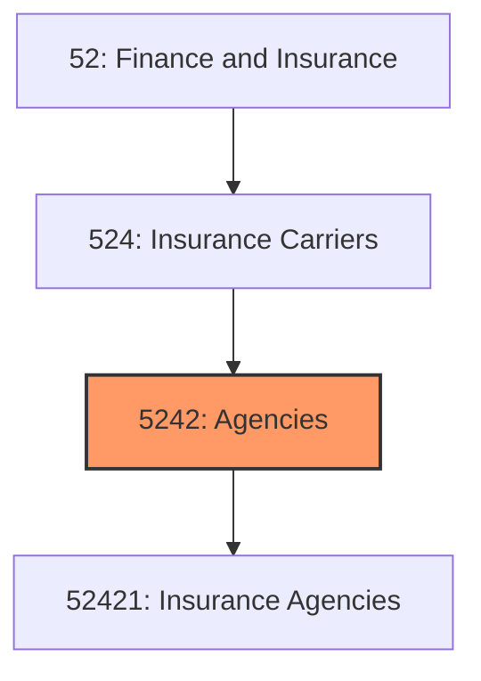
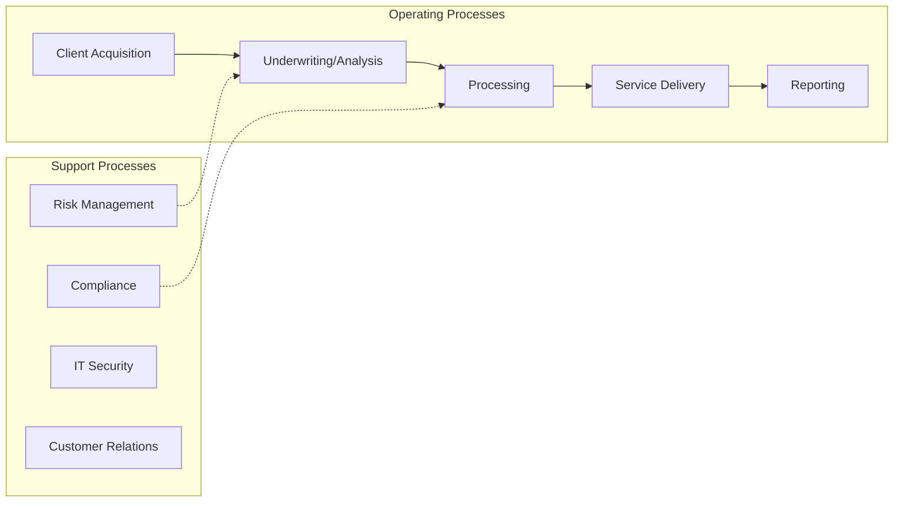

# Agencies

> This industry group comprises establishments primarily engaged in (1) acting as agents (i.

## Overview

Agencies represents an important category within the Finance and Insurance sector (NAICS 52).

This industry group comprises establishments primarily engaged in (1) acting as agents (i.e., brokers) in selling annuities and insurance policies or (2) providing other employee benefits and insurance related services, such as claims adjustment and third party administration.

## Industry Hierarchy

## Key Statistics

| Metric | Value |
|--------|-------|
| NAICS Code | 5242 |
| Level | Industry Group |
| Parent | [Insurance Carriers](../) |
| Child Industries | 1 |

## Sub-Industries

| Industry | Code | Description |
|----------|------|-------------|
| [Insurance Agencies](./InsuranceAgencies/) | 52421 | See industry description for 524210 |

## Related Occupations

See the [occupations directory](/occupations) for roles commonly found in this industry.

## Core Business Processes

## Industry Value Chain

```mermaid
graph LR
    subgraph Inputs["Inputs"]
        I1["Capital"]
        I2["Data"]
        I3["Expertise"]
        I4["Technology"]
    end

    subgraph Primary["Primary Activities"]
        A1["Inbound Logistics"]
        A2["Core Operations"]
        A3["Quality Assurance"]
        A4["Outbound/Delivery"]
    end

    subgraph Outputs["Products/Services"]
        O1["Financial Products"]
        O2["Risk Coverage"]
        O3["Advisory"]
    end

    subgraph Customers["Markets"]
        C1["Individuals"]
        C2["Businesses"]
        C3["Institutions"]
        C4["Government"]
    end

    Inputs --> Primary --> Outputs --> Customers
```

---

*Source: NAICS 5242 - Agencies*
