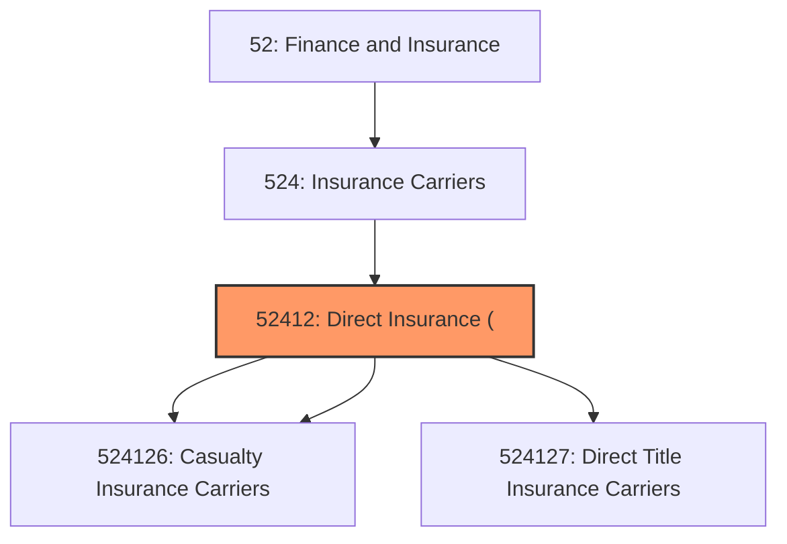
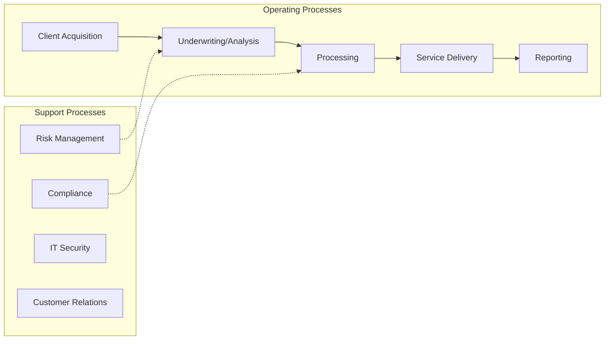

# Direct Insurance (

> This industry comprises establishments primarily engaged in initially underwriting (i.

## Overview

Direct Insurance ( represents an important category within the Finance and Insurance sector (NAICS 52).

This industry comprises establishments primarily engaged in initially underwriting (i.e., assuming the risk and assigning premiums) various types of insurance policies (except life, disability income, accidental death and dismemberment, and health and medical insurance policies). Illustrative Examples: Automobile insurance carriers, direct Property and casualty insurance carriers, direct Bank deposit insurance carriers, direct Title insurance carriers, real estate, direct Mortgage guaranty insurance carriers, direct Warranty insurance carriers (e.g., appliance, automobile, homeowners', product), direct Cross-References.

## Industry Hierarchy

## Key Statistics

| Metric | Value |
|--------|-------|
| NAICS Code | 52412 |
| Level | Industry |
| Child Industries | 3 |

## Sub-Industries

| Industry | Code | Description |
|----------|------|-------------|
| [Direct Property](./DirectProperty.mdx) | 524126 | This U |
| [Casualty Insurance Carriers](./CasualtyInsuranceCarriers.mdx) | 524126 | This U |
| [Direct Title Insurance Carriers](./DirectTitleInsuranceCarriers.mdx) | 524127 | This U |

## Related Occupations

See the [occupations directory](/occupations) for roles commonly found in this industry.

## Core Business Processes

## Industry Value Chain

## Market Context

Manufacturing transforms raw materials into finished goods, with Industry 4.0 driving automation, digitalization, and smart factory implementations.

| Aspect | Details |
|--------|---------|
| Industry Sector | Insurance |
| NAICS/SIC Code | 52412 |
| Market Segment | Direct Insurance ( |

## Key Business Processes

- Production planning
- Manufacturing operations
- Quality assurance
- Inventory management
- Distribution and logistics

## Common Occupations

- [Industrial Production Managers](/occupations/Management/IndustrialProductionManagers)
- [Production Workers](/occupations/Production/ProductionWorkers)
- [Quality Control Inspectors](/occupations/Production/QualityControlInspectors)
- [Industrial Engineers](/occupations/Engineering/IndustrialEngineers)

## Regulations and Standards

- OSHA Manufacturing Standards
- EPA Environmental Regulations
- FDA regulations (where applicable)
- ISO quality standards
- Industry-specific certifications

## Technology and Tools

- Industrial automation and robotics
- Enterprise Resource Planning (ERP)
- Quality management systems
- Predictive maintenance
- IoT and smart manufacturing

## Industry Trends

- Digital transformation and automation adoption
- Sustainability and environmental compliance focus
- Workforce development and skills training
- Supply chain resilience and optimization
- Customer experience enhancement

---

*Source: NAICS 52412 - Direct Insurance (*
