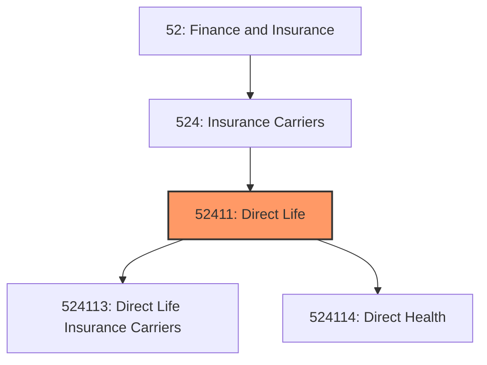
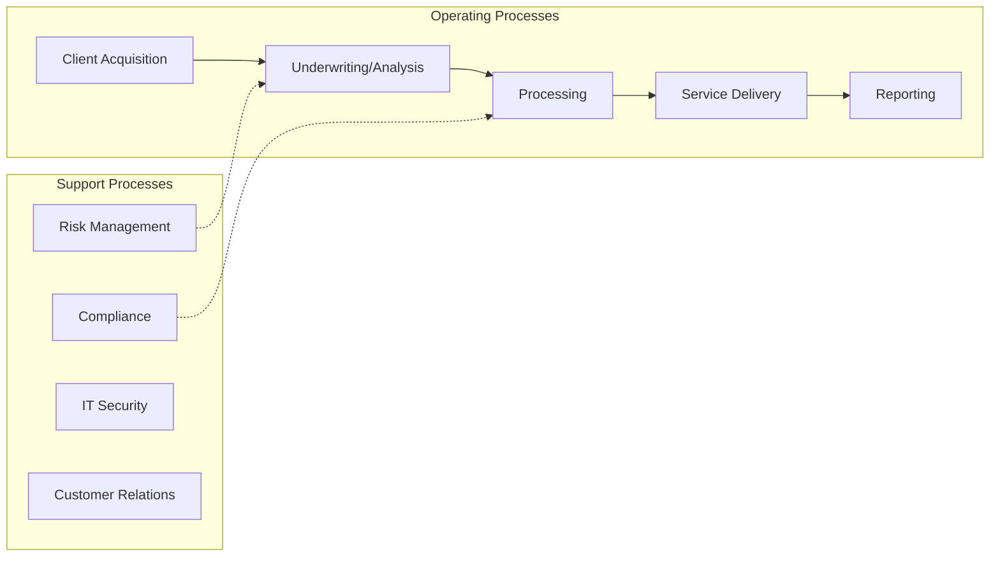

# Direct Life

> This industry comprises establishments primarily engaged in initially underwriting (i.

## Overview

Direct Life represents an important category within the Finance and Insurance sector (NAICS 52).

This industry comprises establishments primarily engaged in initially underwriting (i.e., assuming the risk and assigning premiums) annuities and life insurance policies, disability income insurance policies, accidental death and dismemberment insurance policies, and health and medical insurance policies. Cross-References.

## Industry Hierarchy

## Key Statistics

| Metric | Value |
|--------|-------|
| NAICS Code | 52411 |
| Level | Industry |
| Child Industries | 2 |

## Sub-Industries

| Industry | Code | Description |
|----------|------|-------------|
| [Direct Life Insurance Carriers](./DirectLifeInsuranceCarriers.mdx) | 524113 | This U |
| [Direct Health](./DirectHealth.mdx) | 524114 | This U |

## Related Occupations

See the [occupations directory](/occupations) for roles commonly found in this industry.

## Core Business Processes

## Industry Value Chain

```mermaid
graph LR
    subgraph Inputs["Inputs"]
        I1["Capital"]
        I2["Data"]
        I3["Expertise"]
        I4["Technology"]
    end

    subgraph Primary["Primary Activities"]
        A1["Inbound Logistics"]
        A2["Core Operations"]
        A3["Quality Assurance"]
        A4["Outbound/Delivery"]
    end

    subgraph Outputs["Products/Services"]
        O1["Financial Products"]
        O2["Risk Coverage"]
        O3["Advisory"]
    end

    subgraph Customers["Markets"]
        C1["Individuals"]
        C2["Businesses"]
        C3["Institutions"]
        C4["Government"]
    end

    Inputs --> Primary --> Outputs --> Customers
```

---

*Source: NAICS 52411 - Direct Life*
