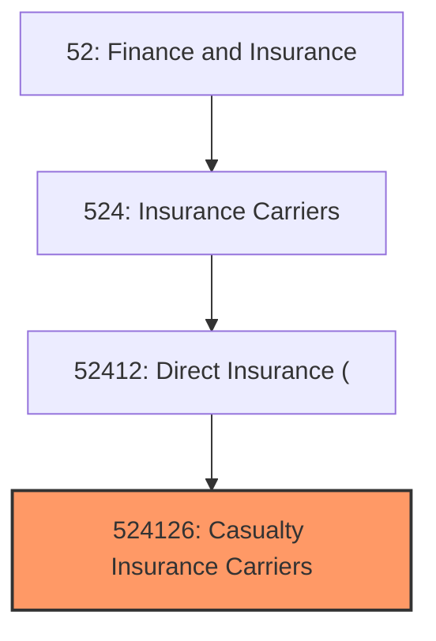
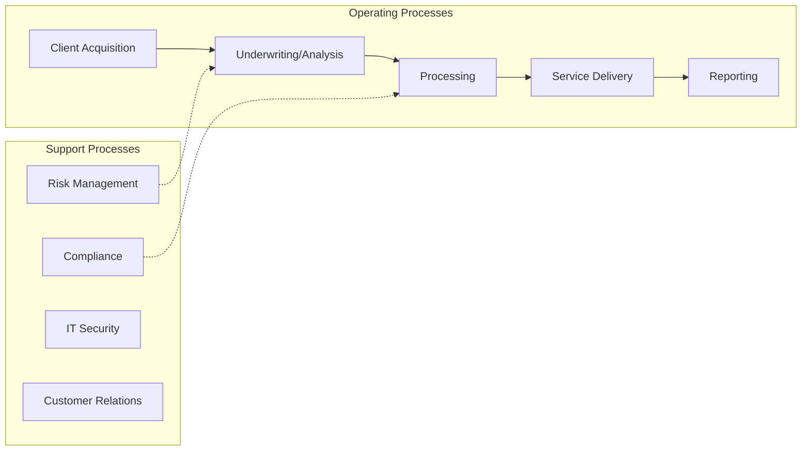

# Casualty Insurance Carriers

> This U.

## Overview

Casualty Insurance Carriers represents a specialized segment within the Finance and Insurance sector (NAICS 52).

This U.S. industry comprises establishments primarily engaged in initially underwriting (i.e., assuming the risk and assigning premiums) insurance policies that protect policyholders against losses that may occur as a result of property damage or liability. Illustrative Examples: Automobile insurance carriers, direct Malpractice insurance carriers, direct Fidelity insurance carriers, direct Mortgage guaranty insurance carriers, direct Homeowners' insurance carriers, direct Surety insurance carriers, direct Liability insurance carriers, direct Cross-References.

## Industry Hierarchy

## Key Statistics

| Metric | Value |
|--------|-------|
| NAICS Code | 524126 |
| Level | National Industry |
| Parent | [Direct Insurance (](../) |
| Child Industries | 0 |

## Related Occupations

See the [occupations directory](/occupations) for roles commonly found in this industry.

## Core Business Processes

## Industry Value Chain

---

*Source: NAICS 524126 - Casualty Insurance Carriers*
