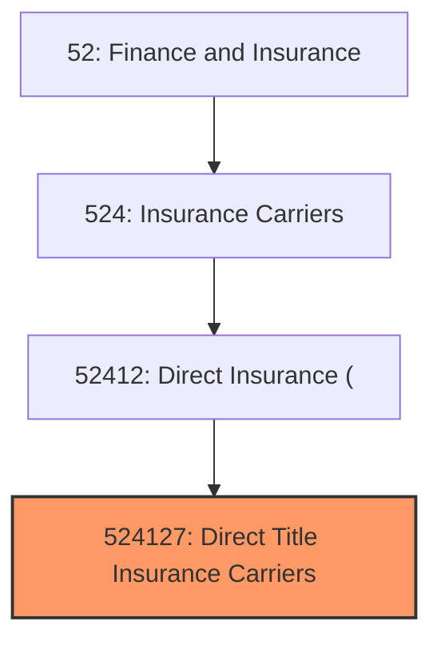
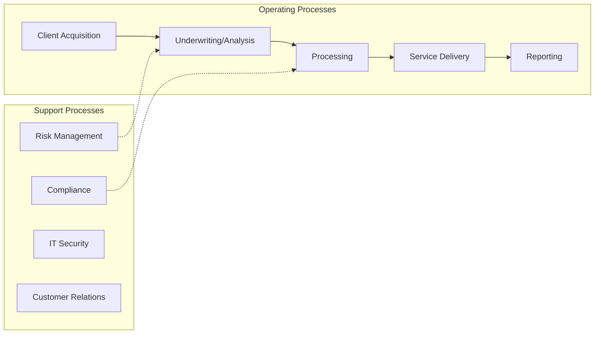

# Direct Title Insurance Carriers

> This U.

## Overview

Direct Title Insurance Carriers represents a specialized segment within the Finance and Insurance sector (NAICS 52).

This U.S. industry comprises establishments primarily engaged in initially underwriting (i.e., assuming the risk and assigning premiums) insurance policies to protect the owners of real estate or real estate creditors against loss sustained by reason of any title defect to real property. Cross-References. Establishments primarily engaged in--

## Industry Hierarchy

## Key Statistics

| Metric | Value |
|--------|-------|
| NAICS Code | 524127 |
| Level | National Industry |
| Parent | [Direct Insurance (](../) |
| Child Industries | 0 |

## Related Occupations

- [Insurance Underwriters](/occupations/Business/InsuranceUnderwriters) - Evaluate insurance applications and risk
- [Actuaries](/occupations/Technology/Actuaries) - Analyze statistical data to estimate risk
- [Claims Adjusters, Examiners, and Investigators](/occupations/Business/ClaimsAdjustersExaminersAndInvestigators) - Process insurance claims
- [Insurance Sales Agents](/occupations/Sales/InsuranceSalesAgents) - Sell insurance policies

## Core Business Processes

## Industry Value Chain

## Regulatory Environment

- **State Insurance Commissioners** - Regulate insurance rates, policies, and solvency
- **NAIC** (National Association of Insurance Commissioners) - Sets model regulations
- **Federal Insurance Office** - Monitors systemic risk in insurance
- **State Guaranty Associations** - Protect policyholders from insurer insolvency

## Technology & Innovation

- **Insurtech** - Digital-first insurance platforms and automated underwriting
- **Telematics and IoT** - Usage-based insurance, connected devices, and real-time risk monitoring
- **AI Claims Processing** - Automated damage assessment, fraud detection, and chatbot customer service
- **Parametric Insurance** - Event-triggered automatic payouts using smart contracts

## Industry Outlook

The insurance industry is embracing digital transformation through insurtech partnerships, automated underwriting, and data-driven risk assessment. Climate-related risks are reshaping actuarial models and product offerings, while parametric and usage-based insurance gain market share. Customer expectations for digital-first experiences are driving investment in self-service platforms and AI-powered claims processing.

## Market Context

Manufacturing transforms raw materials into finished goods, with Industry 4.0 driving automation, digitalization, and smart factory implementations.

| Aspect | Details |
|--------|---------|
| Industry Sector | Insurance |
| NAICS/SIC Code | 524127 |
| Market Segment | Direct Title Insurance Carriers |

## Key Business Processes

- Production planning
- Manufacturing operations
- Quality assurance
- Inventory management
- Distribution and logistics

## Common Occupations

- [Industrial Production Managers](/occupations/Management/IndustrialProductionManagers)
- [Production Workers](/occupations/Production/ProductionWorkers)
- [Quality Control Inspectors](/occupations/Production/QualityControlInspectors)
- [Industrial Engineers](/occupations/Engineering/IndustrialEngineers)

## Regulations and Standards

- OSHA Manufacturing Standards
- EPA Environmental Regulations
- FDA regulations (where applicable)
- ISO quality standards
- Industry-specific certifications

## Technology and Tools

- Industrial automation and robotics
- Enterprise Resource Planning (ERP)
- Quality management systems
- Predictive maintenance
- IoT and smart manufacturing

## Industry Trends

- Digital transformation and automation adoption
- Sustainability and environmental compliance focus
- Workforce development and skills training
- Supply chain resilience and optimization
- Customer experience enhancement

---

*Source: NAICS 524127 - Direct Title Insurance Carriers*
