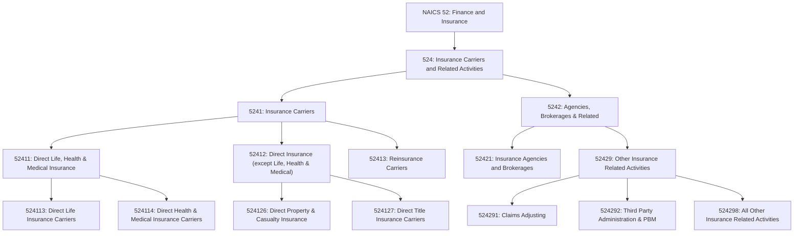
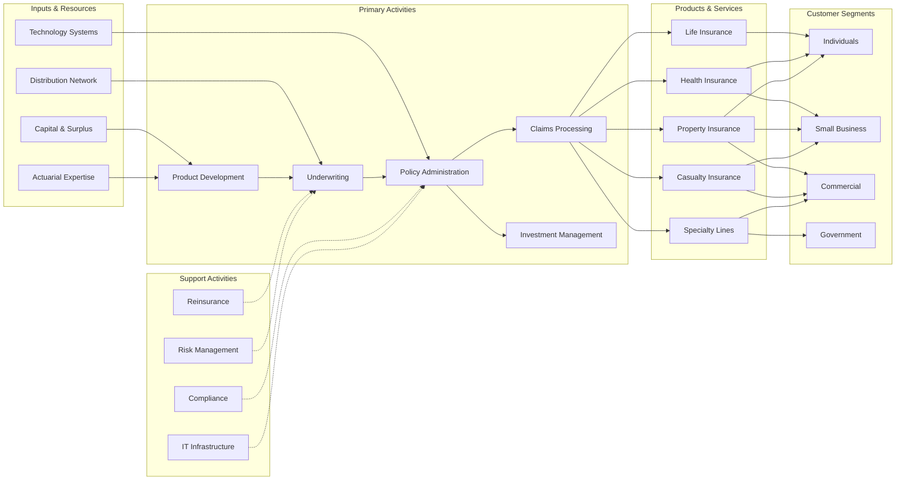
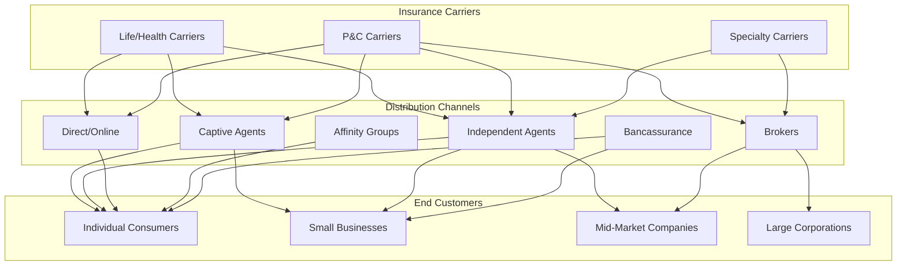

# Insurance Carriers and Related Activities

> The Insurance Carriers and Related Activities subsector comprises establishments primarily engaged in underwriting annuities and insurance policies, selling insurance policies, and providing other insurance and employee benefit related services.

## Overview

This subsector encompasses two principal types of activities:

1. **Insurance Underwriting**: Assuming risk, assigning premiums, and issuing annuities and insurance policies. Carriers collect premiums or annuity considerations, build up reserves, invest those reserves, and make contractual payments based on the expected incidence of the insured risk and expected return on investment.

2. **Insurance Facilitation**: Acting as agents or brokers to sell annuities and insurance policies, and providing other employee benefits and insurance-related services such as claims adjustment, third-party administration, and pharmacy benefit management.

The insurance industry plays a critical role in the economy by:
- Pooling and distributing risk across policyholders
- Providing financial protection against unexpected losses
- Enabling economic activity by transferring risk from individuals and businesses
- Serving as major institutional investors through premium reserves

## Industry Hierarchy

## Key Statistics

| Metric | Value |
|--------|-------|
| NAICS Code | 524 |
| Level | Subsector |
| Parent Sector | [52: Finance and Insurance](../Finance/) |
| Industry Groups | 2 |
| Industries | 9 |
| National Industries | 11 |

## Sub-Industries

| Industry Group | Code | Description |
|----------------|------|-------------|
| Insurance Carriers | 5241 | Establishments primarily engaged in underwriting insurance policies |
| Direct Life, Health & Medical Insurance Carriers | 52411 | Life insurance, disability income, accidental death, and health insurance underwriting |
| Direct Insurance (except Life, Health & Medical) | 52412 | Property, casualty, automobile, and title insurance underwriting |
| Reinsurance Carriers | 52413 | Assuming all or part of risk from other insurance carriers |
| Agencies, Brokerages, and Other Insurance Related | 5242 | Selling insurance policies and providing insurance services |
| Insurance Agencies and Brokerages | 52421 | Acting as agents or brokers in selling insurance policies |
| Other Insurance Related Activities | 52429 | Claims adjustment, third-party administration, and other services |

## Related Occupations

- [Insurance Underwriters](/occupations/InsuranceUnderwriters) - Evaluate risk and determine policy acceptance
- [Actuaries](/occupations/Actuaries) - Analyze statistical data to forecast risk and liability
- [Insurance Sales Agents](/occupations/InsuranceSalesAgents) - Sell insurance policies to individuals and businesses
- [Claims Adjusters, Examiners, and Investigators](/occupations/ClaimsAdjustersExaminersAndInvestigators) - Review and settle insurance claims
- [Insurance Appraisers, Auto Damage](/occupations/InsuranceAppraisersAutoDamage) - Assess vehicle damage for claims
- [Insurance Claims and Policy Processing Clerks](/occupations/InsuranceClaimsAndPolicyProcessingClerks) - Process policies and claims forms
- [Financial Managers](/occupations/FinancialManagers) - Oversee financial operations and investments
- [Financial Risk Specialists](/occupations/FinancialRiskSpecialists) - Analyze and measure risk exposure
- [Title Examiners, Abstractors, and Searchers](/occupations/TitleExaminersAbstractorsAndSearchers) - Examine real estate titles

## Core Business Processes

```mermaid
flowchart LR
    subgraph ProductDevelopment["Product Development"]
        P1["Market Analysis"]
        P2["Product Design"]
        P3["Pricing/Rating"]
        P4["Filing/Approval"]
    end

    subgraph Distribution["Distribution & Sales"]
        D1["Agent/Broker Network"]
        D2["Direct Marketing"]
        D3["Policy Issuance"]
        D4["Customer Onboarding"]
    end

    subgraph Underwriting["Underwriting"]
        U1["Risk Assessment"]
        U2["Application Review"]
        U3["Medical/Background"]
        U4["Policy Decision"]
    end

    subgraph PolicyAdmin["Policy Administration"]
        A1["Premium Collection"]
        A2["Policy Servicing"]
        A3["Renewals"]
        A4["Endorsements"]
    end

    subgraph Claims["Claims Management"]
        C1["First Notice of Loss"]
        C2["Investigation"]
        C3["Adjustment"]
        C4["Settlement/Payment"]
    end

    subgraph Investment["Investment Management"]
        I1["Asset Allocation"]
        I2["Portfolio Management"]
        I3["Reserve Management"]
    end

    P1 --> P2 --> P3 --> P4
    P4 --> D1
    D1 --> D2 --> D3 --> D4
    D4 --> U1
    U1 --> U2 --> U3 --> U4
    U4 --> A1
    A1 --> A2 --> A3
    A3 --> A4
    A1 --> I1 --> I2 --> I3
    A2 -.-> C1 --> C2 --> C3 --> C4
```

### Underwriting

Evaluating risk and determining whether to accept or reject insurance applications, and at what premium.

**Key Activities:**
- Assess applicant risk profiles and loss history
- Review medical records, driving records, or property inspections
- Apply actuarial tables and rating algorithms
- Determine coverage terms, conditions, and exclusions
- Set appropriate premium rates
- Issue or decline policies

### Claims Management

Processing and settling claims submitted by policyholders for covered losses.

**Key Activities:**
- Receive and log first notice of loss (FNOL)
- Assign claims adjusters and investigators
- Investigate claim circumstances and coverage
- Assess damage and determine liability
- Negotiate settlements with claimants
- Process payments and close claims
- Detect and prevent fraudulent claims

### Investment Management

Managing policyholder premiums and reserves to generate investment returns while maintaining liquidity.

**Key Activities:**
- Develop investment policy and asset allocation
- Manage fixed income, equity, and alternative investments
- Ensure asset-liability matching
- Monitor portfolio risk and performance
- Maintain regulatory capital and reserves
- Generate investment income to offset underwriting costs

## Industry Value Chain

## Insurance Product Types

### Life and Annuities
Provide financial protection for beneficiaries upon the insured's death or income during retirement. Products include term life, whole life, universal life, variable life, fixed annuities, and variable annuities.

### Health and Medical
Cover medical expenses and provide income replacement during illness or disability. Products include individual health plans, group health plans, dental, vision, disability income, and long-term care insurance.

### Property and Casualty
Protect against losses to property and liability for injuries or damage to others. Products include homeowners, auto, commercial property, general liability, professional liability, and workers' compensation.

### Specialty Lines
Cover unique or hard-to-place risks. Products include marine, aviation, surety bonds, title insurance, mortgage guaranty, and cyber liability.

### Reinsurance
Insurance for insurance companies, allowing primary carriers to transfer risk and increase capacity. Includes treaty reinsurance, facultative reinsurance, and alternative risk transfer.

## Distribution Channels

## Regulatory Environment

The insurance industry operates under comprehensive regulation at both state and federal levels:

### State Regulation
- **State Insurance Departments**: Primary regulators for insurance companies, overseeing licensing, rates, forms, and market conduct
- **NAIC**: National Association of Insurance Commissioners coordinates state regulation and develops model laws
- **Rate and Form Filings**: Prior approval or file-and-use requirements for policy forms and premium rates
- **Market Conduct Examinations**: Reviews of sales practices, claims handling, and consumer treatment
- **Financial Examinations**: Periodic reviews of insurer financial condition and reserves

### Federal Regulation
- **McCarran-Ferguson Act**: Establishes state primacy in insurance regulation
- **Dodd-Frank Act**: Created Federal Insurance Office (FIO) for monitoring and international coordination
- **HIPAA/ACA**: Health insurance portability and coverage requirements
- **ERISA**: Regulation of employer-sponsored benefit plans
- **Terrorism Risk Insurance Act**: Federal backstop for terrorism coverage

### Solvency Requirements
- **Risk-Based Capital (RBC)**: Minimum capital requirements based on risk profile
- **Statutory Accounting Principles (SAP)**: Conservative accounting standards for insurers
- **Reserve Requirements**: Adequate reserves for policy liabilities and claims
- **Guaranty Funds**: State-run funds protecting policyholders if carriers become insolvent
- **Reinsurance Collateral**: Requirements for unauthorized reinsurers

### Consumer Protection
- **Unfair Trade Practices Acts**: Prohibit deceptive or unfair insurance practices
- **Claims Handling Standards**: Timely investigation and fair settlement requirements
- **Privacy Regulations**: Protection of policyholder personal and health information
- **Anti-Rebating Laws**: Restrictions on inducements for insurance purchases

## Technology & Innovation

The insurance industry is undergoing significant digital transformation:

### InsurTech Innovation
- **Digital Distribution**: Online quoting, binding, and policy issuance
- **Telematics and IoT**: Usage-based insurance using connected devices
- **AI/Machine Learning**: Automated underwriting, claims processing, and fraud detection
- **Blockchain**: Smart contracts, parametric insurance, and reinsurance placement
- **Mobile Apps**: Self-service policy management and claims filing

### Data Analytics
- **Predictive Modeling**: Risk scoring and pricing optimization
- **Claims Analytics**: Loss prediction and fraud detection
- **Customer Analytics**: Retention modeling and cross-sell opportunities
- **Catastrophe Modeling**: Natural disaster exposure assessment

### Process Automation
- **Robotic Process Automation**: Streamlining policy administration
- **Straight-Through Processing**: Automated underwriting and claims adjudication
- **Digital Claims**: Photo-based damage assessment and virtual inspections
- **Chatbots and Virtual Assistants**: Customer service automation

### Emerging Products
- **Cyber Insurance**: Coverage for data breaches and cyber attacks
- **Parametric Insurance**: Index-based coverage with automatic payouts
- **Peer-to-Peer Insurance**: Community-based risk sharing models
- **On-Demand Insurance**: Short-term, usage-based coverage
- **Embedded Insurance**: Coverage integrated into product purchases

## Related Industries

- [Finance and Insurance](../Finance/) - Parent sector including banking, securities, and funds
- [Securities and Investments](../Securities/) - Investment management and capital markets
- [Health Care](../HealthCare/) - Healthcare services and medical providers
- [Real Estate](../RealEstate/) - Property ownership and management
- [Professional Services](../Professional/) - Actuarial, legal, and consulting services

---

*Source: NAICS 524 - Insurance Carriers and Related Activities*
