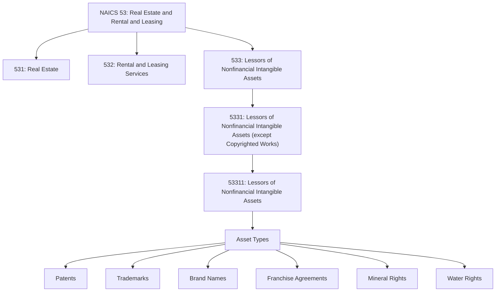
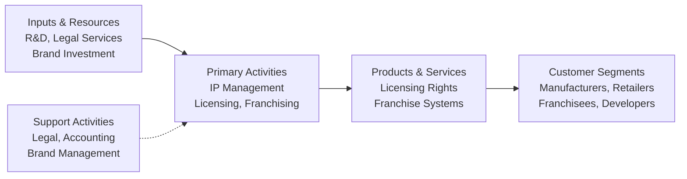

# Lessors of Nonfinancial Intangible Assets

> The Lessors of Nonfinancial Intangible Assets (except Copyrighted Works) subsector includes establishments primarily engaged in assigning rights to assets, such as patents, trademarks, brand names, and/or franchise agreements, for which a royalty payment or licensing fee is paid to the asset holder.

## Overview

This subsector represents a unique segment of the economy where establishments generate revenue not from physical assets or real property, but from intellectual property and intangible rights. Establishments in this subsector own patents, trademarks, brand names, and/or franchise agreements that they allow others to use or reproduce for a fee.

**Key Characteristics:**
- Revenue is derived from royalty payments or licensing fees
- Assets are intangible rather than physical
- Establishments may or may not have created the underlying intellectual property
- Value is based on the legal protection and market recognition of the intangible assets

**Important Exclusions:**
- Franchisors that require franchisees to purchase products/services from the franchisor (classified in wholesale/retail trade)
- Lessors of real property (classified in Subsector 531, Real Estate)
- Lessors of tangible assets like vehicles, equipment, or consumer goods (classified in Subsector 532, Rental and Leasing Services)
- Lessors of copyrighted works (classified in Sector 51, Information)
- Financial intangible assets like securities (classified in Sector 52, Finance and Insurance)

## Industry Hierarchy

## Key Statistics

| Metric | Value |
|--------|-------|
| NAICS Code | 533 |
| Level | Subsector |
| Parent Sector | [Real Estate and Rental and Leasing](../) (53) |
| Industry Groups | 1 |
| Industries | 1 |
| National Industries | 1 |

## Sub-Industries

| Industry | Code | Description |
|----------|------|-------------|
| Lessors of Nonfinancial Intangible Assets (except Copyrighted Works) | 533110 | Establishments assigning rights to patents, trademarks, brand names, franchise agreements, and other nonfinancial intangible assets |

## Related Occupations

- [Chief Executives](/occupations/Management/ChiefExecutives) - Strategic leadership and licensing decisions
- [Sales Managers](/occupations/Management/SalesManagers) - Licensing and franchise sales management
- [Marketing Managers](/occupations/Management/MarketingManagers) - Brand management and licensing strategy
- [Lawyers](/occupations/Legal/Lawyers) - Intellectual property protection and licensing agreements
- [Financial Managers](/occupations/Management/FinancialManagers) - Royalty accounting and financial planning
- [Administrative Services Managers](/occupations/Management/AdministrativeServicesManagers) - Operations oversight
- [Public Relations Managers](/occupations/Management/PublicRelationsManagers) - Brand reputation management
- [Purchasing Managers](/occupations/Management/PurchasingManagers) - Intellectual property acquisition

## Core Business Processes

```mermaid
flowchart LR
    subgraph IPDevelopment["IP Development/Acquisition"]
        A1["Research & Innovation"]
        A2["Brand Building"]
        A3["IP Registration"]
        A4["Acquisition"]
    end

    subgraph Portfolio["Portfolio Management"]
        P1["Valuation"]
        P2["Maintenance"]
        P3["Enforcement"]
        P4["Renewal"]
    end

    subgraph Licensing["Licensing Operations"]
        L1["Prospect Identification"]
        L2["Negotiation"]
        L3["Agreement Execution"]
        L4["Royalty Collection"]
    end

    subgraph Compliance["Compliance & Support"]
        C1["Licensee Support"]
        C2["Quality Control"]
        C3["Audit & Monitoring"]
        C4["Legal Enforcement"]
    end

    A1 --> A2 --> A3 --> A4
    A4 --> P1 --> P2 --> P3 --> P4
    P4 --> L1 --> L2 --> L3 --> L4
    L4 --> C1 --> C2 --> C3 --> C4
    C4 -.-> P3
```

### Intellectual Property Portfolio Management

Managing the organization's portfolio of intangible assets to maximize value and protect rights.

**Key Activities:**
- Register and maintain patents, trademarks, and other IP
- Monitor IP landscape for infringement
- Conduct portfolio valuation and optimization
- Manage renewal deadlines and maintenance fees
- Develop IP acquisition and divestiture strategies
- Defend intellectual property rights

### Licensing and Franchising Operations

Negotiating and executing agreements that allow third parties to use intellectual property.

**Key Activities:**
- Identify and qualify potential licensees/franchisees
- Structure licensing terms and royalty arrangements
- Negotiate and execute licensing agreements
- Onboard new licensees with training and support
- Process royalty payments and reconciliation
- Manage licensee relationships and communications

### Quality Assurance and Brand Protection

Ensuring that licensed use of intangible assets maintains quality standards and brand integrity.

**Key Activities:**
- Establish brand guidelines and quality standards
- Conduct compliance audits of licensees
- Monitor market for unauthorized use
- Take enforcement action against infringers
- Provide ongoing support to licensees
- Measure and report brand performance metrics

## Industry Value Chain

## Intangible Asset Types

### Patents
Legal rights granted for inventions, providing exclusive rights to make, use, or sell the invention for a limited period. Patent licensing allows others to practice the patented technology in exchange for royalty payments.

**Licensing Models:**
- Exclusive licenses (sole licensee rights)
- Non-exclusive licenses (multiple licensees)
- Field-of-use restrictions
- Geographic limitations
- Running royalties vs. lump-sum payments

### Trademarks and Brand Names
Distinctive signs, symbols, names, or designs that identify products or services. Trademark licensing allows others to use the mark in connection with approved products or services.

**Considerations:**
- Quality control requirements to maintain trademark validity
- Geographic scope of license
- Product/service categories covered
- Co-branding arrangements
- Merchandising rights

### Franchise Agreements
Business format franchising where franchisees operate under the franchisor's brand and system. This subsector covers franchisors whose primary revenue comes from royalties and licensing fees rather than product sales to franchisees.

**Franchise Components:**
- Brand/trademark usage rights
- Operating system and procedures
- Training and support
- Territory rights
- Ongoing royalty and fee structures

### Mineral and Natural Resource Rights
Rights to extract minerals, oil, gas, water, or other natural resources from land. These rights may be separated from surface land ownership and licensed to extraction companies.

**Right Types:**
- Mineral rights and mining leases
- Oil and gas leases
- Water rights and usage permits
- Timber harvesting rights
- Geothermal rights

## Regulatory Environment

The intangible asset licensing industry operates under various regulatory frameworks:

- **Patent Law (USPTO)**: Patent registration, maintenance, and enforcement procedures
- **Trademark Law (Lanham Act)**: Trademark registration, use requirements, and protection
- **FTC Franchise Rule**: Disclosure requirements for franchise offerings
- **State Franchise Laws**: Registration and relationship laws in various states
- **Antitrust Laws**: Restrictions on anticompetitive licensing practices
- **International IP Treaties**: WIPO, Paris Convention, Madrid Protocol for international protection
- **Tax Regulations**: Treatment of royalty income, transfer pricing rules
- **Export Controls**: Restrictions on technology licensing to certain countries
- **Industry-Specific Regulations**: FDA, FCC, or other agency requirements for licensed technologies

## Technology & Innovation

The intellectual property licensing industry is evolving with technological advances:

- **IP Management Software**: Portfolio tracking, docketing, and analytics platforms
- **Blockchain and Smart Contracts**: Automated royalty tracking and payment execution
- **Digital Rights Management**: Technology for tracking and controlling digital asset usage
- **AI-Powered Patent Analytics**: Machine learning for prior art search and valuation
- **Online Licensing Marketplaces**: Platforms connecting IP owners with potential licensees
- **Brand Monitoring Tools**: Automated detection of trademark infringement online
- **Royalty Management Systems**: Integrated platforms for licensing accounting
- **Data Analytics**: Insights into licensing market trends and valuations
- **NFT and Digital Assets**: Emerging frameworks for digital intellectual property

## Business Model Considerations

### Revenue Streams
- Initial licensing fees (one-time)
- Running royalties (percentage of sales)
- Minimum guarantee payments
- Franchise fees (initial and ongoing)
- Training and support fees
- Renewal fees
- Sublicensing revenue shares
- Settlement and litigation recoveries

### Cost Structure
- IP registration and maintenance fees
- Legal services (prosecution, enforcement)
- Brand development and marketing
- Licensee support and training
- Compliance monitoring and auditing
- Portfolio management systems
- Insurance (errors and omissions)
- Research and development (for patent portfolios)

### Key Performance Metrics
- Royalty revenue per asset
- License utilization rate
- Portfolio value and growth
- Infringement detection rate
- Licensee satisfaction scores
- Renewal rate
- Time to license execution
- Legal cost as percentage of revenue

## Market Dynamics

### Demand Drivers
- Innovation and new technology development
- Brand extension and licensing strategies
- Franchising as business expansion model
- Manufacturing outsourcing trends
- Cross-industry technology transfer
- International market expansion

### Supply Factors
- Research and development investment
- Patent filing activity
- Brand building and recognition
- Franchise system development
- IP acquisition activity
- Legal protection strength

### Valuation Considerations
- Remaining legal protection period
- Market size and growth potential
- Competitive landscape
- Enforcement track record
- Licensee quality and stability
- Geographic coverage

---

*Source: NAICS 533 - Lessors of Nonfinancial Intangible Assets (except Copyrighted Works)*
