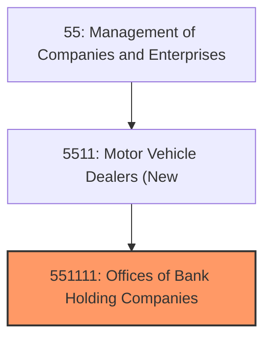
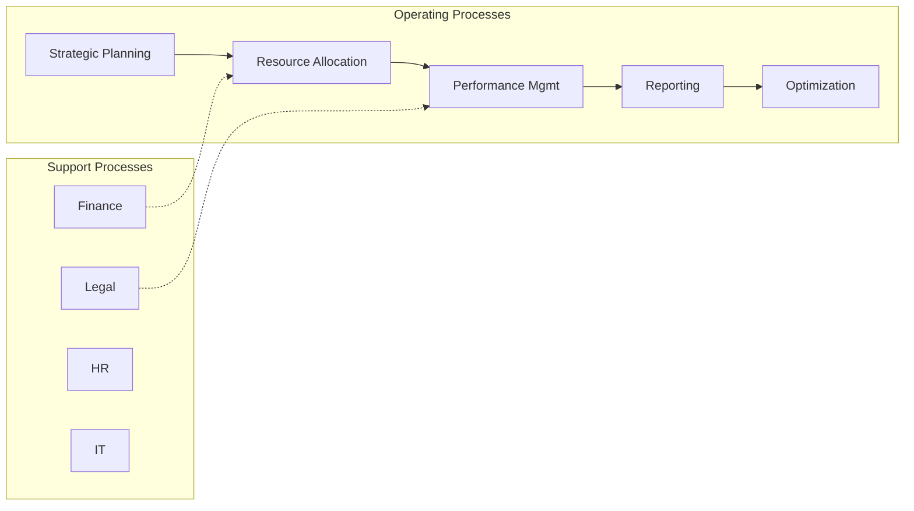

# Offices of Bank Holding Companies

> This U.

## Overview

Offices of Bank Holding Companies represents a specialized segment within the Management of Companies and Enterprises sector (NAICS 55).

This U.S. industry comprises legal entities known as bank holding companies primarily engaged in holding the securities of (or other equity interests in) companies and enterprises for the purpose of owning a controlling interest or influencing the management decisions of these firms. The holding companies in this industry do not administer, oversee, and manage other establishments of the company or enterprise whose securities they hold. Cross-References. Establishments primarily engaged in--

## Industry Hierarchy

## Key Statistics

| Metric | Value |
|--------|-------|
| NAICS Code | 551111 |
| Level | National Industry |
| Child Industries | 0 |

## Related Occupations

See the [occupations directory](/occupations) for roles commonly found in this industry.

## Core Business Processes

## Industry Value Chain

```mermaid
graph LR
    subgraph Inputs["Inputs"]
        I1["Resources"]
        I2["Expertise"]
        I3["Technology"]
    end

    subgraph Primary["Primary Activities"]
        A1["Inbound Logistics"]
        A2["Core Operations"]
        A3["Quality Assurance"]
        A4["Outbound/Delivery"]
    end

    subgraph Outputs["Products/Services"]
        O1["Products"]
        O2["Services"]
        O3["Solutions"]
    end

    subgraph Customers["Markets"]
        C1["Businesses"]
        C2["Consumers"]
        C3["Government"]
        C4["Institutions"]
    end

    Inputs --> Primary --> Outputs --> Customers
```

---

*Source: NAICS 551111 - Offices of Bank Holding Companies*
