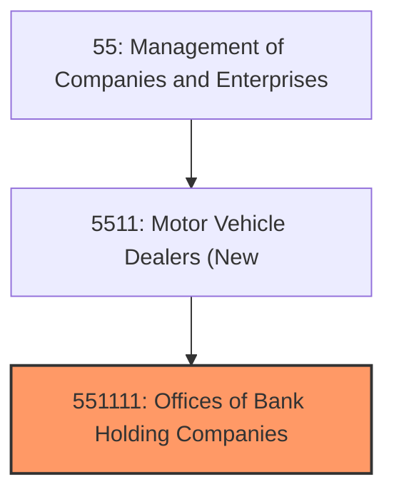
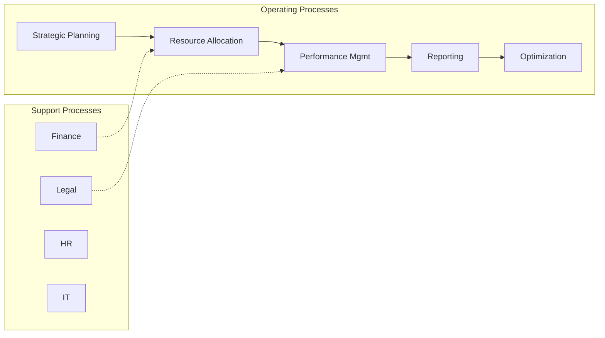

# Offices of Bank Holding Companies

> This U.

## Overview

Offices of Bank Holding Companies represents a specialized segment within the Management of Companies and Enterprises sector (NAICS 55).

This U.S. industry comprises legal entities known as bank holding companies primarily engaged in holding the securities of (or other equity interests in) companies and enterprises for the purpose of owning a controlling interest or influencing the management decisions of these firms. The holding companies in this industry do not administer, oversee, and manage other establishments of the company or enterprise whose securities they hold. Cross-References. Establishments primarily engaged in--

## Industry Hierarchy

## Key Statistics

| Metric | Value |
|--------|-------|
| NAICS Code | 551111 |
| Level | National Industry |
| Child Industries | 0 |

## Related Occupations

- [Chief Executives](/occupations/Management/ChiefExecutives) - Determine and formulate company policies
- [General and Operations Managers](/occupations/Management/GeneralAndOperationsManagers) - Plan and direct operations
- [Financial Managers](/occupations/Management/FinancialManagers) - Direct financial activities
- [Human Resources Managers](/occupations/Management/HumanResourcesManagers) - Plan and direct HR activities

## Core Business Processes

## Industry Value Chain

## Regulatory Environment

- **SEC** (Securities and Exchange Commission) - Regulates holding company disclosures
- **IRS** (Internal Revenue Service) - Governs tax treatment of management companies
- **State Corporate Governance Laws** - Regulate corporate structures
- **FTC** (Federal Trade Commission) - Enforces anti-trust and competitive practices

## Technology & Innovation

- **Enterprise Resource Planning** - Integrated management systems for multi-business operations
- **Data Analytics and BI** - Advanced dashboards, predictive analytics, and AI-driven insights
- **Digital Transformation** - Cloud migration, process automation, and digital strategy
- **Cybersecurity Governance** - Enterprise-wide security frameworks and risk management

## Industry Outlook

The management of companies sector reflects broader economic trends as corporate structures evolve toward more agile and technology-enabled holding company models. Digital transformation, ESG governance, and talent management are top strategic priorities. Mergers, acquisitions, and portfolio optimization continue as companies seek growth and operational synergies.

## Market Context

Manufacturing transforms raw materials into finished goods, with Industry 4.0 driving automation, digitalization, and smart factory implementations.

| Aspect | Details |
|--------|---------|
| Industry Sector | Management |
| NAICS/SIC Code | 551111 |
| Market Segment | Offices of Bank Holding Companies |

## Key Business Processes

- Production planning
- Manufacturing operations
- Quality assurance
- Inventory management
- Distribution and logistics

## Common Occupations

- [Industrial Production Managers](/occupations/Management/IndustrialProductionManagers)
- [Production Workers](/occupations/Production/ProductionWorkers)
- [Quality Control Inspectors](/occupations/Production/QualityControlInspectors)
- [Industrial Engineers](/occupations/Engineering/IndustrialEngineers)

## Regulations and Standards

- OSHA Manufacturing Standards
- EPA Environmental Regulations
- FDA regulations (where applicable)
- ISO quality standards
- Industry-specific certifications

## Technology and Tools

- Industrial automation and robotics
- Enterprise Resource Planning (ERP)
- Quality management systems
- Predictive maintenance
- IoT and smart manufacturing

## Industry Trends

- Digital transformation and automation adoption
- Sustainability and environmental compliance focus
- Workforce development and skills training
- Supply chain resilience and optimization
- Customer experience enhancement

---

*Source: NAICS 551111 - Offices of Bank Holding Companies*
