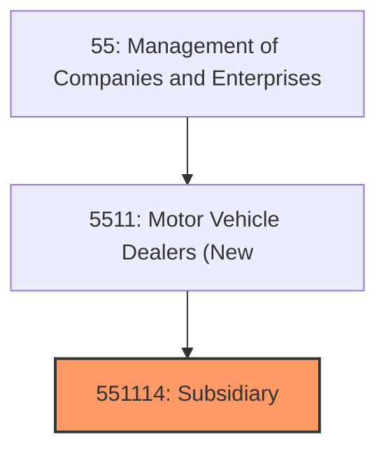
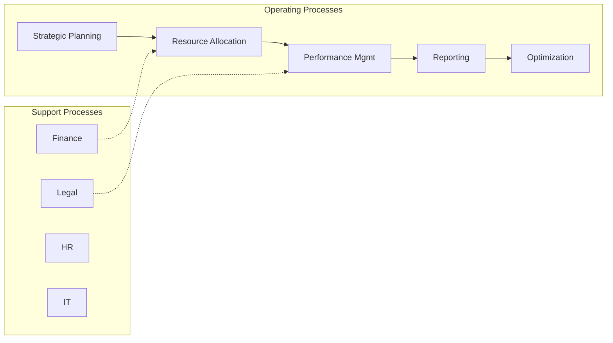

# Subsidiary

> This U.

## Overview

Subsidiary represents a specialized segment within the Management of Companies and Enterprises sector (NAICS 55).

This U.S. industry comprises establishments (except government establishments) primarily engaged in administering, overseeing, and managing other establishments of the company or enterprise. These establishments normally undertake the strategic or organizational planning and decision-making role of the company or enterprise. Establishments in this industry may hold the securities of the company or enterprise. Illustrative Examples: Centralized administrative offices Head offices Corporate offices Holding companies that manage District and regional offices Subsidiary management offices Cross-References.

## Industry Hierarchy

## Key Statistics

| Metric | Value |
|--------|-------|
| NAICS Code | 551114 |
| Level | National Industry |
| Child Industries | 0 |

## Related Occupations

See the [occupations directory](/occupations) for roles commonly found in this industry.

## Core Business Processes

## Industry Value Chain

```mermaid
graph LR
    subgraph Inputs["Inputs"]
        I1["Resources"]
        I2["Expertise"]
        I3["Technology"]
    end

    subgraph Primary["Primary Activities"]
        A1["Inbound Logistics"]
        A2["Core Operations"]
        A3["Quality Assurance"]
        A4["Outbound/Delivery"]
    end

    subgraph Outputs["Products/Services"]
        O1["Products"]
        O2["Services"]
        O3["Solutions"]
    end

    subgraph Customers["Markets"]
        C1["Businesses"]
        C2["Consumers"]
        C3["Government"]
        C4["Institutions"]
    end

    Inputs --> Primary --> Outputs --> Customers
```

---

*Source: NAICS 551114 - Subsidiary*
