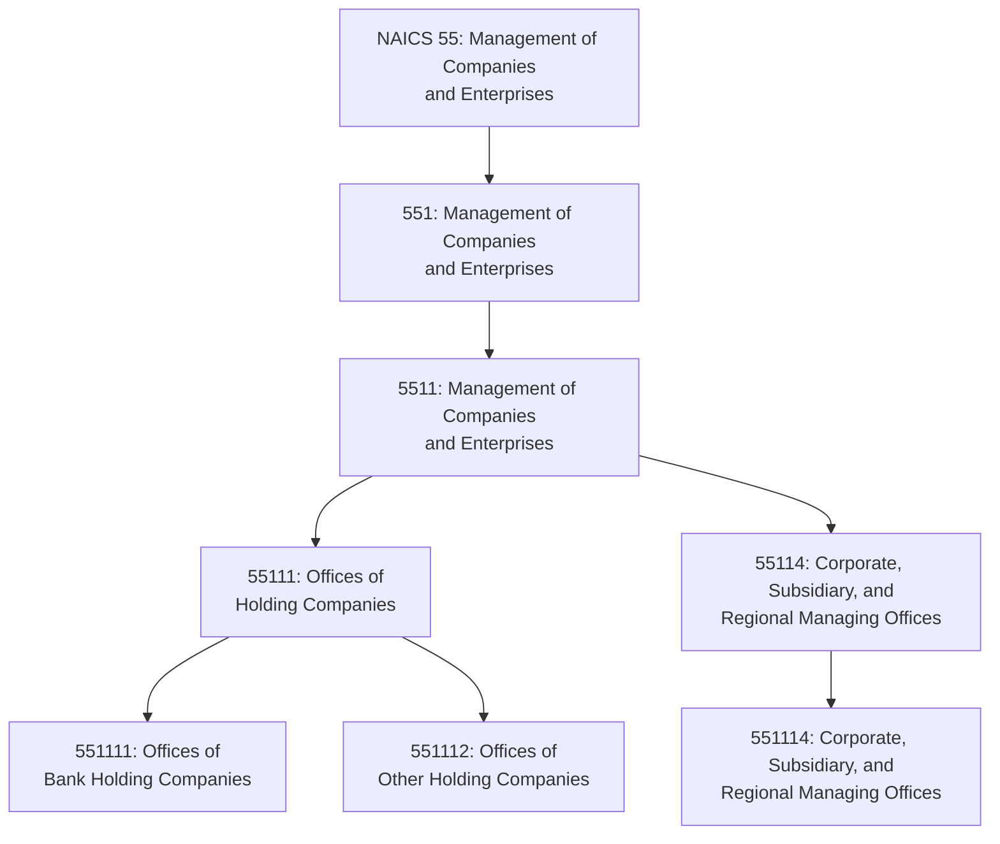
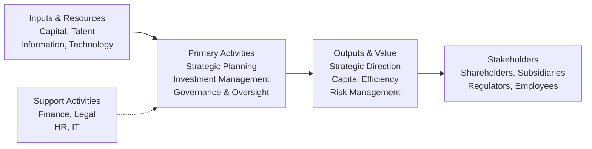

# Management of Companies and Enterprises

> The Management of Companies and Enterprises sector comprises establishments that hold the securities of (or other equity interests in) companies and enterprises for the purpose of owning a controlling interest or influencing management decisions, or establishments that administer, oversee, and manage other establishments of the company or enterprise.

## Overview

This sector encompasses two principal types of establishments:

1. **Holding Companies**: Legal entities that hold securities or equity interests in other companies for the purpose of owning a controlling interest or influencing management decisions. These establishments do not directly manage the operations of subsidiary companies.

2. **Corporate Management Offices**: Establishments (except government) that administer, oversee, and manage other establishments of the company or enterprise. These entities undertake the strategic and organizational planning and decision-making role of the enterprise, including head offices, regional offices, and centralized administrative offices.

Establishments in this sector perform essential activities that are often undertaken in-house by establishments across all sectors of the economy. By consolidating these management and oversight activities at specialized establishments, enterprises achieve economies of scale in strategic planning, financial management, legal services, and administrative functions.

The sector is unique in NAICS as one of the smallest sectors by number of industries but highly significant in terms of economic influence and employment of high-skilled management professionals.

## Industry Hierarchy

## Key Statistics

| Metric | Value |
|--------|-------|
| NAICS Code | 55 |
| Level | Sector |
| Subsectors | 1 |
| Industry Groups | 1 |
| Industries | 4 |

## Sub-Industries

| Industry | Code | Description |
|----------|------|-------------|
| Offices of Bank Holding Companies | 551111 | Bank holding companies holding securities of subsidiary banks |
| Offices of Other Holding Companies | 551112 | Non-bank holding companies owning controlling interests in enterprises |
| Corporate, Subsidiary, and Regional Managing Offices | 551114 | Head offices, regional offices, and administrative centers that manage enterprise operations |

## Related Occupations

- [Chief Executives](/occupations/ChiefExecutives) - Strategic leadership and policy formulation
- [General and Operations Managers](/occupations/GeneralAndOperationsManagers) - Operational oversight and coordination
- [Financial Managers](/occupations/FinancialManagers) - Financial planning, investment, and treasury management
- [Human Resources Managers](/occupations/HumanResourcesManagers) - Workforce planning and talent management
- [Administrative Services Managers](/occupations/AdministrativeServicesManagers) - Administrative operations coordination
- [Computer and Information Systems Managers](/occupations/ComputerAndInformationSystemsManagers) - IT strategy and systems management
- [Management Analysts](/occupations/ManagementAnalysts) - Business strategy and operational improvement
- [Compensation and Benefits Managers](/occupations/CompensationAndBenefitsManagers) - Enterprise-wide compensation programs
- [Training and Development Managers](/occupations/TrainingAndDevelopmentManagers) - Organizational learning and development

## Core Business Processes

### Strategic Planning and Direction

Setting long-term vision, strategic objectives, and enterprise-wide policies that guide subsidiary and operating company decisions.

**Key Activities:**
- Formulate corporate vision and mission
- Develop multi-year strategic plans
- Assess market opportunities and competitive positioning
- Allocate capital across business units
- Evaluate and execute mergers, acquisitions, and divestitures

### Portfolio and Investment Management

Managing the portfolio of subsidiary companies, investments, and business units to optimize enterprise value.

**Key Activities:**
- Monitor subsidiary company performance
- Evaluate investment opportunities and returns
- Manage holding company asset portfolios
- Optimize capital structure and financing
- Execute dividend and distribution policies

### Corporate Governance and Compliance

Ensuring proper governance, regulatory compliance, and ethical conduct across the enterprise.

**Key Activities:**
- Support board of directors and committees
- Maintain regulatory compliance programs
- Oversee enterprise risk management
- Implement internal audit functions
- Manage shareholder and investor relations

### Shared Services Management

Providing centralized administrative, financial, and operational services to subsidiary companies.

**Key Activities:**
- Deliver centralized accounting and treasury services
- Manage enterprise-wide human resources programs
- Provide legal and corporate secretary services
- Operate shared information technology infrastructure
- Coordinate procurement and vendor management

## Industry Value Chain

## Holding Company Structures

### Bank Holding Companies (551111)

Legal entities that own or control one or more banks. These companies are subject to regulation by the Federal Reserve and must meet specific capital and regulatory requirements. Bank holding companies allow for diversification of financial services while maintaining bank charter protections.

**Characteristics:**
- Regulated by Federal Reserve Board
- Subject to capital adequacy requirements
- May own multiple banking subsidiaries
- Often provide non-banking financial services through affiliates

### Non-Bank Holding Companies (551112)

Holding companies that own controlling interests in non-bank enterprises across any industry. These include diversified conglomerates, private equity holding structures, and family office investment vehicles.

**Characteristics:**
- Diverse investment portfolios
- Passive ownership without operational management
- Focus on value creation through ownership
- May include publicly traded and private structures

### Corporate Managing Offices (551114)

Establishments that actively manage and oversee subsidiary operations. This includes corporate headquarters, regional management offices, and centralized administrative centers that provide strategic direction and shared services.

**Characteristics:**
- Active management role in subsidiaries
- Strategic and organizational decision-making
- Centralized administrative functions
- May also hold subsidiary securities

## Regulatory Environment

The management sector operates under varying regulatory frameworks depending on structure:

- **SEC Regulations**: Public holding companies must comply with securities laws, periodic reporting, and disclosure requirements
- **Federal Reserve**: Bank holding companies are supervised by the Federal Reserve under the Bank Holding Company Act
- **State Corporate Law**: General corporate governance and fiduciary duty requirements
- **Tax Regulations**: Complex tax treatment of holding company structures, including consolidated returns and intercompany transactions
- **Antitrust Laws**: Merger and acquisition activities subject to DOJ and FTC review
- **Sarbanes-Oxley Act**: Public company internal controls and audit requirements
- **Investment Company Act**: Certain holding structures may be subject to investment company regulations
- **Foreign Investment Laws**: International holding structures subject to CFIUS and foreign investment regulations

## Technology and Innovation

Corporate management and holding company operations are being transformed by technology:

- **Enterprise Resource Planning (ERP)**: Integrated financial and operational management across subsidiaries
- **Business Intelligence and Analytics**: Data-driven decision-making and performance monitoring
- **Governance, Risk, and Compliance (GRC) Platforms**: Automated compliance monitoring and risk assessment
- **Digital Board Portals**: Secure collaboration for board communications and governance
- **Cloud Computing**: Scalable infrastructure for shared services delivery
- **Robotic Process Automation (RPA)**: Automation of routine administrative and financial processes
- **Cybersecurity**: Enterprise-wide security governance and threat management
- **ESG Reporting Tools**: Environmental, social, and governance performance tracking and disclosure

## Industry Distinctions

The Management of Companies sector is distinguished from related activities:

- **Office Administrative Services (56111)**: Day-to-day administrative services provided on a contract basis are classified separately
- **Public Administration (92)**: Government establishments that administer programs are in the public administration sector
- **Investment Management (5239)**: Portfolio management on behalf of third-party investors is in the Finance sector
- **Management Consulting (5416)**: Advisory services provided on a fee basis are in Professional Services

## Related Industries

- [Finance and Insurance](../Finance/) - Financial services and investment activities
- [Administrative and Support Services](../Administrative/) - Contract administrative services
- [Professional, Scientific, and Technical Services](../Scientific/) - Management consulting and professional services

---

*Source: NAICS 55 - Management of Companies and Enterprises*
