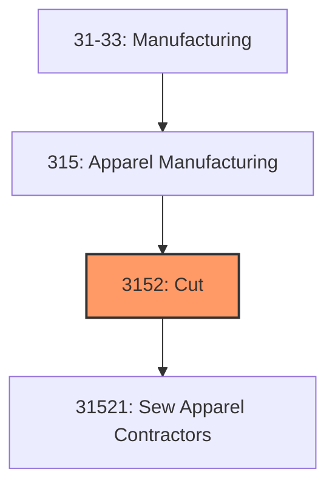
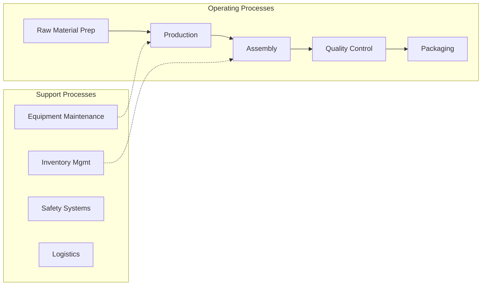

# Cut

> This industry group comprises establishments primarily engaged in manufacturing cut and sew apparel from woven fabric or purchased knit fabric.

## Overview

Cut represents an important category within the U.S. Manufacturing sector (NAICS 31-33). This industry group encompasses establishments primarily engaged in cut.

This industry group comprises establishments primarily engaged in manufacturing cut and sew apparel from woven fabric or purchased knit fabric. Included in this industry group is a diverse range of establishments manufacturing full lines of ready-to-wear apparel and custom apparel: apparel contractors, performing cutting or sewing operations on materials owned by others; jobbers, performing entrepreneurial functions involved in apparel manufacturing; and tailors, manufacturing custom garments for individual clients. Establishments weaving or knitting fabric, without manufacturing apparel, are classified in Subsector 313, Textile Mills.

## Industry Hierarchy

## Key Statistics

| Metric | Value |
|--------|-------|
| NAICS Code | 3152 |
| Level | Industry Group |
| Parent | [Apparel Manufacturing](../) |
| Child Industries | 1 |

## Sub-Industries

| Industry | Code | Description |
|----------|------|-------------|
| [Sew Apparel Contractors](./SewApparelContractors/) | 31521 | See industry description for 315210 |

## Related Occupations

- [Industrial Production Managers](/occupations/Management/IndustrialProductionManagers) - Plan and coordinate production activities
- [First-Line Supervisors of Production Workers](/occupations/Production/FirstLineSupervisorsOfProductionAndOperatingWorkers) - Supervise production floor operations
- [Quality Control Inspectors](/occupations/QualityControlInspectors) - Inspect products for defects and compliance

## Core Business Processes

## Industry Value Chain

## Regulatory Environment

Manufacturing operations in this industry are subject to various federal, state, and local regulations:

- **OSHA Regulations**: Workplace safety standards, machine guarding, hazard communication
- **EPA Requirements**: Air emissions, water discharge, hazardous waste management
- **State/Local Requirements**: Zoning, permits, and local environmental regulations

## Technology & Innovation

The cut industry is experiencing significant technological advancement:

- **Industry 4.0**: Connected manufacturing, IoT sensors, and real-time monitoring
- **Automation & Robotics**: Automated production lines and robotic assembly
- **Data Analytics**: Predictive maintenance, quality analytics, and process optimization
- **Sustainability**: Carbon reduction, circular economy, and green manufacturing
- **Digital Twin**: Virtual replicas for simulation and optimization

---

*Source: NAICS 3152 - Cut*
