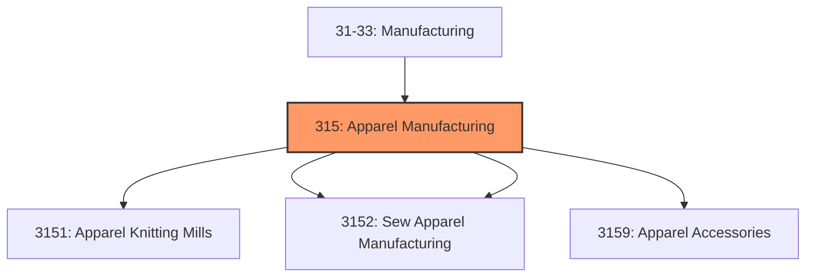
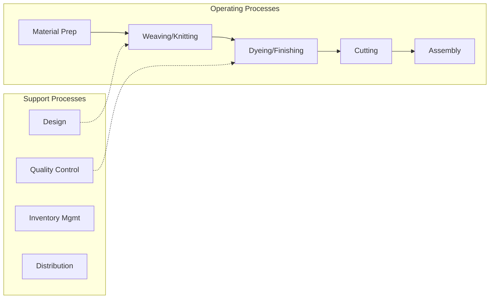

# Apparel Manufacturing

> Industries in the Apparel Manufacturing subsector group establishments with two distinct manufacturing processes: (1) cut and sew (i.

## Overview

Apparel Manufacturing represents an important category within the U.S. Manufacturing sector (NAICS 31-33). This subsector encompasses establishments primarily engaged in apparel manufacturing.

Industries in the Apparel Manufacturing subsector group establishments with two distinct manufacturing processes: (1) cut and sew (i.e., purchasing fabric and cutting and sewing to make a garment) and (2) the manufacture of garments in establishments that first knit fabric and then cut and sew the fabric into a garment. The Apparel Manufacturing subsector includes a diverse range of establishments manufacturing full lines of ready-to-wear apparel and custom apparel: apparel contractors, performing cutting or sewing operations on materials owned by others; jobbers, performing entrepreneurial functions involved in apparel manufacturing; and tailors, manufacturing custom garments for individual clients. Knitting fabric, when done alone, is classified in the Textile Mills subsector, but when knitting is combined with the production of complete garments, the activity is classified in the Apparel Manufacturing subsector.

## Industry Hierarchy

## Key Statistics

| Metric | Value |
|--------|-------|
| NAICS Code | 315 |
| Level | Subsector |
| Child Industries | 4 |

## Sub-Industries

| Industry | Code | Description |
|----------|------|-------------|
| [Apparel Knitting Mills](./ApparelKnittingMills/) | 3151 | Apparel Knitting Mills |
| [Cut](./Cut/) | 3152 | This industry group comprises establishments primarily engaged in manufacturing  |
| [Sew Apparel Manufacturing](./SewApparelManufacturing/) | 3152 | This industry group comprises establishments primarily engaged in manufacturing  |
| [Apparel Accessories](./ApparelAccessories/) | 3159 | Apparel Accessories |

## Related Occupations

- [Industrial Production Managers](/occupations/IndustrialProductionManagers) - Plan and coordinate production activities
- [First-Line Supervisors of Production Workers](/occupations/FirstLineSupervisorsOfProductionAndOperatingWorkers) - Supervise production floor operations
- [Quality Control Inspectors](/occupations/QualityControlInspectors) - Inspect products for defects and compliance

## Core Business Processes

## Industry Value Chain

## Regulatory Environment

Manufacturing operations in this industry are subject to various federal, state, and local regulations:

- **OSHA Regulations**: Workplace safety standards, machine guarding, hazard communication
- **EPA Requirements**: Air emissions, water discharge, hazardous waste management
- **State/Local Requirements**: Zoning, permits, and local environmental regulations

## Technology & Innovation

The apparel manufacturing industry is experiencing significant technological advancement:

- **Industry 4.0**: Connected manufacturing, IoT sensors, and real-time monitoring
- **Automation & Robotics**: Automated production lines and robotic assembly
- **Data Analytics**: Predictive maintenance, quality analytics, and process optimization
- **Sustainability**: Carbon reduction, circular economy, and green manufacturing
- **Digital Twin**: Virtual replicas for simulation and optimization

---

*Source: NAICS 315 - Apparel Manufacturing*
