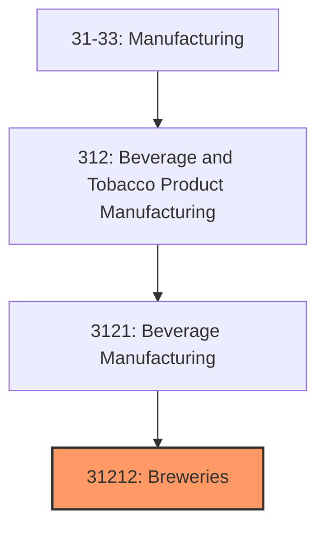
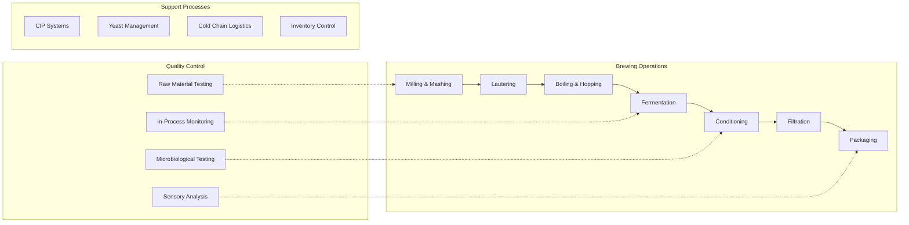

# Breweries

> Establishments primarily engaged in brewing beer, ale, lager, malt beverages, and nonalcoholic beer.

## Overview

The Breweries industry (NAICS 31212) encompasses establishments primarily engaged in brewing beer, ale, malt liquors, and nonalcoholic beer. This industry has experienced remarkable transformation over the past two decades, evolving from a market dominated by a few large producers to one characterized by thousands of craft breweries, microbreweries, and brewpubs operating alongside major brewing companies.

The U.S. brewing industry generates over $100 billion in annual economic impact, with craft breweries accounting for approximately 24% of the beer market by volume and over 40% by revenue. The industry supports over 500,000 jobs directly and indirectly, including brewing, packaging, distribution, and retail operations.

Key industry characteristics include:
- **Production Diversity**: Range from nano-breweries producing under 500 barrels annually to major brewers producing millions of barrels
- **Regional Focus**: Strong emphasis on local and regional distribution, particularly among craft brewers
- **Innovation-Driven**: Constant product innovation with new styles, flavors, and brewing techniques
- **Vertical Integration**: Many breweries operate taprooms, restaurants, and direct-to-consumer sales

## Industry Hierarchy

## Key Statistics

| Metric | Value |
|--------|-------|
| NAICS Code | 31212 |
| Level | Industry |
| Parent | [Beverage Manufacturing](../) |
| Child Industries | 0 |
| U.S. Establishments | ~9,500 |
| Annual Revenue | ~$120 billion |
| Employment | ~75,000 direct |

## Related Occupations

- [Industrial Production Managers](/occupations/Management/IndustrialProductionManagers) - Oversee brewing operations and production schedules
- [First-Line Supervisors of Production Workers](/occupations/Production/FirstLineSupervisorsOfProductionAndOperatingWorkers) - Supervise brewhouse and packaging operations
- [Food Scientists and Technologists](/occupations/Science/FoodScientistsAndTechnologists) - Develop new recipes and ensure product consistency
- [Quality Control Analysts](/occupations/Science/QualityControlAnalysts) - Monitor fermentation and final product quality
- [Food Batchmakers](/occupations/Production/FoodBatchmakers) - Operate brewing equipment and manage fermentation
- [Packaging and Filling Machine Operators](/occupations/Production/PackagingAndFillingMachineOperatorsAndTenders) - Run canning, bottling, and kegging lines
- [Industrial Machinery Mechanics](/occupations/InstallationMaintenanceRepair/IndustrialMachineryMechanics) - Maintain brewing and packaging equipment
- [Sales Representatives](/occupations/Sales/SalesRepresentativesWholesaleAndManufacturing) - Manage distributor and retail accounts

## Core Business Processes

## Industry Value Chain

## Regulatory Environment

The brewing industry operates under extensive federal, state, and local regulations:

### Federal Regulations
- **TTB (Alcohol and Tobacco Tax and Trade Bureau)**: Brewery permits, formula approval, labeling requirements, and excise tax compliance
- **FDA (Food and Drug Administration)**: Food safety standards, ingredient labeling, allergen disclosure
- **OSHA (Occupational Safety and Health Administration)**: Workplace safety including confined space entry, lockout/tagout, and chemical handling
- **EPA (Environmental Protection Agency)**: Wastewater discharge permits, air emissions, and waste management

### State and Local Requirements
- **State Alcohol Control Boards**: Production licenses, distribution permits, and sales regulations
- **Three-Tier System Compliance**: Separation of production, distribution, and retail (varies by state)
- **Local Permits**: Zoning, building codes, and health department inspections
- **Self-Distribution Laws**: Regulations governing direct brewery-to-retailer sales

### Industry Standards
- **HACCP (Hazard Analysis Critical Control Points)**: Food safety management systems
- **SQF (Safe Quality Food) Certification**: Third-party food safety certification
- **Organic Certification**: USDA organic standards for organic beer production

## Technology & Tools

### Brewing Systems
- **Brewhouse Automation**: Programmable Logic Controllers (PLCs), SCADA systems, and recipe management software
- **Fermentation Control**: Temperature-controlled fermenters with automated glycol cooling
- **CIP (Clean-in-Place) Systems**: Automated sanitation systems for tanks and lines
- **Yeast Propagation Systems**: Controlled yeast growth and harvesting equipment

### Quality & Laboratory
- **Spectrophotometers**: Color and clarity measurement
- **Gas Chromatography**: Flavor compound analysis
- **Dissolved Oxygen Meters**: Oxygen level monitoring throughout production
- **Microbiological Testing Equipment**: Rapid detection of contaminants

### Business Operations
- **ERP Systems**: SAP, Oracle, or brewing-specific systems like Ekos, Orchestrated Beer
- **Inventory Management**: Grain, hops, and finished goods tracking
- **Production Scheduling**: Batch planning and tank allocation software
- **Compliance Software**: TTB reporting and excise tax calculation

### Packaging Technology
- **High-Speed Canning Lines**: Modern rotary fillers processing 1,000+ cans per minute
- **Mobile Canning Services**: Contract canning for smaller breweries
- **Kegging Systems**: Automated keg washing, filling, and tracking
- **Date Coding and Traceability**: Lot tracking and freshness dating systems

## Market Trends

### Consumer Preferences
- **Premiumization**: Consumers trading up to craft and premium brands
- **Health and Wellness**: Growth in low-alcohol, low-calorie, and functional beverages
- **Local and Authentic**: Preference for locally-produced craft beers with authentic stories
- **Flavor Innovation**: Demand for unique styles, fruit additions, and barrel-aged products

### Industry Dynamics
- **Consolidation**: Major brewers acquiring successful craft brands
- **Taproom Model**: Breweries deriving significant revenue from on-site sales
- **Contract Brewing**: Growth in alternating proprietorships and contract arrangements
- **Hard Seltzer and RTD**: Breweries diversifying into adjacent categories

### Sustainability Initiatives
- **Water Conservation**: Reducing water-to-beer ratios from 7:1 to under 4:1
- **Renewable Energy**: Solar installations, biogas from wastewater, and green power purchases
- **Spent Grain Utilization**: Partnerships with farmers and food producers
- **Packaging Innovation**: Lightweight cans, recycled content, and plastic-free multipacks

### Technology Adoption
- **Smart Brewing**: IoT sensors for real-time process monitoring and optimization
- **Predictive Analytics**: Machine learning for quality prediction and demand forecasting
- **Direct-to-Consumer**: E-commerce platforms and subscription services
- **Blockchain**: Supply chain traceability for ingredients and finished products

---

*Source: NAICS 31212 - Breweries*
