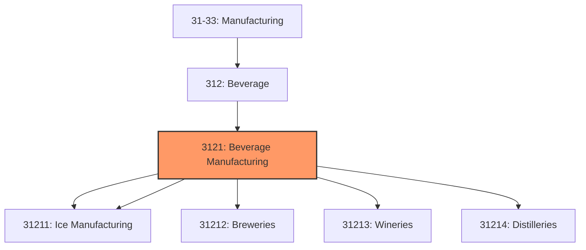
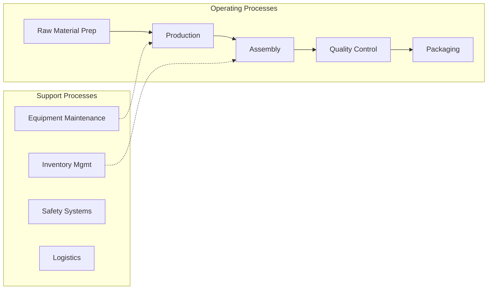

# Beverage Manufacturing

> This industry group comprises establishments primarily engaged in manufacturing soft drinks and ice; purifying and bottling water; and manufacturing brewery, winery, and distillery products.

## Overview

Beverage Manufacturing represents an important category within the U.S. Manufacturing sector (NAICS 31-33). This industry group encompasses establishments primarily engaged in beverage manufacturing.

This industry group comprises establishments primarily engaged in manufacturing soft drinks and ice; purifying and bottling water; and manufacturing brewery, winery, and distillery products.

## Industry Hierarchy

## Key Statistics

| Metric | Value |
|--------|-------|
| NAICS Code | 3121 |
| Level | Industry Group |
| Parent | [Beverage](../) |
| Child Industries | 5 |

## Sub-Industries

| Industry | Code | Description |
|----------|------|-------------|
| [Soft Drink](./SoftDrink/) | 31211 | This industry comprises establishments primarily engaged in one or more of the f |
| [Ice Manufacturing](./IceManufacturing/) | 31211 | This industry comprises establishments primarily engaged in one or more of the f |
| [Breweries](./Breweries/) | 31212 | See industry description for 312120 |
| [Wineries](./Wineries/) | 31213 | See industry description for 312130 |
| [Distilleries](./Distilleries/) | 31214 | See industry description for 312140 |

## Related Occupations

- [Industrial Production Managers](/occupations/IndustrialProductionManagers) - Plan and coordinate production activities
- [First-Line Supervisors of Production Workers](/occupations/FirstLineSupervisorsOfProductionAndOperatingWorkers) - Supervise production floor operations
- [Quality Control Inspectors](/occupations/QualityControlInspectors) - Inspect products for defects and compliance

## Core Business Processes

## Industry Value Chain

## Regulatory Environment

Manufacturing operations in this industry are subject to various federal, state, and local regulations:

- **OSHA Regulations**: Workplace safety standards, machine guarding, hazard communication
- **EPA Requirements**: Air emissions, water discharge, hazardous waste management
- **FDA Regulations**: Food safety (FSMA), labeling requirements, facility registration
- **USDA Inspection**: Meat, poultry, and egg products inspection
- **State Health Departments**: Local food safety requirements
- **State/Local Requirements**: Zoning, permits, and local environmental regulations

## Technology & Innovation

The beverage manufacturing industry is experiencing significant technological advancement:

- **Industry 4.0**: Connected manufacturing, IoT sensors, and real-time monitoring
- **Automation & Robotics**: Automated production lines and robotic assembly
- **Data Analytics**: Predictive maintenance, quality analytics, and process optimization
- **Sustainability**: Carbon reduction, circular economy, and green manufacturing
- **Digital Twin**: Virtual replicas for simulation and optimization

---

*Source: NAICS 3121 - Beverage Manufacturing*
