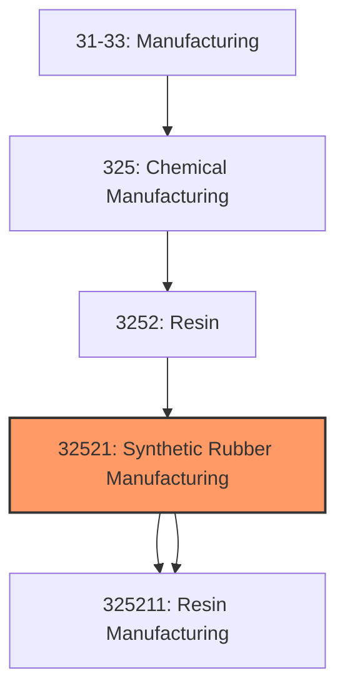
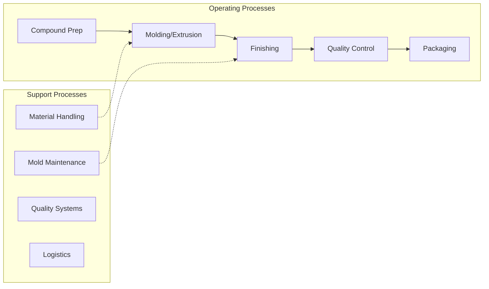

# Synthetic Rubber Manufacturing

> This industry comprises establishments primarily engaged in one or more of the following: (1) manufacturing synthetic resins, plastics materials, and nonvulcanizable elastomers and mixing and blending resins on a custom basis; (2) manufacturing noncustomized synthetic resins; and (3) manufacturing synthetic rubber.

## Overview

Synthetic Rubber Manufacturing represents an important category within the U.S. Manufacturing sector (NAICS 31-33). This industry encompasses establishments primarily engaged in synthetic rubber manufacturing.

This industry comprises establishments primarily engaged in one or more of the following: (1) manufacturing synthetic resins, plastics materials, and nonvulcanizable elastomers and mixing and blending resins on a custom basis; (2) manufacturing noncustomized synthetic resins; and (3) manufacturing synthetic rubber. Cross-References. Establishments primarily engaged in--

## Industry Hierarchy

## Key Statistics

| Metric | Value |
|--------|-------|
| NAICS Code | 32521 |
| Level | Industry |
| Parent | [Resin](../) |
| Child Industries | 2 |

## Sub-Industries

| Industry | Code | Description |
|----------|------|-------------|
| [Plastics Material](./PlasticsMaterial.mdx) | 325211 | This U |
| [Resin Manufacturing](./ResinManufacturing.mdx) | 325211 | This U |

## Related Occupations

- [Industrial Production Managers](/occupations/Management/IndustrialProductionManagers) - Plan and coordinate production activities
- [First-Line Supervisors of Production Workers](/occupations/Production/FirstLineSupervisorsOfProductionAndOperatingWorkers) - Supervise production floor operations
- [Quality Control Inspectors](/occupations/QualityControlInspectors) - Inspect products for defects and compliance

## Core Business Processes

## Industry Value Chain

```mermaid
graph LR
    subgraph Inputs["Inputs"]
        I1["Raw Materials"]
        I2["Components"]
        I3["Equipment"]
    end

    subgraph Primary["Primary Activities"]
        A1["Inbound Logistics"]
        A2["Manufacturing Operations"]
        A3["Quality Assurance"]
        A4["Outbound Logistics"]
    end

    subgraph Outputs["Products"]
        O1["Finished Products"]
        O2["Components"]
        O3["Assemblies"]
    end

    subgraph Customers["Markets"]
        C1["Industrial Buyers"]
        C2["Retailers"]
        C3["Distributors"]
        C4["End Users"]
    end

    Inputs --> Primary --> Outputs --> Customers
```

## Regulatory Environment

Manufacturing operations in this industry are subject to various federal, state, and local regulations:

- **OSHA Regulations**: Workplace safety standards, machine guarding, hazard communication
- **EPA Requirements**: Air emissions, water discharge, hazardous waste management
- **State/Local Requirements**: Zoning, permits, and local environmental regulations

## Technology & Innovation

The synthetic rubber manufacturing industry is experiencing significant technological advancement:

- **Industry 4.0**: Connected manufacturing, IoT sensors, and real-time monitoring
- **Automation & Robotics**: Automated production lines and robotic assembly
- **Data Analytics**: Predictive maintenance, quality analytics, and process optimization
- **Sustainability**: Carbon reduction, circular economy, and green manufacturing
- **Digital Twin**: Virtual replicas for simulation and optimization

---

*Source: NAICS 32521 - Synthetic Rubber Manufacturing*
