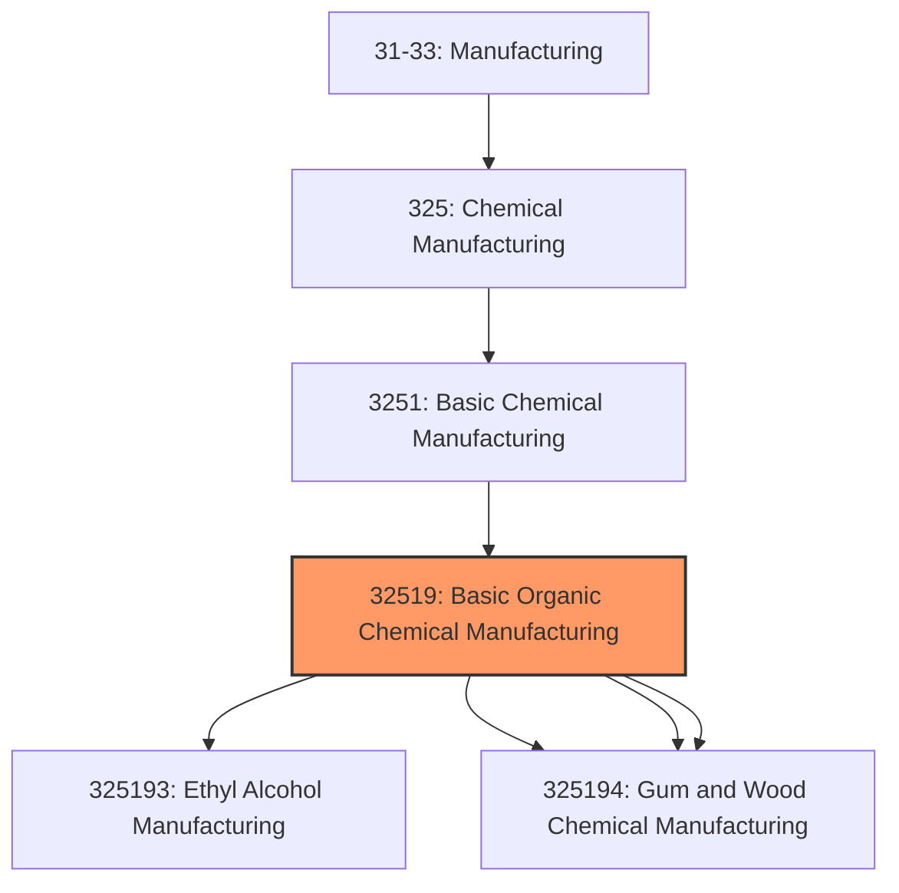
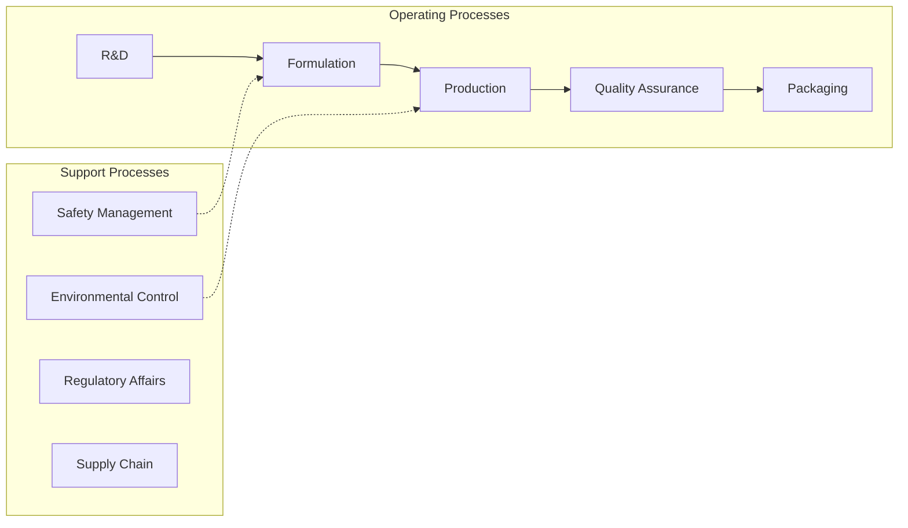

# Basic Organic Chemical Manufacturing

> This industry comprises establishments primarily engaged in manufacturing basic organic chemicals (except petrochemicals, industrial gases, and synthetic dyes and pigments).

## Overview

Basic Organic Chemical Manufacturing represents an important category within the U.S. Manufacturing sector (NAICS 31-33). This industry encompasses establishments primarily engaged in basic organic chemical manufacturing.

This industry comprises establishments primarily engaged in manufacturing basic organic chemicals (except petrochemicals, industrial gases, and synthetic dyes and pigments). Illustrative Examples: Biodiesel fuels not made in petroleum refineries and not blended with petroleum Carbon organic compounds, not specified elsewhere by process, manufacturing Cyclic intermediates made from refined petroleum or natural gas (except aromatic petrochemicals) Enzyme proteins (i.e., basic synthetic chemicals) (except pharmaceutical use) manufacturing Gum and wood chemicals manufacturing Fatty acids (e.g., margaric, oleic, stearic) manufacturing Organo-inorganic compound manufacturing Plasticizers (i.e., basic synthetic chemical) manufacturing Silicone (except resins) manufacturing Synthetic sweeteners (i.e., sweetening agents) manufacturing Cross-References. Establishments primarily engaged in--

## Industry Hierarchy

## Key Statistics

| Metric | Value |
|--------|-------|
| NAICS Code | 32519 |
| Level | Industry |
| Parent | [Basic Chemical Manufacturing](../) |
| Child Industries | 4 |

## Sub-Industries

| Industry | Code | Description |
|----------|------|-------------|
| [Ethyl Alcohol Manufacturing](./EthylAlcoholManufacturing.mdx) | 325193 | This U |
| [Cyclic Crude](./CyclicCrude.mdx) | 325194 | This U |
| [Intermediate](./Intermediate.mdx) | 325194 | This U |
| [Gum and Wood Chemical Manufacturing](./GumAndWoodChemicalManufacturing.mdx) | 325194 | This U |

## Related Occupations

- [Industrial Production Managers](/occupations/Management/IndustrialProductionManagers) - Plan and coordinate production activities
- [First-Line Supervisors of Production Workers](/occupations/Production/FirstLineSupervisorsOfProductionAndOperatingWorkers) - Supervise production floor operations
- [Quality Control Inspectors](/occupations/QualityControlInspectors) - Inspect products for defects and compliance
- [Chemical Engineers](/occupations/Architecture/ChemicalEngineers) - Design and optimize chemical processes
- [Chemical Plant Operators](/occupations/Production/ChemicalPlantAndSystemOperators) - Control chemical process equipment

## Core Business Processes

## Industry Value Chain

```mermaid
graph LR
    subgraph Inputs["Inputs"]
        I1["Raw Chemicals"]
        I2["Active Ingredients"]
        I3["Packaging"]
    end

    subgraph Primary["Primary Activities"]
        A1["Inbound Logistics"]
        A2["Manufacturing Operations"]
        A3["Quality Assurance"]
        A4["Outbound Logistics"]
    end

    subgraph Outputs["Products"]
        O1["Chemical Products"]
        O2["Medicines"]
        O3["Formulations"]
    end

    subgraph Customers["Markets"]
        C1["Healthcare"]
        C2["Industrial Users"]
        C3["Retailers"]
        C4["Research"]
    end

    Inputs --> Primary --> Outputs --> Customers
```

## Regulatory Environment

Manufacturing operations in this industry are subject to various federal, state, and local regulations:

- **OSHA Regulations**: Workplace safety standards, machine guarding, hazard communication
- **EPA Requirements**: Air emissions, water discharge, hazardous waste management
- **TSCA Compliance**: Toxic Substances Control Act requirements
- **RCRA Requirements**: Hazardous waste management
- **DHS CFATS**: Chemical facility anti-terrorism standards
- **State/Local Requirements**: Zoning, permits, and local environmental regulations

## Technology & Innovation

The basic organic chemical manufacturing industry is experiencing significant technological advancement:

- **Industry 4.0**: Connected manufacturing, IoT sensors, and real-time monitoring
- **Automation & Robotics**: Automated production lines and robotic assembly
- **Data Analytics**: Predictive maintenance, quality analytics, and process optimization
- **Continuous Manufacturing**: Flow chemistry and continuous processing
- **AI in Drug Discovery**: Machine learning for compound screening and optimization
- **Sustainability**: Carbon reduction, circular economy, and green manufacturing
- **Digital Twin**: Virtual replicas for simulation and optimization

---

*Source: NAICS 32519 - Basic Organic Chemical Manufacturing*
