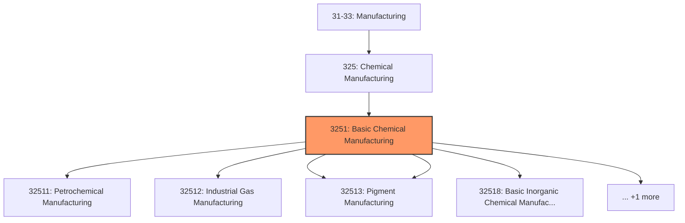
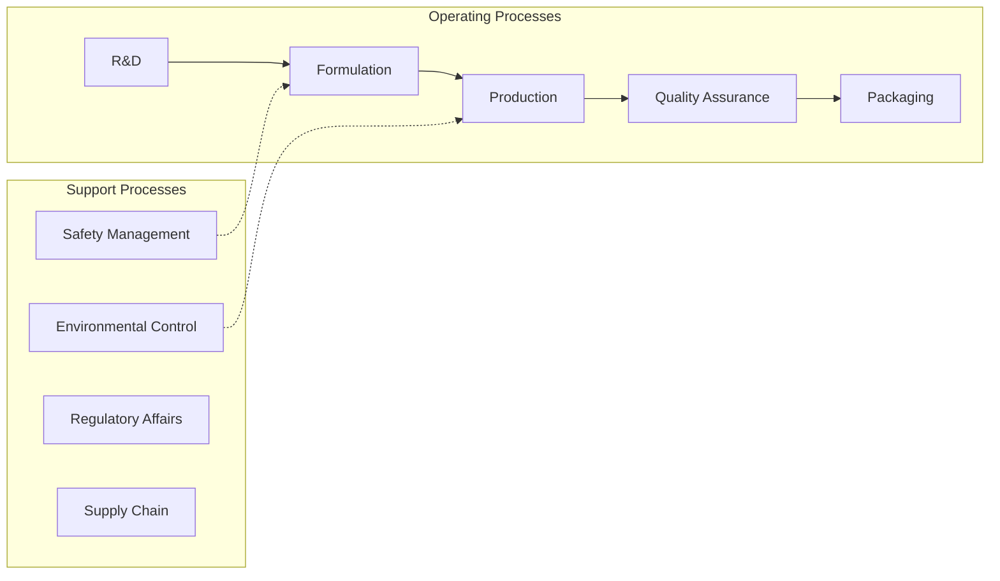

# Basic Chemical Manufacturing

> This industry group comprises establishments primarily engaged in manufacturing chemicals using basic processes, such as thermal cracking and distillation.

## Overview

Basic Chemical Manufacturing represents an important category within the U.S. Manufacturing sector (NAICS 31-33). This industry group encompasses establishments primarily engaged in basic chemical manufacturing.

This industry group comprises establishments primarily engaged in manufacturing chemicals using basic processes, such as thermal cracking and distillation. Chemicals manufactured in this industry group are usually separate chemical elements or separate chemically-defined compounds.

## Industry Hierarchy

## Key Statistics

| Metric | Value |
|--------|-------|
| NAICS Code | 3251 |
| Level | Industry Group |
| Parent | [Chemical Manufacturing](../) |
| Child Industries | 6 |

## Sub-Industries

| Industry | Code | Description |
|----------|------|-------------|
| [Petrochemical Manufacturing](./PetrochemicalManufacturing/) | 32511 | See industry description for 325110 |
| [Industrial Gas Manufacturing](./IndustrialGasManufacturing/) | 32512 | See industry description for 325120 |
| [Synthetic Dye](./SyntheticDye/) | 32513 | See industry description for 325130 |
| [Pigment Manufacturing](./PigmentManufacturing/) | 32513 | See industry description for 325130 |
| [Basic Inorganic Chemical Manufacturing](./BasicInorganicChemicalManufacturing/) | 32518 | See industry description for 325180 |
| [Basic Organic Chemical Manufacturing](./BasicOrganicChemicalManufacturing/) | 32519 | This industry comprises establishments primarily engaged in manufacturing basic  |

## Related Occupations

- [Industrial Production Managers](/occupations/IndustrialProductionManagers) - Plan and coordinate production activities
- [First-Line Supervisors of Production Workers](/occupations/FirstLineSupervisorsOfProductionAndOperatingWorkers) - Supervise production floor operations
- [Quality Control Inspectors](/occupations/QualityControlInspectors) - Inspect products for defects and compliance
- [Chemical Engineers](/occupations/ChemicalEngineers) - Design and optimize chemical processes
- [Chemical Plant Operators](/occupations/ChemicalPlantAndSystemOperators) - Control chemical process equipment

## Core Business Processes

## Industry Value Chain

```mermaid
graph LR
    subgraph Inputs["Inputs"]
        I1["Raw Chemicals"]
        I2["Active Ingredients"]
        I3["Packaging"]
    end

    subgraph Primary["Primary Activities"]
        A1["Inbound Logistics"]
        A2["Manufacturing Operations"]
        A3["Quality Assurance"]
        A4["Outbound Logistics"]
    end

    subgraph Outputs["Products"]
        O1["Chemical Products"]
        O2["Medicines"]
        O3["Formulations"]
    end

    subgraph Customers["Markets"]
        C1["Healthcare"]
        C2["Industrial Users"]
        C3["Retailers"]
        C4["Research"]
    end

    Inputs --> Primary --> Outputs --> Customers
```

## Regulatory Environment

Manufacturing operations in this industry are subject to various federal, state, and local regulations:

- **OSHA Regulations**: Workplace safety standards, machine guarding, hazard communication
- **EPA Requirements**: Air emissions, water discharge, hazardous waste management
- **TSCA Compliance**: Toxic Substances Control Act requirements
- **RCRA Requirements**: Hazardous waste management
- **DHS CFATS**: Chemical facility anti-terrorism standards
- **State/Local Requirements**: Zoning, permits, and local environmental regulations

## Technology & Innovation

The basic chemical manufacturing industry is experiencing significant technological advancement:

- **Industry 4.0**: Connected manufacturing, IoT sensors, and real-time monitoring
- **Automation & Robotics**: Automated production lines and robotic assembly
- **Data Analytics**: Predictive maintenance, quality analytics, and process optimization
- **Continuous Manufacturing**: Flow chemistry and continuous processing
- **AI in Drug Discovery**: Machine learning for compound screening and optimization
- **Sustainability**: Carbon reduction, circular economy, and green manufacturing
- **Digital Twin**: Virtual replicas for simulation and optimization

---

*Source: NAICS 3251 - Basic Chemical Manufacturing*
