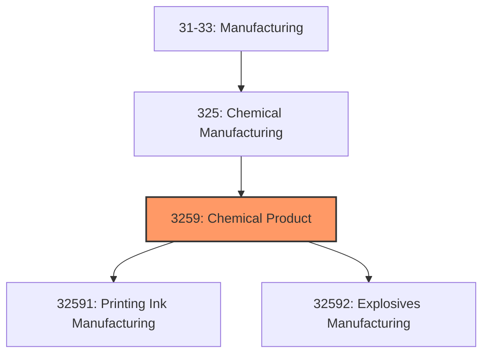
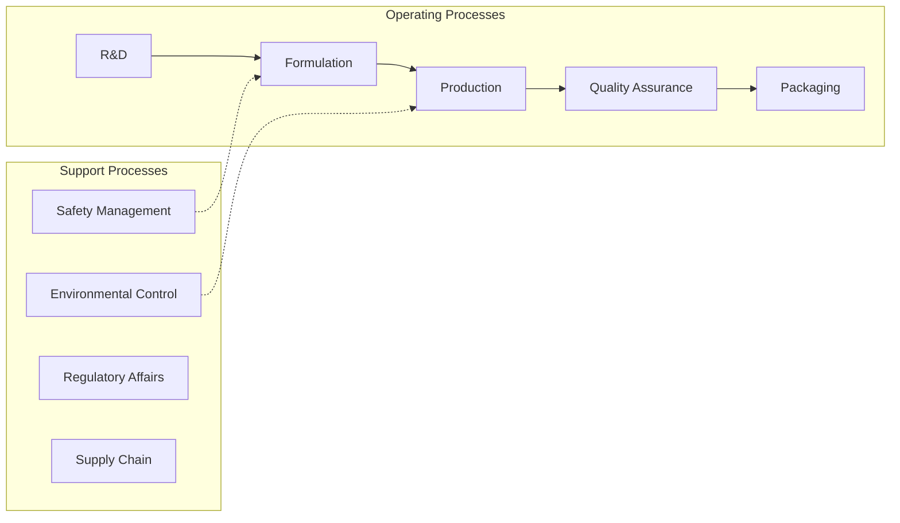

# Chemical Product

> This industry group comprises establishments primarily engaged in manufacturing chemical products (except basic chemicals; resins, synthetic rubber, cellulosic and noncellulosic fibers and filaments; pesticides, fertilizers, and other agricultural chemicals; pharmaceuticals and medicines; paints, coatings, and adhesives; soaps and cleaning compounds; and toilet preparations).

## Overview

Chemical Product represents an important category within the U.S. Manufacturing sector (NAICS 31-33). This industry group encompasses establishments primarily engaged in chemical product.

This industry group comprises establishments primarily engaged in manufacturing chemical products (except basic chemicals; resins, synthetic rubber, cellulosic and noncellulosic fibers and filaments; pesticides, fertilizers, and other agricultural chemicals; pharmaceuticals and medicines; paints, coatings, and adhesives; soaps and cleaning compounds; and toilet preparations).

## Industry Hierarchy

## Key Statistics

| Metric | Value |
|--------|-------|
| NAICS Code | 3259 |
| Level | Industry Group |
| Parent | [Chemical Manufacturing](../) |
| Child Industries | 2 |

## Sub-Industries

| Industry | Code | Description |
|----------|------|-------------|
| [Printing Ink Manufacturing](./PrintingInkManufacturing/) | 32591 | See industry description for 325910 |
| [Explosives Manufacturing](./ExplosivesManufacturing/) | 32592 | See industry description for 325920 |

## Related Occupations

- [Industrial Production Managers](/occupations/Management/IndustrialProductionManagers) - Plan and coordinate production activities
- [First-Line Supervisors of Production Workers](/occupations/Production/FirstLineSupervisorsOfProductionAndOperatingWorkers) - Supervise production floor operations
- [Quality Control Inspectors](/occupations/QualityControlInspectors) - Inspect products for defects and compliance
- [Chemical Engineers](/occupations/Architecture/ChemicalEngineers) - Design and optimize chemical processes
- [Chemical Plant Operators](/occupations/Production/ChemicalPlantAndSystemOperators) - Control chemical process equipment

## Core Business Processes

## Industry Value Chain

```mermaid
graph LR
    subgraph Inputs["Inputs"]
        I1["Raw Chemicals"]
        I2["Active Ingredients"]
        I3["Packaging"]
    end

    subgraph Primary["Primary Activities"]
        A1["Inbound Logistics"]
        A2["Manufacturing Operations"]
        A3["Quality Assurance"]
        A4["Outbound Logistics"]
    end

    subgraph Outputs["Products"]
        O1["Chemical Products"]
        O2["Medicines"]
        O3["Formulations"]
    end

    subgraph Customers["Markets"]
        C1["Healthcare"]
        C2["Industrial Users"]
        C3["Retailers"]
        C4["Research"]
    end

    Inputs --> Primary --> Outputs --> Customers
```

## Regulatory Environment

Manufacturing operations in this industry are subject to various federal, state, and local regulations:

- **OSHA Regulations**: Workplace safety standards, machine guarding, hazard communication
- **EPA Requirements**: Air emissions, water discharge, hazardous waste management
- **TSCA Compliance**: Toxic Substances Control Act requirements
- **RCRA Requirements**: Hazardous waste management
- **DHS CFATS**: Chemical facility anti-terrorism standards
- **State/Local Requirements**: Zoning, permits, and local environmental regulations

## Technology & Innovation

The chemical product industry is experiencing significant technological advancement:

- **Industry 4.0**: Connected manufacturing, IoT sensors, and real-time monitoring
- **Automation & Robotics**: Automated production lines and robotic assembly
- **Data Analytics**: Predictive maintenance, quality analytics, and process optimization
- **Continuous Manufacturing**: Flow chemistry and continuous processing
- **AI in Drug Discovery**: Machine learning for compound screening and optimization
- **Sustainability**: Carbon reduction, circular economy, and green manufacturing
- **Digital Twin**: Virtual replicas for simulation and optimization

---

*Source: NAICS 3259 - Chemical Product*
