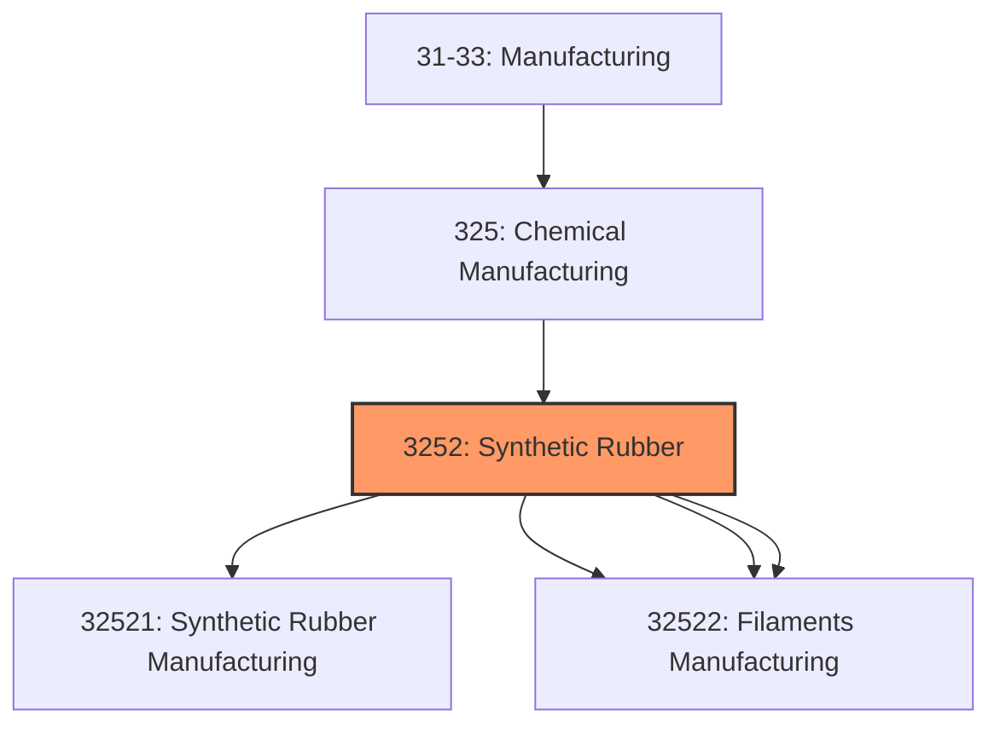
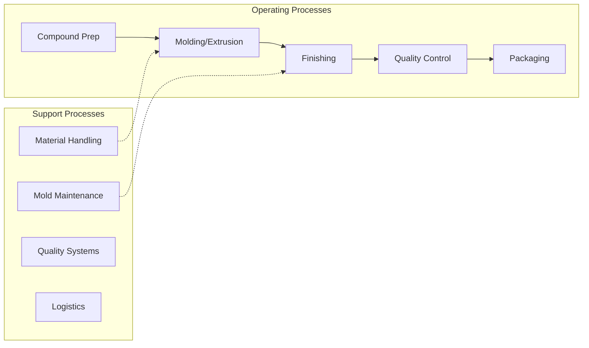

# Synthetic Rubber

> This industry group comprises establishments primarily engaged in one of the following: (1) manufacturing synthetic resins, plastics materials, and nonvulcanizable elastomers and mixing and blending resins on a custom basis; (2) manufacturing noncustomized synthetic resins; (3) manufacturing synthetic rubber; (4) manufacturing cellulosic (e.

## Overview

Synthetic Rubber represents an important category within the U.S. Manufacturing sector (NAICS 31-33). This industry group encompasses establishments primarily engaged in synthetic rubber.

This industry group comprises establishments primarily engaged in one of the following: (1) manufacturing synthetic resins, plastics materials, and nonvulcanizable elastomers and mixing and blending resins on a custom basis; (2) manufacturing noncustomized synthetic resins; (3) manufacturing synthetic rubber; (4) manufacturing cellulosic (e.g., rayon, acetate) and noncellulosic (e.g., nylon, polyolefin, polyester) fibers and filaments in the form of monofilament, filament yarn, staple, or tow; or (5) manufacturing and texturizing cellulosic and noncellulosic fibers and filaments.

## Industry Hierarchy

## Key Statistics

| Metric | Value |
|--------|-------|
| NAICS Code | 3252 |
| Level | Industry Group |
| Parent | [Chemical Manufacturing](../) |
| Child Industries | 4 |

## Sub-Industries

| Industry | Code | Description |
|----------|------|-------------|
| [Synthetic Rubber Manufacturing](./SyntheticRubberManufacturing/) | 32521 | This industry comprises establishments primarily engaged in one or more of the f |
| [Artificial](./Artificial/) | 32522 | See industry description for 325220 |
| [Synthetic Fibers](./SyntheticFibers/) | 32522 | See industry description for 325220 |
| [Filaments Manufacturing](./FilamentsManufacturing/) | 32522 | See industry description for 325220 |

## Related Occupations

- [Industrial Production Managers](/occupations/Management/IndustrialProductionManagers) - Plan and coordinate production activities
- [First-Line Supervisors of Production Workers](/occupations/Production/FirstLineSupervisorsOfProductionAndOperatingWorkers) - Supervise production floor operations
- [Quality Control Inspectors](/occupations/QualityControlInspectors) - Inspect products for defects and compliance

## Core Business Processes

## Industry Value Chain

```mermaid
graph LR
    subgraph Inputs["Inputs"]
        I1["Raw Materials"]
        I2["Components"]
        I3["Equipment"]
    end

    subgraph Primary["Primary Activities"]
        A1["Inbound Logistics"]
        A2["Manufacturing Operations"]
        A3["Quality Assurance"]
        A4["Outbound Logistics"]
    end

    subgraph Outputs["Products"]
        O1["Finished Products"]
        O2["Components"]
        O3["Assemblies"]
    end

    subgraph Customers["Markets"]
        C1["Industrial Buyers"]
        C2["Retailers"]
        C3["Distributors"]
        C4["End Users"]
    end

    Inputs --> Primary --> Outputs --> Customers
```

## Regulatory Environment

Manufacturing operations in this industry are subject to various federal, state, and local regulations:

- **OSHA Regulations**: Workplace safety standards, machine guarding, hazard communication
- **EPA Requirements**: Air emissions, water discharge, hazardous waste management
- **State/Local Requirements**: Zoning, permits, and local environmental regulations

## Technology & Innovation

The synthetic rubber industry is experiencing significant technological advancement:

- **Industry 4.0**: Connected manufacturing, IoT sensors, and real-time monitoring
- **Automation & Robotics**: Automated production lines and robotic assembly
- **Data Analytics**: Predictive maintenance, quality analytics, and process optimization
- **Sustainability**: Carbon reduction, circular economy, and green manufacturing
- **Digital Twin**: Virtual replicas for simulation and optimization

---

*Source: NAICS 3252 - Synthetic Rubber*
