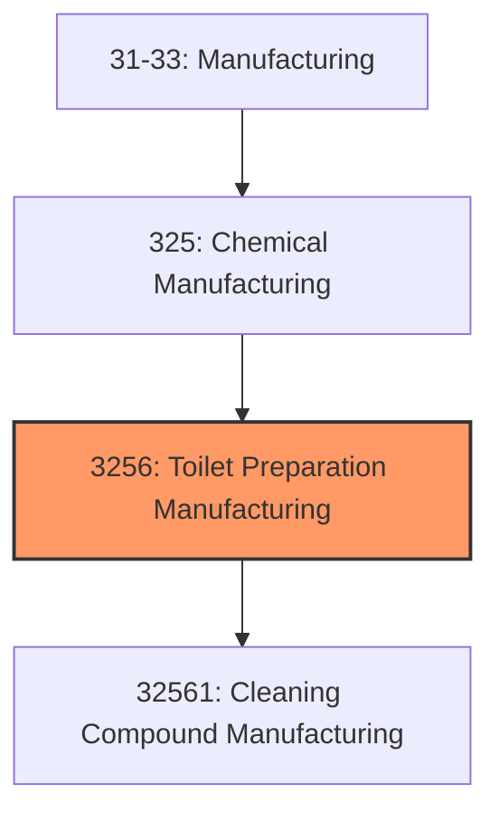
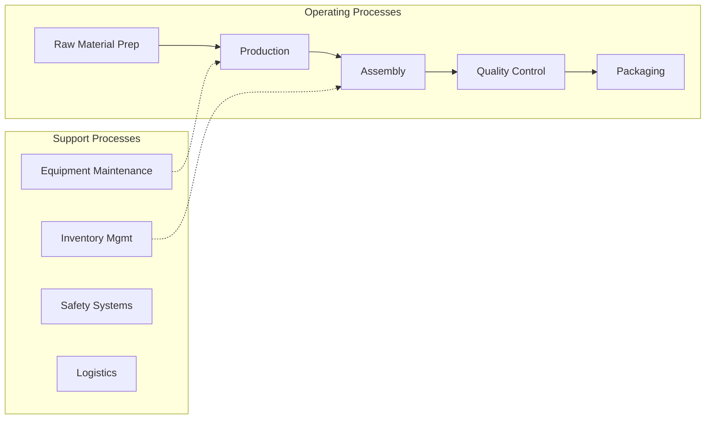

# Toilet Preparation Manufacturing

> This industry group comprises establishments primarily engaged in (1) manufacturing and packaging soaps, detergents, polishes, surface active agents, textile and leather finishing agents, and other sanitation goods or (2) preparing, blending, compounding, and packaging toilet preparations.

## Overview

Toilet Preparation Manufacturing represents an important category within the U.S. Manufacturing sector (NAICS 31-33). This industry group encompasses establishments primarily engaged in toilet preparation manufacturing.

This industry group comprises establishments primarily engaged in (1) manufacturing and packaging soaps, detergents, polishes, surface active agents, textile and leather finishing agents, and other sanitation goods or (2) preparing, blending, compounding, and packaging toilet preparations.

## Industry Hierarchy

## Key Statistics

| Metric | Value |
|--------|-------|
| NAICS Code | 3256 |
| Level | Industry Group |
| Parent | [Chemical Manufacturing](../) |
| Child Industries | 1 |

## Sub-Industries

| Industry | Code | Description |
|----------|------|-------------|
| [Cleaning Compound Manufacturing](./CleaningCompoundManufacturing/) | 32561 | This industry comprises establishments primarily engaged in manufacturing and pa |

## Related Occupations

- [Industrial Production Managers](/occupations/IndustrialProductionManagers) - Plan and coordinate production activities
- [First-Line Supervisors of Production Workers](/occupations/FirstLineSupervisorsOfProductionAndOperatingWorkers) - Supervise production floor operations
- [Quality Control Inspectors](/occupations/QualityControlInspectors) - Inspect products for defects and compliance

## Core Business Processes

## Industry Value Chain

## Regulatory Environment

Manufacturing operations in this industry are subject to various federal, state, and local regulations:

- **OSHA Regulations**: Workplace safety standards, machine guarding, hazard communication
- **EPA Requirements**: Air emissions, water discharge, hazardous waste management
- **State/Local Requirements**: Zoning, permits, and local environmental regulations

## Technology & Innovation

The toilet preparation manufacturing industry is experiencing significant technological advancement:

- **Industry 4.0**: Connected manufacturing, IoT sensors, and real-time monitoring
- **Automation & Robotics**: Automated production lines and robotic assembly
- **Data Analytics**: Predictive maintenance, quality analytics, and process optimization
- **Sustainability**: Carbon reduction, circular economy, and green manufacturing
- **Digital Twin**: Virtual replicas for simulation and optimization

---

*Source: NAICS 3256 - Toilet Preparation Manufacturing*
