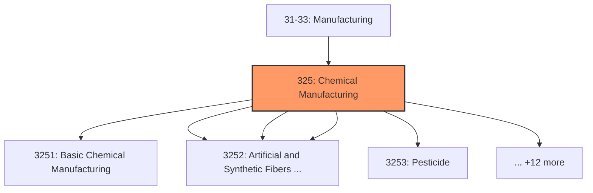
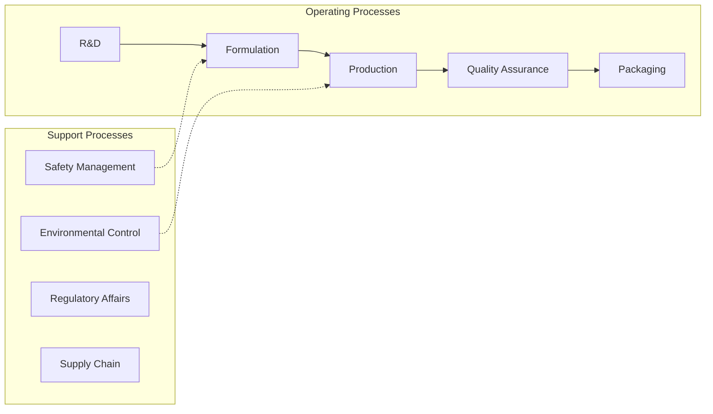

# Chemical Manufacturing

> The Chemical Manufacturing subsector is based on the transformation of organic and inorganic raw materials by a chemical process and the formulation of products.

## Overview

Chemical Manufacturing represents an important category within the U.S. Manufacturing sector (NAICS 31-33). This subsector encompasses establishments primarily engaged in chemical manufacturing.

The Chemical Manufacturing subsector is based on the transformation of organic and inorganic raw materials by a chemical process and the formulation of products. This subsector distinguishes the production of basic chemicals that comprise the first industry group from the production of intermediate and end products produced by further processing of basic chemicals that make up the remaining industry groups. This subsector does not include all industries transforming raw materials by a chemical process. It is common for some chemical processing to occur during mining operations. These beneficiating operations, such as copper concentrating, are classified in Sector 21, Mining, Quarrying, and Oil and Gas Extraction. Furthermore, the refining of crude petroleum is included in Subsector 324, Petroleum and Coal Products Manufacturing. In addition, the manufacturing of aluminum oxide is included in Subsector 331, Primary Metal Manufacturing; and beverage distilleries are classified in Subsector 312, Beverage and Tobacco Product Manufacturing. As is the case of these two activities, the grouping of industries into subsectors may take into account the association of the activities performed with other activities in the subsector.

## Industry Hierarchy

## Key Statistics

| Metric | Value |
|--------|-------|
| NAICS Code | 325 |
| Level | Subsector |
| Child Industries | 17 |

## Sub-Industries

| Industry | Code | Description |
|----------|------|-------------|
| [Basic Chemical Manufacturing](./BasicChemicalManufacturing/) | 3251 | This industry group comprises establishments primarily engaged in manufacturing  |
| [Resin](./Resin/) | 3252 | This industry group comprises establishments primarily engaged in one of the fol |
| [Synthetic Rubber](./SyntheticRubber/) | 3252 | This industry group comprises establishments primarily engaged in one of the fol |
| [Artificial and Synthetic Fibers and Filaments Manufacturing](./ArtificialAndSyntheticFibersAndFilamentsManufacturing/) | 3252 | This industry group comprises establishments primarily engaged in one of the fol |
| [Pesticide](./Pesticide/) | 3253 | This industry group comprises establishments primarily engaged in one or more of |
| [Fertilizer](./Fertilizer/) | 3253 | This industry group comprises establishments primarily engaged in one or more of |
| [Agricultural Chemical Manufacturing](./AgriculturalChemicalManufacturing/) | 3253 | This industry group comprises establishments primarily engaged in one or more of |
| [Pharmaceutical](./Pharmaceutical/) | 3254 | Pharmaceutical |
| [Medicine Manufacturing](./MedicineManufacturing/) | 3254 | Medicine Manufacturing |
| [Paint](./Paint/) | 3255 | This industry group comprises establishments primarily engaged in one or more of |
| [Coating](./Coating/) | 3255 | This industry group comprises establishments primarily engaged in one or more of |
| [Adhesive Manufacturing](./AdhesiveManufacturing/) | 3255 | This industry group comprises establishments primarily engaged in one or more of |
| [Soap](./Soap/) | 3256 | This industry group comprises establishments primarily engaged in (1) manufactur |
| [Cleaning Compound](./CleaningCompound/) | 3256 | This industry group comprises establishments primarily engaged in (1) manufactur |
| [Toilet Preparation Manufacturing](./ToiletPreparationManufacturing/) | 3256 | This industry group comprises establishments primarily engaged in (1) manufactur |
| [Chemical Product](./ChemicalProduct/) | 3259 | This industry group comprises establishments primarily engaged in manufacturing  |
| [Preparation Manufacturing](./PreparationManufacturing/) | 3259 | This industry group comprises establishments primarily engaged in manufacturing  |

## Related Occupations

- [Industrial Production Managers](/occupations/IndustrialProductionManagers) - Plan and coordinate production activities
- [First-Line Supervisors of Production Workers](/occupations/FirstLineSupervisorsOfProductionAndOperatingWorkers) - Supervise production floor operations
- [Quality Control Inspectors](/occupations/QualityControlInspectors) - Inspect products for defects and compliance
- [Chemical Engineers](/occupations/ChemicalEngineers) - Design and optimize chemical processes
- [Chemical Plant Operators](/occupations/ChemicalPlantAndSystemOperators) - Control chemical process equipment

## Core Business Processes

## Industry Value Chain

```mermaid
graph LR
    subgraph Inputs["Inputs"]
        I1["Raw Chemicals"]
        I2["Active Ingredients"]
        I3["Packaging"]
    end

    subgraph Primary["Primary Activities"]
        A1["Inbound Logistics"]
        A2["Manufacturing Operations"]
        A3["Quality Assurance"]
        A4["Outbound Logistics"]
    end

    subgraph Outputs["Products"]
        O1["Chemical Products"]
        O2["Medicines"]
        O3["Formulations"]
    end

    subgraph Customers["Markets"]
        C1["Healthcare"]
        C2["Industrial Users"]
        C3["Retailers"]
        C4["Research"]
    end

    Inputs --> Primary --> Outputs --> Customers
```

## Regulatory Environment

Manufacturing operations in this industry are subject to various federal, state, and local regulations:

- **OSHA Regulations**: Workplace safety standards, machine guarding, hazard communication
- **EPA Requirements**: Air emissions, water discharge, hazardous waste management
- **TSCA Compliance**: Toxic Substances Control Act requirements
- **RCRA Requirements**: Hazardous waste management
- **DHS CFATS**: Chemical facility anti-terrorism standards
- **State/Local Requirements**: Zoning, permits, and local environmental regulations

## Technology & Innovation

The chemical manufacturing industry is experiencing significant technological advancement:

- **Industry 4.0**: Connected manufacturing, IoT sensors, and real-time monitoring
- **Automation & Robotics**: Automated production lines and robotic assembly
- **Data Analytics**: Predictive maintenance, quality analytics, and process optimization
- **Continuous Manufacturing**: Flow chemistry and continuous processing
- **AI in Drug Discovery**: Machine learning for compound screening and optimization
- **Sustainability**: Carbon reduction, circular economy, and green manufacturing
- **Digital Twin**: Virtual replicas for simulation and optimization

---

*Source: NAICS 325 - Chemical Manufacturing*
