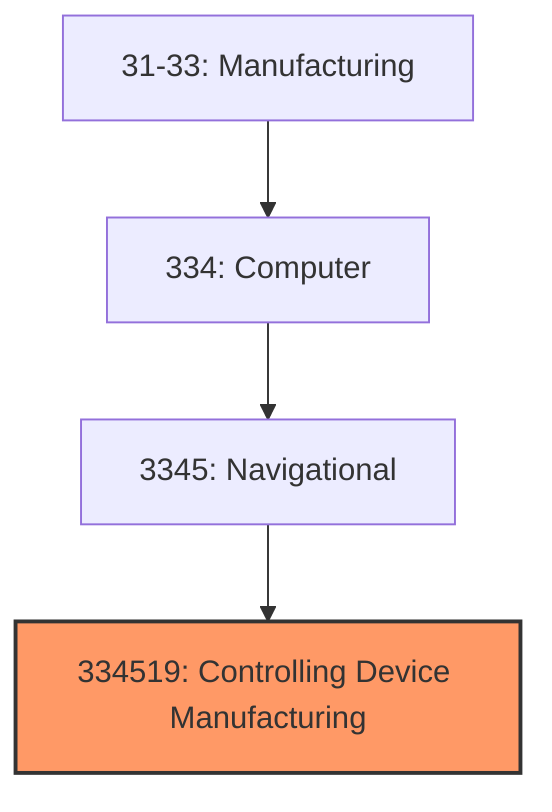
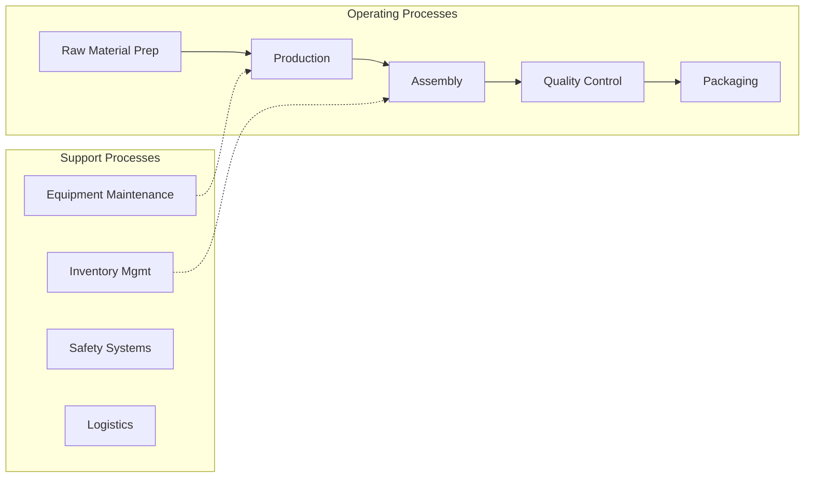

# Controlling Device Manufacturing

> This U.

## Overview

Controlling Device Manufacturing represents a specialized segment within the Manufacturing sector (NAICS 31-33).

This U.S. industry comprises establishments primarily engaged in manufacturing measuring and controlling devices (except search, detection, navigation, guidance, aeronautical, and nautical instruments and systems; automatic environmental controls for residential, commercial, and appliance use; instruments for measurement, display, and control of industrial process variables; totalizing fluid meters and counting devices; instruments for measuring and testing electricity and electrical signals; analytical laboratory instruments; irradiation equipment; and electromedical and electrotherapeutic apparatus). Illustrative Examples: Aircraft engine instruments manufacturing Automotive emissions testing equipment manufacturing Clocks assembling Meteorological instruments manufacturing Physical properties testing and inspection equipment manufacturing Polygraph machines manufacturing Radiation detection and monitoring instruments manufacturing Surveying instruments manufacturing Thermometers, liquid-in-glass and bimetal types (except medical), manufacturing Watches (except smartwatches) and parts (except crystals) manufacturing Cross-References. Establishments primarily engaged in--

## Industry Hierarchy

## Key Statistics

| Metric | Value |
|--------|-------|
| NAICS Code | 334519 |
| Level | National Industry |
| Child Industries | 0 |

## Related Occupations

See the [occupations directory](/occupations) for roles commonly found in this industry.

## Core Business Processes

## Industry Value Chain

## Market Context

Manufacturing transforms raw materials into finished goods, with Industry 4.0 driving automation, digitalization, and smart factory implementations.

| Aspect | Details |
|--------|---------|
| Industry Sector | Manufacturing |
| NAICS/SIC Code | 334519 |
| Market Segment | Controlling Device Manufacturing |

## Key Business Processes

- Production planning
- Manufacturing operations
- Quality assurance
- Inventory management
- Distribution and logistics

## Common Occupations

- [Industrial Production Managers](/occupations/Management/IndustrialProductionManagers)
- [Production Workers](/occupations/Production/ProductionWorkers)
- [Quality Control Inspectors](/occupations/Production/QualityControlInspectors)
- [Industrial Engineers](/occupations/Engineering/IndustrialEngineers)

## Regulations and Standards

- OSHA Manufacturing Standards
- EPA Environmental Regulations
- FDA regulations (where applicable)
- ISO quality standards
- Industry-specific certifications

## Technology and Tools

- Industrial automation and robotics
- Enterprise Resource Planning (ERP)
- Quality management systems
- Predictive maintenance
- IoT and smart manufacturing

## Industry Trends

- Digital transformation and automation adoption
- Sustainability and environmental compliance focus
- Workforce development and skills training
- Supply chain resilience and optimization
- Customer experience enhancement

---

*Source: NAICS 334519 - Controlling Device Manufacturing*
