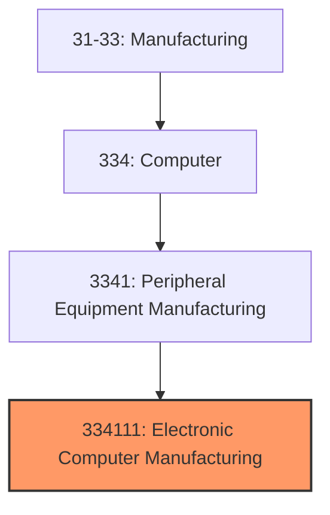
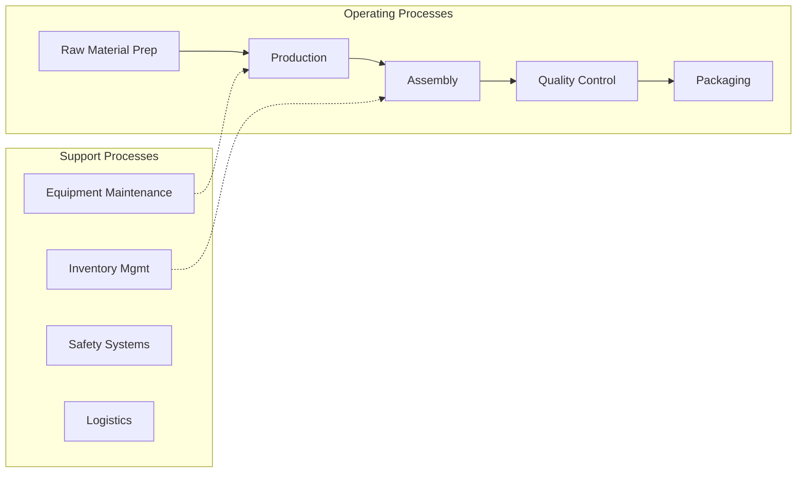

# Electronic Computer Manufacturing

> This U.

## Overview

Electronic Computer Manufacturing represents a specialized segment within the Manufacturing sector (NAICS 31-33).

This U.S. industry comprises establishments primarily engaged in manufacturing and/or assembling electronic computers, such as mainframes, personal computers, workstations, laptops, and computer servers. Computers can be analog, digital, or hybrid. Digital computers, the most common type, are devices that do all of the following: (1) store the processing program or programs and the data immediately necessary for the execution of the program; (2) can be freely programmed in accordance with the requirements of the user; (3) perform arithmetical computations specified by the user; and (4) execute, without human intervention, a processing program that requires the computer to modify its execution by logical decision during the processing run. Analog computers are capable of simulating mathematical models and contain at least analog, control, and programming elements. The manufacture of computers includes the assembly or integration of processors, coprocessors, memory, storage, and input/output devices into a user-programmable final product. Cross-References. Establishments primarily engaged in--

## Industry Hierarchy

## Key Statistics

| Metric | Value |
|--------|-------|
| NAICS Code | 334111 |
| Level | National Industry |
| Child Industries | 0 |

## Related Occupations

See the [occupations directory](/occupations) for roles commonly found in this industry.

## Core Business Processes

## Industry Value Chain

---

*Source: NAICS 334111 - Electronic Computer Manufacturing*
