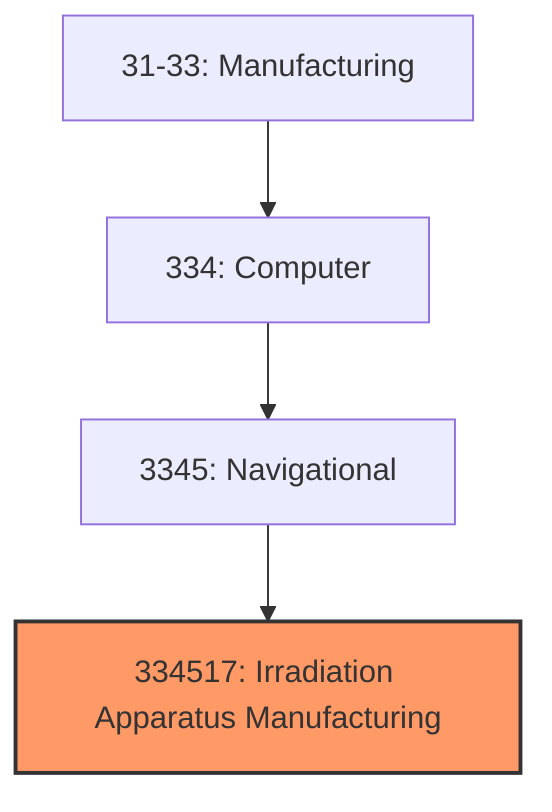
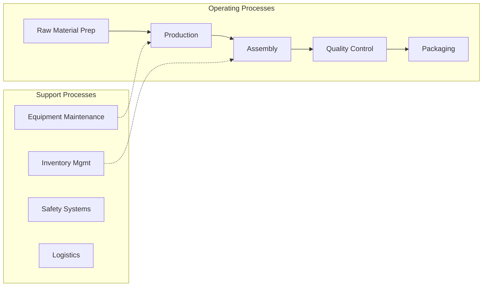

# Irradiation Apparatus Manufacturing

> This U.

## Overview

Irradiation Apparatus Manufacturing represents a specialized segment within the Manufacturing sector (NAICS 31-33).

This U.S. industry comprises establishments primarily engaged in manufacturing irradiation apparatus and tubes for applications, such as medical diagnostic, medical therapeutic, industrial, research, and scientific evaluation. Irradiation can take the form of beta-rays, gamma-rays, X-rays, or other ionizing radiation.

## Industry Hierarchy

## Key Statistics

| Metric | Value |
|--------|-------|
| NAICS Code | 334517 |
| Level | National Industry |
| Child Industries | 0 |

## Related Occupations

See the [occupations directory](/occupations) for roles commonly found in this industry.

## Core Business Processes

## Industry Value Chain

```mermaid
graph LR
    subgraph Inputs["Inputs"]
        I1["Raw Materials"]
        I2["Components"]
        I3["Equipment"]
    end

    subgraph Primary["Primary Activities"]
        A1["Inbound Logistics"]
        A2["Core Operations"]
        A3["Quality Assurance"]
        A4["Outbound/Delivery"]
    end

    subgraph Outputs["Products/Services"]
        O1["Finished Products"]
        O2["Components"]
        O3["Assemblies"]
    end

    subgraph Customers["Markets"]
        C1["Industrial Buyers"]
        C2["Retailers"]
        C3["Distributors"]
        C4["End Users"]
    end

    Inputs --> Primary --> Outputs --> Customers
```

---

*Source: NAICS 334517 - Irradiation Apparatus Manufacturing*
