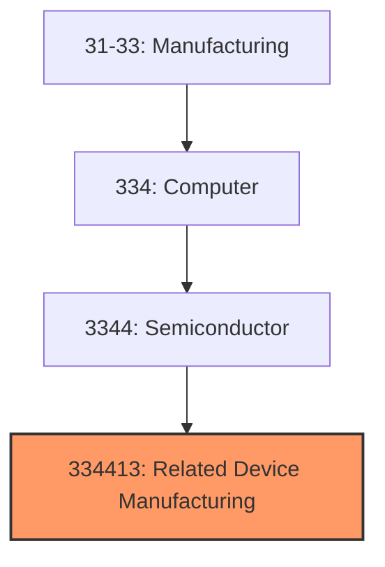
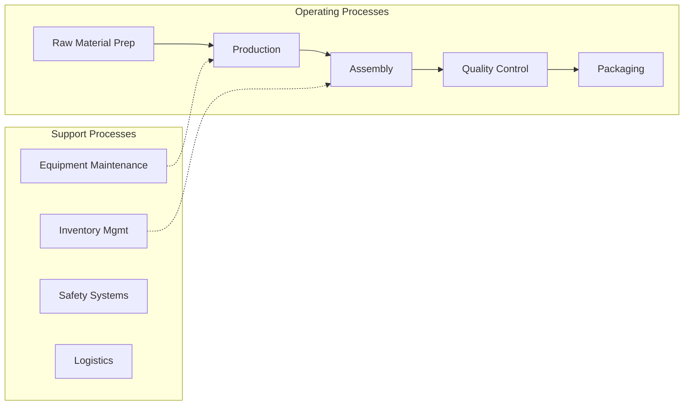

# Related Device Manufacturing

> This U.

## Overview

Related Device Manufacturing represents a specialized segment within the Manufacturing sector (NAICS 31-33).

This U.S. industry comprises establishments primarily engaged in manufacturing semiconductors and related solid-state devices. Examples of products made by these establishments are integrated circuits, memory chips, microprocessors, diodes, transistors, solar cells, and other optoelectronic devices.

## Industry Hierarchy

## Key Statistics

| Metric | Value |
|--------|-------|
| NAICS Code | 334413 |
| Level | National Industry |
| Child Industries | 0 |

## Related Occupations

See the [occupations directory](/occupations) for roles commonly found in this industry.

## Core Business Processes

## Industry Value Chain

```mermaid
graph LR
    subgraph Inputs["Inputs"]
        I1["Raw Materials"]
        I2["Components"]
        I3["Equipment"]
    end

    subgraph Primary["Primary Activities"]
        A1["Inbound Logistics"]
        A2["Core Operations"]
        A3["Quality Assurance"]
        A4["Outbound/Delivery"]
    end

    subgraph Outputs["Products/Services"]
        O1["Finished Products"]
        O2["Components"]
        O3["Assemblies"]
    end

    subgraph Customers["Markets"]
        C1["Industrial Buyers"]
        C2["Retailers"]
        C3["Distributors"]
        C4["End Users"]
    end

    Inputs --> Primary --> Outputs --> Customers
```

---

*Source: NAICS 334413 - Related Device Manufacturing*
