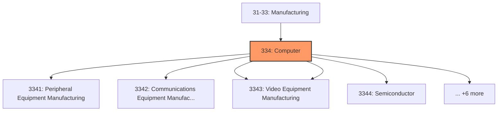
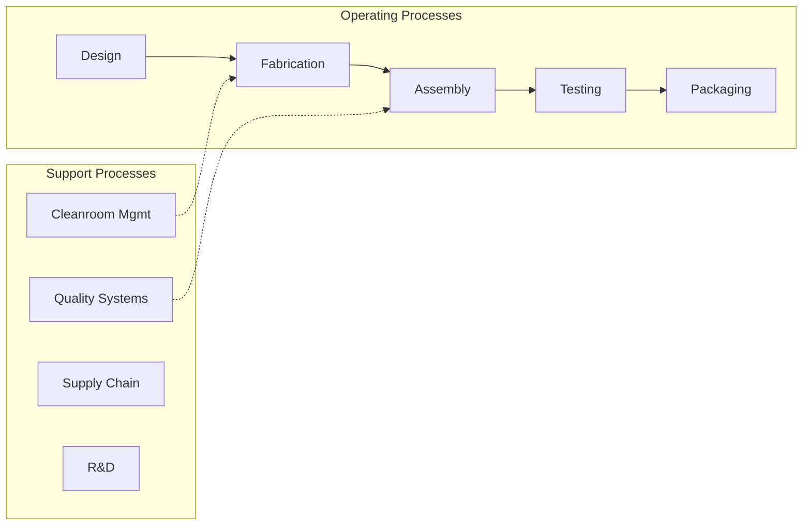

# Computer

> Industries in the Computer and Electronic Product Manufacturing subsector group establishments that manufacture computers, computer peripherals, communications equipment, and similar electronic products, and establishments that manufacture components for such products.

## Overview

Computer represents an important category within the U.S. Manufacturing sector (NAICS 31-33). This subsector encompasses establishments primarily engaged in computer.

Industries in the Computer and Electronic Product Manufacturing subsector group establishments that manufacture computers, computer peripherals, communications equipment, and similar electronic products, and establishments that manufacture components for such products. The Computer and Electronic Product Manufacturing industries are combined in the hierarchy of NAICS because of their economic significance to the economies of all three North American countries. For industries in this subsector, the manufacturing processes are fundamentally different from the manufacturing processes of other machinery and equipment. The design and use of integrated circuits and the application of highly specialized miniaturization technologies are common elements in the production technologies of the Computer and Electronic Product Manufacturing subsector.

## Industry Hierarchy

## Key Statistics

| Metric | Value |
|--------|-------|
| NAICS Code | 334 |
| Level | Subsector |
| Child Industries | 11 |

## Sub-Industries

| Industry | Code | Description |
|----------|------|-------------|
| [Peripheral Equipment Manufacturing](./PeripheralEquipmentManufacturing/) | 3341 | Peripheral Equipment Manufacturing |
| [Communications Equipment Manufacturing](./CommunicationsEquipmentManufacturing/) | 3342 | This industry group comprises establishments primarily engaged in manufacturing  |
| [Audio](./Audio/) | 3343 | Audio |
| [Video Equipment Manufacturing](./VideoEquipmentManufacturing/) | 3343 | Video Equipment Manufacturing |
| [Semiconductor](./Semiconductor/) | 3344 | Semiconductor |
| [Electronic Component Manufacturing](./ElectronicComponentManufacturing/) | 3344 | Electronic Component Manufacturing |
| [Navigational](./Navigational/) | 3345 | Navigational |
| [Electromedical](./Electromedical/) | 3345 | Electromedical |
| [Control Instruments Manufacturing](./ControlInstrumentsManufacturing/) | 3345 | Control Instruments Manufacturing |
| [Reproducing Magnetic](./ReproducingMagnetic/) | 3346 | Reproducing Magnetic |
| [Optical Media](./OpticalMedia/) | 3346 | Optical Media |

## Related Occupations

- [Industrial Production Managers](/occupations/Management/IndustrialProductionManagers) - Plan and coordinate production activities
- [First-Line Supervisors of Production Workers](/occupations/Production/FirstLineSupervisorsOfProductionAndOperatingWorkers) - Supervise production floor operations
- [Quality Control Inspectors](/occupations/QualityControlInspectors) - Inspect products for defects and compliance
- [Electrical and Electronics Engineers](/occupations/ElectricalAndElectronicsEngineers) - Design electronic systems
- [Semiconductor Processing Technicians](/occupations/Production/SemiconductorProcessingTechnicians) - Operate semiconductor equipment

## Core Business Processes

## Industry Value Chain

## Regulatory Environment

Manufacturing operations in this industry are subject to various federal, state, and local regulations:

- **OSHA Regulations**: Workplace safety standards, machine guarding, hazard communication
- **EPA Requirements**: Air emissions, water discharge, hazardous waste management
- **State/Local Requirements**: Zoning, permits, and local environmental regulations

## Technology & Innovation

The computer industry is experiencing significant technological advancement:

- **Industry 4.0**: Connected manufacturing, IoT sensors, and real-time monitoring
- **Automation & Robotics**: Automated production lines and robotic assembly
- **Data Analytics**: Predictive maintenance, quality analytics, and process optimization
- **Sustainability**: Carbon reduction, circular economy, and green manufacturing
- **Digital Twin**: Virtual replicas for simulation and optimization

---

*Source: NAICS 334 - Computer*
