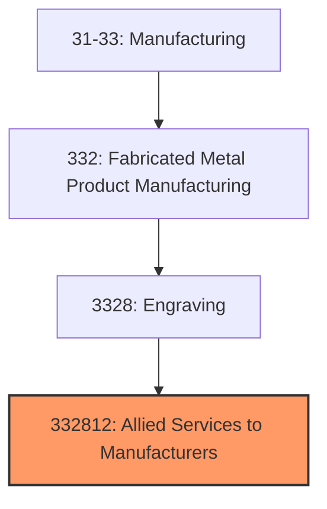
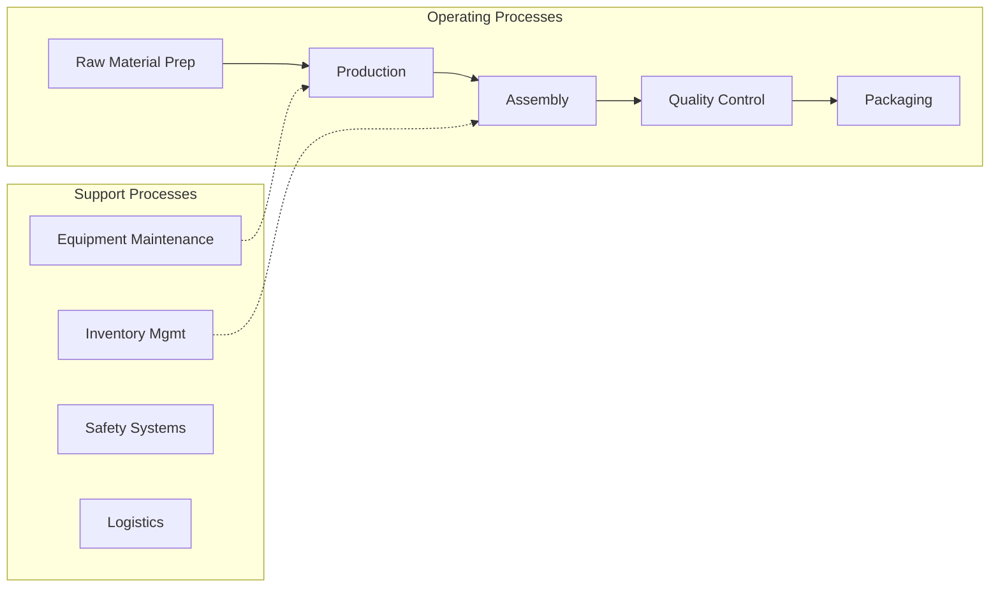

# Allied Services to Manufacturers

> This U.

## Overview

Allied Services to Manufacturers represents a specialized segment within the Manufacturing sector (NAICS 31-33).

This U.S. industry comprises establishments primarily engaged in one or more of the following: (1) enameling, lacquering, and varnishing metals and metal products; (2) hot dip galvanizing metals and metal products; (3) engraving, chasing, or etching metals and metal products (except jewelry; personal goods carried on or about the person, such as compacts and cigarette cases; precious metal products (except precious plated flatware and other plated ware); and printing plates); (4) powder coating metals and metal products; and (5) providing other metal surfacing services for the trade. Included in this industry are establishments that perform these processes on other materials, such as plastics, in addition to metals. Cross-References. Establishments primarily engaged in--

## Industry Hierarchy

## Key Statistics

| Metric | Value |
|--------|-------|
| NAICS Code | 332812 |
| Level | National Industry |
| Child Industries | 0 |

## Related Occupations

See the [occupations directory](/occupations) for roles commonly found in this industry.

## Core Business Processes

## Industry Value Chain

```mermaid
graph LR
    subgraph Inputs["Inputs"]
        I1["Raw Materials"]
        I2["Components"]
        I3["Equipment"]
    end

    subgraph Primary["Primary Activities"]
        A1["Inbound Logistics"]
        A2["Core Operations"]
        A3["Quality Assurance"]
        A4["Outbound/Delivery"]
    end

    subgraph Outputs["Products/Services"]
        O1["Finished Products"]
        O2["Components"]
        O3["Assemblies"]
    end

    subgraph Customers["Markets"]
        C1["Industrial Buyers"]
        C2["Retailers"]
        C3["Distributors"]
        C4["End Users"]
    end

    Inputs --> Primary --> Outputs --> Customers
```

---

*Source: NAICS 332812 - Allied Services to Manufacturers*
