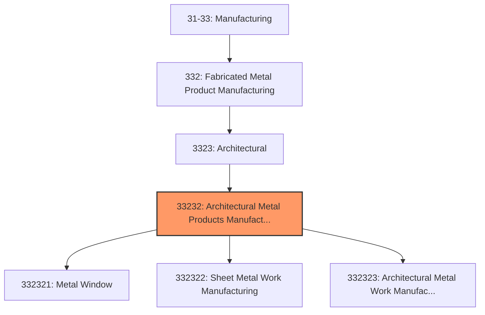
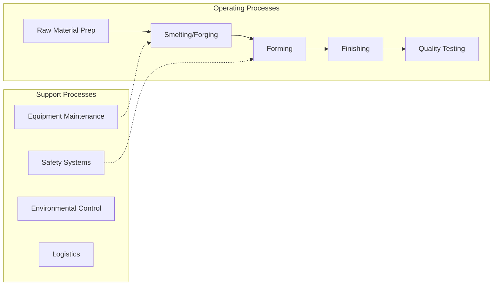

# Architectural Metal Products Manufacturing

> This industry comprises establishments primarily engaged in manufacturing one or more of the following: (1) metal framed windows (i.

## Overview

Architectural Metal Products Manufacturing represents an important category within the U.S. Manufacturing sector (NAICS 31-33). This industry encompasses establishments primarily engaged in architectural metal products manufacturing.

This industry comprises establishments primarily engaged in manufacturing one or more of the following: (1) metal framed windows (i.e., typically using purchased glass) and metal doors; (2) sheet metal work; and (3) ornamental and architectural metal products. Cross-References. Establishments primarily engaged in--

## Industry Hierarchy

## Key Statistics

| Metric | Value |
|--------|-------|
| NAICS Code | 33232 |
| Level | Industry |
| Parent | [Architectural](../) |
| Child Industries | 3 |

## Sub-Industries

| Industry | Code | Description |
|----------|------|-------------|
| [Metal Window](./MetalWindow.mdx) | 332321 | This U |
| [Sheet Metal Work Manufacturing](./SheetMetalWorkManufacturing.mdx) | 332322 | This U |
| [Architectural Metal Work Manufacturing](./ArchitecturalMetalWorkManufacturing.mdx) | 332323 | This U |

## Related Occupations

- [Industrial Production Managers](/occupations/IndustrialProductionManagers) - Plan and coordinate production activities
- [First-Line Supervisors of Production Workers](/occupations/FirstLineSupervisorsOfProductionAndOperatingWorkers) - Supervise production floor operations
- [Quality Control Inspectors](/occupations/QualityControlInspectors) - Inspect products for defects and compliance
- [Metal Workers and Plastic Workers](/occupations/MetalAndPlasticWorkers) - Shape and form metal products
- [Welders, Cutters, Solderers](/occupations/WeldersCuttersSolderersAndBrazers) - Join metal parts

## Core Business Processes

## Industry Value Chain

## Regulatory Environment

Manufacturing operations in this industry are subject to various federal, state, and local regulations:

- **OSHA Regulations**: Workplace safety standards, machine guarding, hazard communication
- **EPA Requirements**: Air emissions, water discharge, hazardous waste management
- **State/Local Requirements**: Zoning, permits, and local environmental regulations

## Technology & Innovation

The architectural metal products manufacturing industry is experiencing significant technological advancement:

- **Industry 4.0**: Connected manufacturing, IoT sensors, and real-time monitoring
- **Automation & Robotics**: Automated production lines and robotic assembly
- **Data Analytics**: Predictive maintenance, quality analytics, and process optimization
- **Additive Manufacturing**: 3D printing and metal additive production
- **Advanced Materials**: High-performance alloys and composites
- **Sustainability**: Carbon reduction, circular economy, and green manufacturing
- **Digital Twin**: Virtual replicas for simulation and optimization

---

*Source: NAICS 33232 - Architectural Metal Products Manufacturing*
