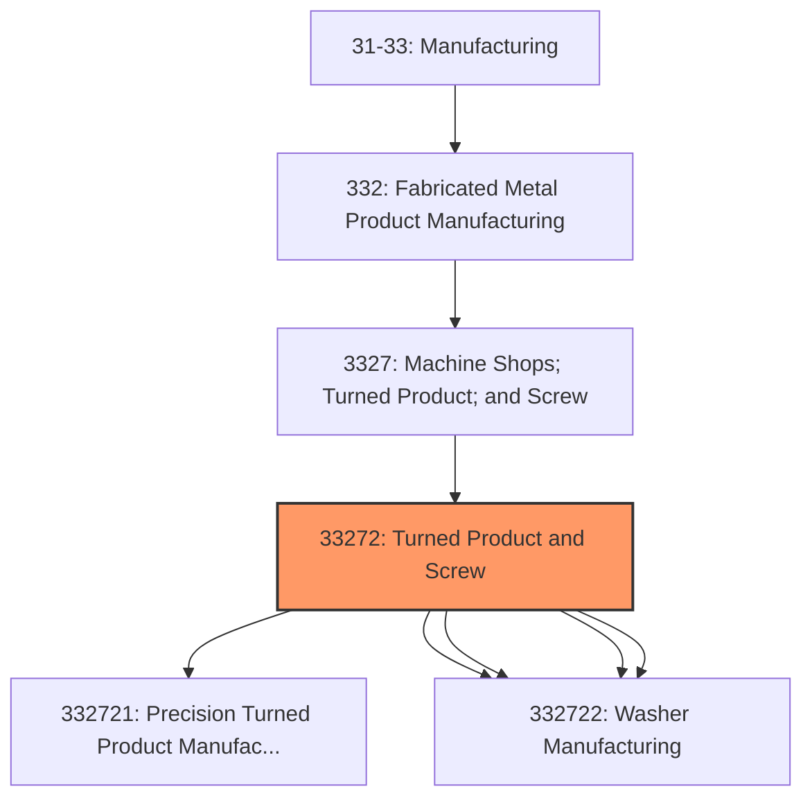
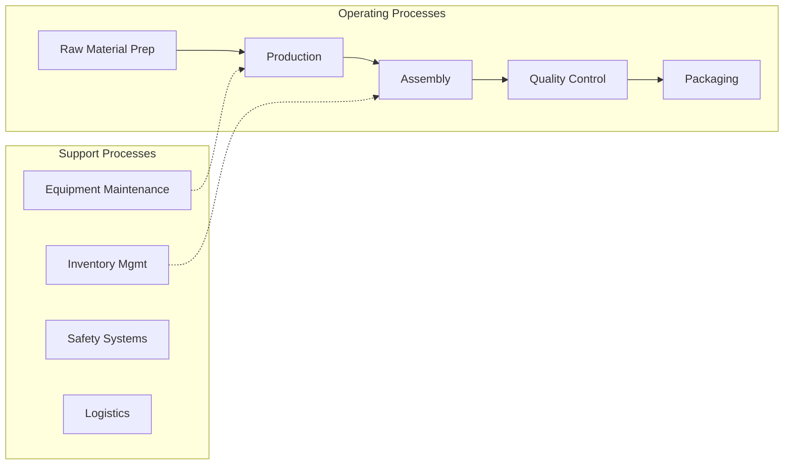

# Turned Product and Screw

> This industry comprises establishments primarily engaged in (1) machining precision turned products or (2) manufacturing metal bolts, nuts, screws, rivets, and other industrial fasteners.

## Overview

Turned Product and Screw represents an important category within the U.S. Manufacturing sector (NAICS 31-33). This industry encompasses establishments primarily engaged in turned product and screw.

This industry comprises establishments primarily engaged in (1) machining precision turned products or (2) manufacturing metal bolts, nuts, screws, rivets, and other industrial fasteners. Included in this industry are establishments primarily engaged in manufacturing parts for machinery and equipment on a custom basis. Cross-References. Establishments primarily engaged in--

## Industry Hierarchy

## Key Statistics

| Metric | Value |
|--------|-------|
| NAICS Code | 33272 |
| Level | Industry |
| Parent | [Machine Shops; Turned Product; and Screw](../) |
| Child Industries | 5 |

## Sub-Industries

| Industry | Code | Description |
|----------|------|-------------|
| [Precision Turned Product Manufacturing](./PrecisionTurnedProductManufacturing.mdx) | 332721 | This U |
| [Bolt](./Bolt.mdx) | 332722 | This U |
| [Screw](./Screw.mdx) | 332722 | This U |
| [Rivet](./Rivet.mdx) | 332722 | This U |
| [Washer Manufacturing](./WasherManufacturing.mdx) | 332722 | This U |

## Related Occupations

- [Industrial Production Managers](/occupations/IndustrialProductionManagers) - Plan and coordinate production activities
- [First-Line Supervisors of Production Workers](/occupations/FirstLineSupervisorsOfProductionAndOperatingWorkers) - Supervise production floor operations
- [Quality Control Inspectors](/occupations/QualityControlInspectors) - Inspect products for defects and compliance

## Core Business Processes

## Industry Value Chain

## Regulatory Environment

Manufacturing operations in this industry are subject to various federal, state, and local regulations:

- **OSHA Regulations**: Workplace safety standards, machine guarding, hazard communication
- **EPA Requirements**: Air emissions, water discharge, hazardous waste management
- **State/Local Requirements**: Zoning, permits, and local environmental regulations

## Technology & Innovation

The turned product and screw industry is experiencing significant technological advancement:

- **Industry 4.0**: Connected manufacturing, IoT sensors, and real-time monitoring
- **Automation & Robotics**: Automated production lines and robotic assembly
- **Data Analytics**: Predictive maintenance, quality analytics, and process optimization
- **Sustainability**: Carbon reduction, circular economy, and green manufacturing
- **Digital Twin**: Virtual replicas for simulation and optimization

---

*Source: NAICS 33272 - Turned Product and Screw*
