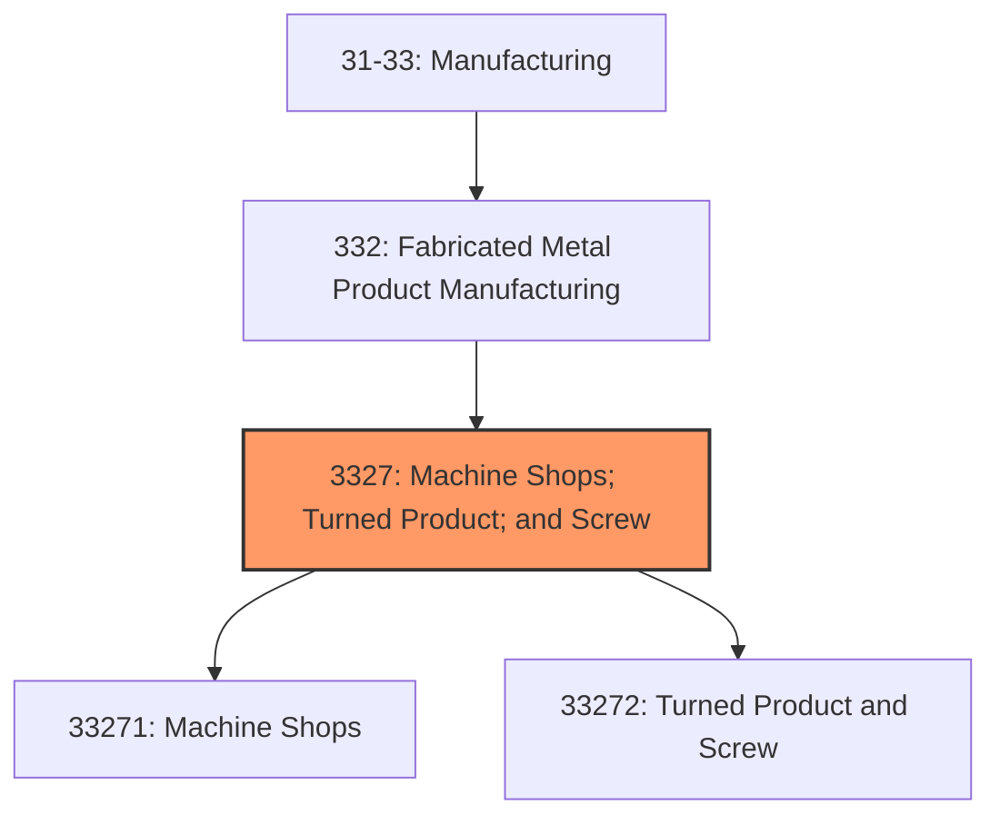
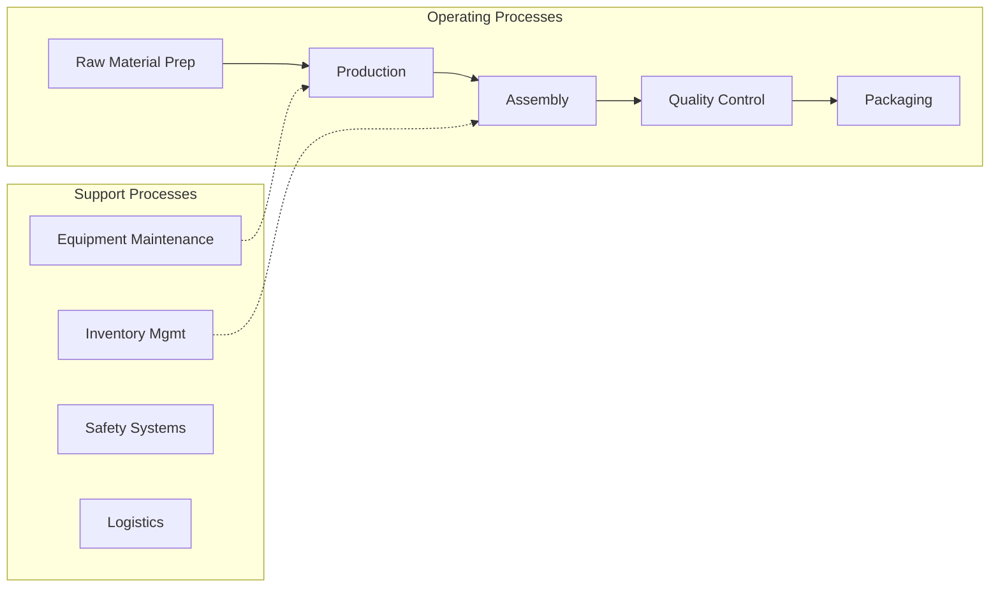

# Machine Shops; Turned Product; and Screw

> This industry group comprises establishments primarily engaged in one of the following: (1) operating machine shops primarily engaged in machining metal and plastic parts and parts of other composite materials on a job or order basis; (2) machining precision turned products; or (3) manufacturing metal bolts, nuts, screws, rivets, and other industrial fasteners.

## Overview

Machine Shops; Turned Product; and Screw represents an important category within the U.S. Manufacturing sector (NAICS 31-33). This industry group encompasses establishments primarily engaged in machine shops; turned product; and screw.

This industry group comprises establishments primarily engaged in one of the following: (1) operating machine shops primarily engaged in machining metal and plastic parts and parts of other composite materials on a job or order basis; (2) machining precision turned products; or (3) manufacturing metal bolts, nuts, screws, rivets, and other industrial fasteners.

## Industry Hierarchy

## Key Statistics

| Metric | Value |
|--------|-------|
| NAICS Code | 3327 |
| Level | Industry Group |
| Parent | [Fabricated Metal Product Manufacturing](../) |
| Child Industries | 2 |

## Sub-Industries

| Industry | Code | Description |
|----------|------|-------------|
| [Machine Shops](./MachineShops/) | 33271 | See industry description for 332710 |
| [Turned Product and Screw](./TurnedProductAndScrew/) | 33272 | This industry comprises establishments primarily engaged in (1) machining precis |

## Related Occupations

- [Industrial Production Managers](/occupations/IndustrialProductionManagers) - Plan and coordinate production activities
- [First-Line Supervisors of Production Workers](/occupations/FirstLineSupervisorsOfProductionAndOperatingWorkers) - Supervise production floor operations
- [Quality Control Inspectors](/occupations/QualityControlInspectors) - Inspect products for defects and compliance
- [Machinists](/occupations/Machinists) - Set up and operate machine tools
- [CNC Machine Tool Programmers](/occupations/ComputerNumericallyControlledMachineToolProgrammers) - Program CNC machines

## Core Business Processes

## Industry Value Chain

## Regulatory Environment

Manufacturing operations in this industry are subject to various federal, state, and local regulations:

- **OSHA Regulations**: Workplace safety standards, machine guarding, hazard communication
- **EPA Requirements**: Air emissions, water discharge, hazardous waste management
- **State/Local Requirements**: Zoning, permits, and local environmental regulations

## Technology & Innovation

The machine shops; turned product; and screw industry is experiencing significant technological advancement:

- **Industry 4.0**: Connected manufacturing, IoT sensors, and real-time monitoring
- **Automation & Robotics**: Automated production lines and robotic assembly
- **Data Analytics**: Predictive maintenance, quality analytics, and process optimization
- **Sustainability**: Carbon reduction, circular economy, and green manufacturing
- **Digital Twin**: Virtual replicas for simulation and optimization

---

*Source: NAICS 3327 - Machine Shops; Turned Product; and Screw*
