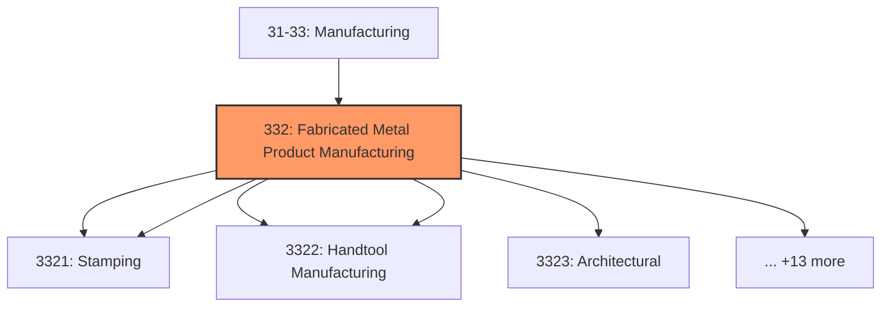
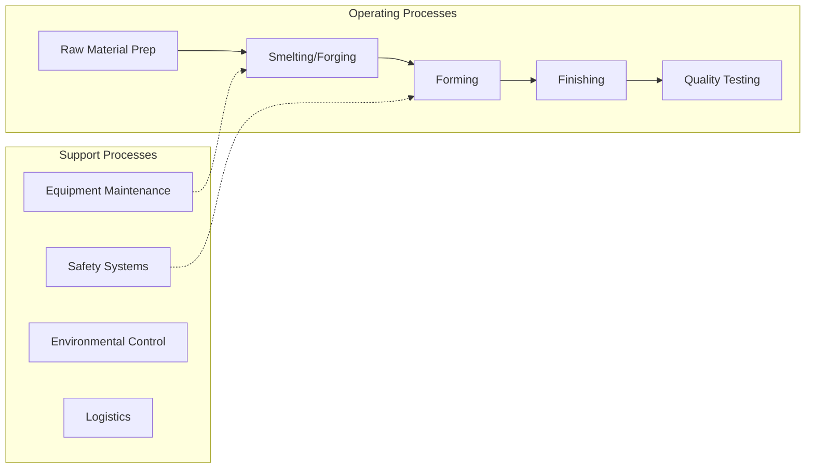

# Fabricated Metal Product Manufacturing

> Industries in the Fabricated Metal Product Manufacturing subsector transform metal into intermediate or end products, other than machinery, computers and electronics, and metal furniture, or treat metals and metal formed products fabricated elsewhere.

## Overview

Fabricated Metal Product Manufacturing represents an important category within the U.S. Manufacturing sector (NAICS 31-33). This subsector encompasses establishments primarily engaged in fabricated metal product manufacturing.

Industries in the Fabricated Metal Product Manufacturing subsector transform metal into intermediate or end products, other than machinery, computers and electronics, and metal furniture, or treat metals and metal formed products fabricated elsewhere. Important fabricated metal processes are forging, stamping, bending, forming, and machining, used to shape individual pieces of metal; and other processes, such as welding and assembling, used to join separate parts together. Establishments in this subsector may use one of these processes or a combination of these processes. The NAICS structure for this subsector distinguishes the forging and stamping processes in a single industry. The remaining industries in the subsector group establishments based on similar combinations of processes used to make products. The manufacturing performed in the Fabricated Metal Product Manufacturing subsector begins with manufactured metal shapes. The establishments in this subsector further fabricate the purchased metal shapes into a product. For instance, the Spring and Wire Product Manufacturing industry starts with wire and fabricates such items. Within the Manufacturing sector there are other establishments that make the same products made by this subsector; only these establishments begin production further back in the production process. These establishments have a more integrated operation. For instance, one establishment may manufacture steel, draw it into wire, and make wire products in the same establishment. Such operations are classified in the Primary Metal Manufacturing subsector.

## Industry Hierarchy

## Key Statistics

| Metric | Value |
|--------|-------|
| NAICS Code | 332 |
| Level | Subsector |
| Child Industries | 18 |

## Sub-Industries

| Industry | Code | Description |
|----------|------|-------------|
| [Forging](./Forging/) | 3321 | Forging |
| [Stamping](./Stamping/) | 3321 | Stamping |
| [Cutlery](./Cutlery/) | 3322 | Cutlery |
| [Handtool Manufacturing](./HandtoolManufacturing/) | 3322 | Handtool Manufacturing |
| [Architectural](./Architectural/) | 3323 | This industry group comprises establishments primarily engaged in manufacturing  |
| [Structural Metals Manufacturing](./StructuralMetalsManufacturing/) | 3323 | This industry group comprises establishments primarily engaged in manufacturing  |
| [Boiler](./Boiler/) | 3324 | This industry group comprises establishments primarily engaged in one of the fol |
| [Tank](./Tank/) | 3324 | This industry group comprises establishments primarily engaged in one of the fol |
| [Shipping Container Manufacturing](./ShippingContainerManufacturing/) | 3324 | This industry group comprises establishments primarily engaged in one of the fol |
| [Hardware Manufacturing](./HardwareManufacturing/) | 3325 | Hardware Manufacturing |
| [Spring](./Spring/) | 3326 | Spring |
| [Wire Product Manufacturing](./WireProductManufacturing/) | 3326 | Wire Product Manufacturing |
| [Machine Shops; Turned Product; and Screw](./MachineShopsTurnedProductAndScrew/) | 3327 | This industry group comprises establishments primarily engaged in one of the fol |
| [Nut](./Nut/) | 3327 | This industry group comprises establishments primarily engaged in one of the fol |
| [Bolt Manufacturing](./BoltManufacturing/) | 3327 | This industry group comprises establishments primarily engaged in one of the fol |
| [Engraving](./Engraving/) | 3328 | Engraving |
| [Heat Treating](./HeatTreating/) | 3328 | Heat Treating |
| [Allied Activities](./AlliedActivities/) | 3328 | Allied Activities |

## Related Occupations

- [Industrial Production Managers](/occupations/IndustrialProductionManagers) - Plan and coordinate production activities
- [First-Line Supervisors of Production Workers](/occupations/FirstLineSupervisorsOfProductionAndOperatingWorkers) - Supervise production floor operations
- [Quality Control Inspectors](/occupations/QualityControlInspectors) - Inspect products for defects and compliance
- [Metal Workers and Plastic Workers](/occupations/MetalAndPlasticWorkers) - Shape and form metal products
- [Welders, Cutters, Solderers](/occupations/WeldersCuttersSolderersAndBrazers) - Join metal parts

## Core Business Processes

## Industry Value Chain

## Regulatory Environment

Manufacturing operations in this industry are subject to various federal, state, and local regulations:

- **OSHA Regulations**: Workplace safety standards, machine guarding, hazard communication
- **EPA Requirements**: Air emissions, water discharge, hazardous waste management
- **State/Local Requirements**: Zoning, permits, and local environmental regulations

## Technology & Innovation

The fabricated metal product manufacturing industry is experiencing significant technological advancement:

- **Industry 4.0**: Connected manufacturing, IoT sensors, and real-time monitoring
- **Automation & Robotics**: Automated production lines and robotic assembly
- **Data Analytics**: Predictive maintenance, quality analytics, and process optimization
- **Additive Manufacturing**: 3D printing and metal additive production
- **Advanced Materials**: High-performance alloys and composites
- **Sustainability**: Carbon reduction, circular economy, and green manufacturing
- **Digital Twin**: Virtual replicas for simulation and optimization

---

*Source: NAICS 332 - Fabricated Metal Product Manufacturing*
