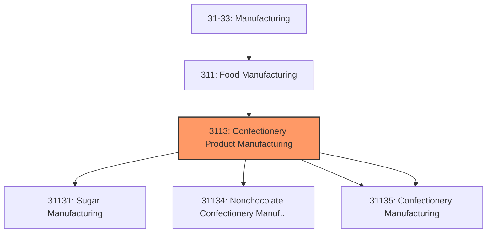
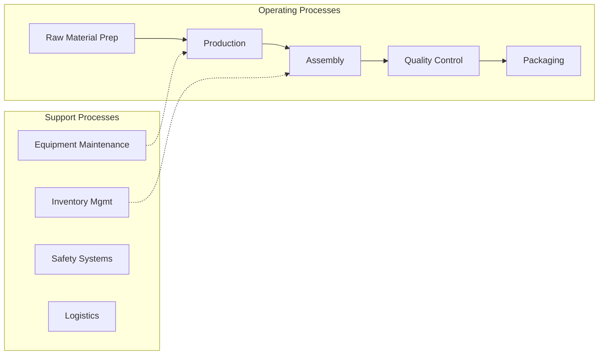

# Confectionery Product Manufacturing

> This industry group comprises (1) establishments that process agricultural inputs, such as sugarcane, beet, and cacao, to give rise to a new product (sugar or chocolate) and (2) establishments that begin with sugar and chocolate and process these further.

## Overview

Confectionery Product Manufacturing represents an important category within the U.S. Manufacturing sector (NAICS 31-33). This industry group encompasses establishments primarily engaged in confectionery product manufacturing.

This industry group comprises (1) establishments that process agricultural inputs, such as sugarcane, beet, and cacao, to give rise to a new product (sugar or chocolate) and (2) establishments that begin with sugar and chocolate and process these further.

## Industry Hierarchy

## Key Statistics

| Metric | Value |
|--------|-------|
| NAICS Code | 3113 |
| Level | Industry Group |
| Parent | [Food Manufacturing](../) |
| Child Industries | 4 |

## Sub-Industries

| Industry | Code | Description |
|----------|------|-------------|
| [Sugar Manufacturing](./SugarManufacturing/) | 31131 | This industry comprises establishments primarily engaged in manufacturing raw su |
| [Nonchocolate Confectionery Manufacturing](./NonchocolateConfectioneryManufacturing/) | 31134 | See industry description for 311340 |
| [Chocolate](./Chocolate/) | 31135 | This industry comprises establishments primarily engaged in (1) manufacturing ch |
| [Confectionery Manufacturing](./ConfectioneryManufacturing/) | 31135 | This industry comprises establishments primarily engaged in (1) manufacturing ch |

## Related Occupations

- [Industrial Production Managers](/occupations/IndustrialProductionManagers) - Plan and coordinate production activities
- [First-Line Supervisors of Production Workers](/occupations/FirstLineSupervisorsOfProductionAndOperatingWorkers) - Supervise production floor operations
- [Quality Control Inspectors](/occupations/QualityControlInspectors) - Inspect products for defects and compliance

## Core Business Processes

## Industry Value Chain

## Regulatory Environment

Manufacturing operations in this industry are subject to various federal, state, and local regulations:

- **OSHA Regulations**: Workplace safety standards, machine guarding, hazard communication
- **EPA Requirements**: Air emissions, water discharge, hazardous waste management
- **State/Local Requirements**: Zoning, permits, and local environmental regulations

## Technology & Innovation

The confectionery product manufacturing industry is experiencing significant technological advancement:

- **Industry 4.0**: Connected manufacturing, IoT sensors, and real-time monitoring
- **Automation & Robotics**: Automated production lines and robotic assembly
- **Data Analytics**: Predictive maintenance, quality analytics, and process optimization
- **Sustainability**: Carbon reduction, circular economy, and green manufacturing
- **Digital Twin**: Virtual replicas for simulation and optimization

---

*Source: NAICS 3113 - Confectionery Product Manufacturing*
