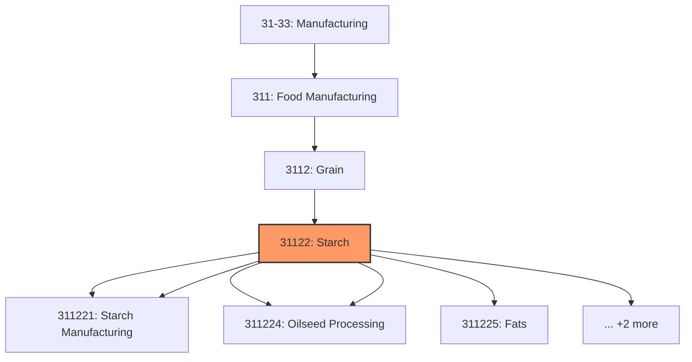
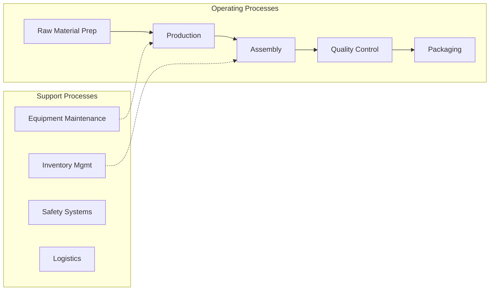

# Starch

> This industry comprises establishments primarily engaged in one or more of the following: (1) wet milling corn and vegetables; (2) crushing oilseeds and tree nuts; (3) refining and/or blending vegetable oils; (4) manufacturing shortening and margarine; and (5) blending purchased animal fats with vegetable fats.

## Overview

Starch represents an important category within the U.S. Manufacturing sector (NAICS 31-33). This industry encompasses establishments primarily engaged in starch.

This industry comprises establishments primarily engaged in one or more of the following: (1) wet milling corn and vegetables; (2) crushing oilseeds and tree nuts; (3) refining and/or blending vegetable oils; (4) manufacturing shortening and margarine; and (5) blending purchased animal fats with vegetable fats. Cross-References. Establishments primarily engaged in--

## Industry Hierarchy

## Key Statistics

| Metric | Value |
|--------|-------|
| NAICS Code | 31122 |
| Level | Industry |
| Parent | [Grain](../) |
| Child Industries | 7 |

## Sub-Industries

| Industry | Code | Description |
|----------|------|-------------|
| [Wet Corn Milling](./WetCornMilling.mdx) | 311221 | This U |
| [Starch Manufacturing](./StarchManufacturing.mdx) | 311221 | This U |
| [Soybean](./Soybean.mdx) | 311224 | This U |
| [Oilseed Processing](./OilseedProcessing.mdx) | 311224 | This U |
| [Fats](./Fats.mdx) | 311225 | This U |
| [Oils Refining](./OilsRefining.mdx) | 311225 | This U |
| [Blending](./Blending.mdx) | 311225 | This U |

## Related Occupations

- [Industrial Production Managers](/occupations/IndustrialProductionManagers) - Plan and coordinate production activities
- [First-Line Supervisors of Production Workers](/occupations/FirstLineSupervisorsOfProductionAndOperatingWorkers) - Supervise production floor operations
- [Quality Control Inspectors](/occupations/QualityControlInspectors) - Inspect products for defects and compliance

## Core Business Processes

## Industry Value Chain

## Regulatory Environment

Manufacturing operations in this industry are subject to various federal, state, and local regulations:

- **OSHA Regulations**: Workplace safety standards, machine guarding, hazard communication
- **EPA Requirements**: Air emissions, water discharge, hazardous waste management
- **State/Local Requirements**: Zoning, permits, and local environmental regulations

## Technology & Innovation

The starch industry is experiencing significant technological advancement:

- **Industry 4.0**: Connected manufacturing, IoT sensors, and real-time monitoring
- **Automation & Robotics**: Automated production lines and robotic assembly
- **Data Analytics**: Predictive maintenance, quality analytics, and process optimization
- **Sustainability**: Carbon reduction, circular economy, and green manufacturing
- **Digital Twin**: Virtual replicas for simulation and optimization

---

*Source: NAICS 31122 - Starch*
