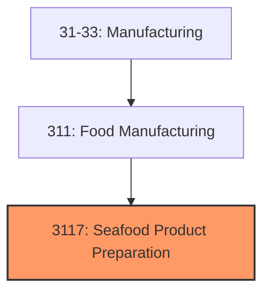
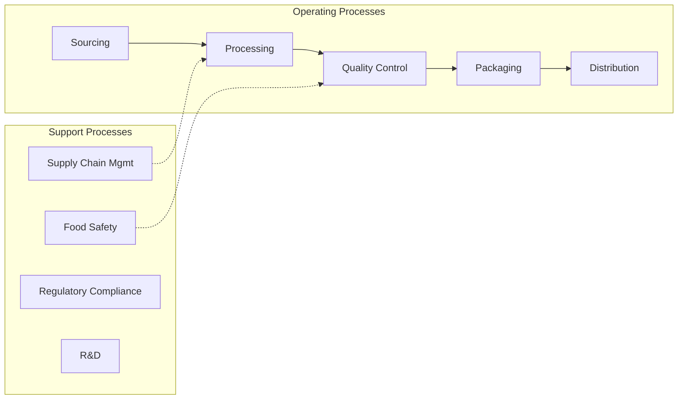

# Seafood Product Preparation

> Manufacturing establishments primarily engaged in seafood product preparation.

## Overview

Seafood Product Preparation represents an important category within the U.S. Manufacturing sector (NAICS 31-33). This industry group encompasses establishments primarily engaged in seafood product preparation.

## Industry Hierarchy

## Key Statistics

| Metric | Value |
|--------|-------|
| NAICS Code | 3117 |
| Level | Industry Group |
| Parent | [Food Manufacturing](../) |
| Child Industries | 0 |

## Related Occupations

- [Industrial Production Managers](/occupations/Management/IndustrialProductionManagers) - Plan and coordinate production activities
- [First-Line Supervisors of Production Workers](/occupations/Production/FirstLineSupervisorsOfProductionAndOperatingWorkers) - Supervise production floor operations
- [Quality Control Inspectors](/occupations/QualityControlInspectors) - Inspect products for defects and compliance
- [Food Scientists and Technologists](/occupations/Science/FoodScientistsAndTechnologists) - Develop food products and processes
- [Food Batchmakers](/occupations/Production/FoodBatchmakers) - Set up and operate food processing equipment

## Core Business Processes

## Industry Value Chain

## Regulatory Environment

Manufacturing operations in this industry are subject to various federal, state, and local regulations:

- **OSHA Regulations**: Workplace safety standards, machine guarding, hazard communication
- **EPA Requirements**: Air emissions, water discharge, hazardous waste management
- **FDA Regulations**: Food safety (FSMA), labeling requirements, facility registration
- **USDA Inspection**: Meat, poultry, and egg products inspection
- **State Health Departments**: Local food safety requirements
- **State/Local Requirements**: Zoning, permits, and local environmental regulations

## Technology & Innovation

The seafood product preparation industry is experiencing significant technological advancement:

- **Industry 4.0**: Connected manufacturing, IoT sensors, and real-time monitoring
- **Automation & Robotics**: Automated production lines and robotic assembly
- **Data Analytics**: Predictive maintenance, quality analytics, and process optimization
- **Food Safety Technology**: Blockchain traceability, rapid testing, and smart packaging
- **Sustainable Processing**: Energy-efficient equipment, waste reduction, and water recycling
- **Sustainability**: Carbon reduction, circular economy, and green manufacturing
- **Digital Twin**: Virtual replicas for simulation and optimization

---

*Source: NAICS 3117 - Seafood Product Preparation*
