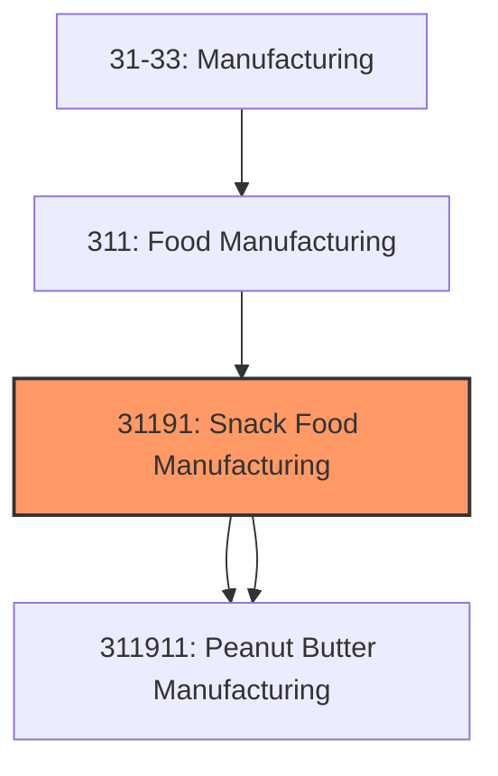
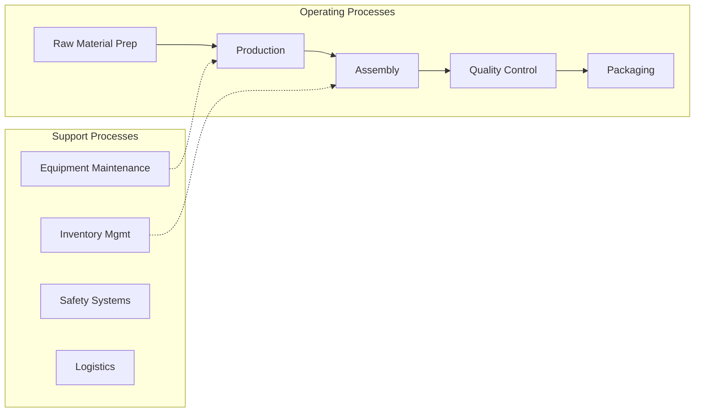

# Snack Food Manufacturing

> This industry comprises establishments primarily engaged in one or more of the following: (1) salting, roasting, drying, cooking, or canning nuts; (2) processing grains or seeds into snacks; (3) manufacturing peanut butter; and (4) manufacturing potato chips, corn chips, popped popcorn, pretzels (except soft), pork rinds, and similar snacks.

## Overview

Snack Food Manufacturing represents an important category within the Manufacturing sector (NAICS 31-33).

This industry comprises establishments primarily engaged in one or more of the following: (1) salting, roasting, drying, cooking, or canning nuts; (2) processing grains or seeds into snacks; (3) manufacturing peanut butter; and (4) manufacturing potato chips, corn chips, popped popcorn, pretzels (except soft), pork rinds, and similar snacks. Cross-References. Establishments primarily engaged in--

## Industry Hierarchy

## Key Statistics

| Metric | Value |
|--------|-------|
| NAICS Code | 31191 |
| Level | Industry |
| Child Industries | 2 |

## Sub-Industries

| Industry | Code | Description |
|----------|------|-------------|
| [Roasted Nuts](./RoastedNuts.mdx) | 311911 | This U |
| [Peanut Butter Manufacturing](./PeanutButterManufacturing.mdx) | 311911 | This U |

## Related Occupations

See the [occupations directory](/occupations) for roles commonly found in this industry.

## Core Business Processes

## Industry Value Chain

## Market Context

Manufacturing transforms raw materials into finished goods, with Industry 4.0 driving automation, digitalization, and smart factory implementations.

| Aspect | Details |
|--------|---------|
| Industry Sector | Manufacturing |
| NAICS/SIC Code | 31191 |
| Market Segment | Snack Food Manufacturing |

## Key Business Processes

- Production planning
- Manufacturing operations
- Quality assurance
- Inventory management
- Distribution and logistics

## Common Occupations

- [Industrial Production Managers](/occupations/Management/IndustrialProductionManagers)
- [Production Workers](/occupations/Production/ProductionWorkers)
- [Quality Control Inspectors](/occupations/Production/QualityControlInspectors)
- [Industrial Engineers](/occupations/Engineering/IndustrialEngineers)

## Regulations and Standards

- OSHA Manufacturing Standards
- EPA Environmental Regulations
- FDA regulations (where applicable)
- ISO quality standards
- Industry-specific certifications

## Technology and Tools

- Industrial automation and robotics
- Enterprise Resource Planning (ERP)
- Quality management systems
- Predictive maintenance
- IoT and smart manufacturing

## Industry Trends

- Digital transformation and automation adoption
- Sustainability and environmental compliance focus
- Workforce development and skills training
- Supply chain resilience and optimization
- Customer experience enhancement

---

*Source: NAICS 31191 - Snack Food Manufacturing*
