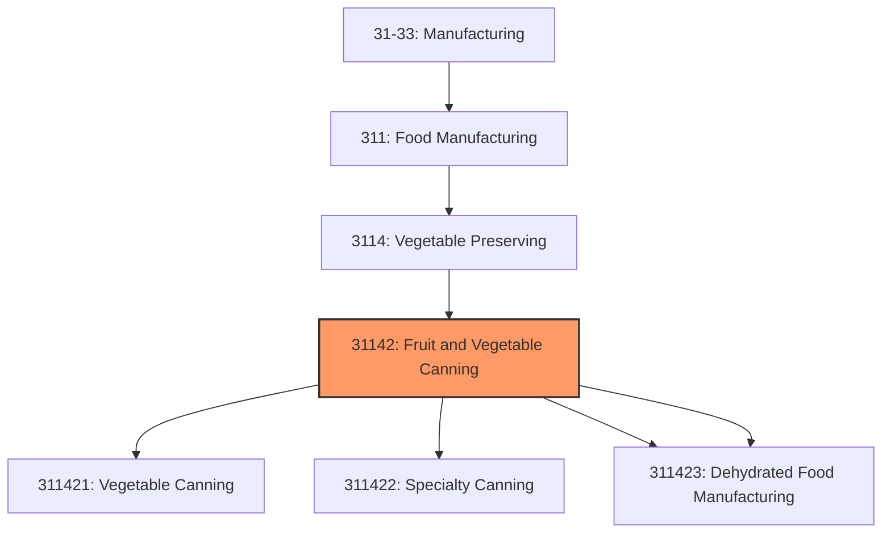
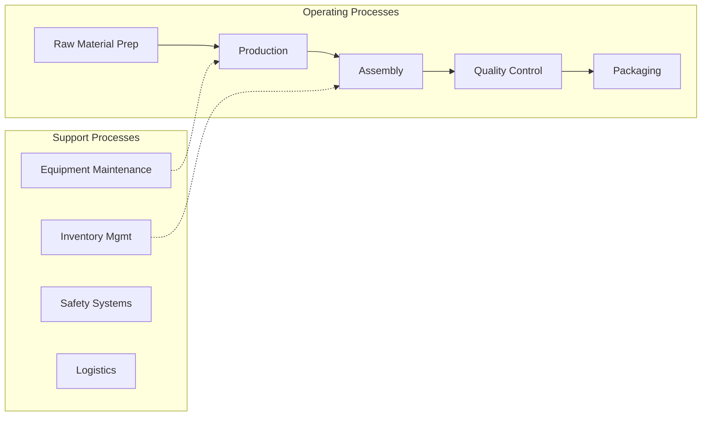

# Fruit and Vegetable Canning

> This industry comprises establishments primarily engaged in manufacturing canned, pickled, and dried fruits, vegetables, and specialty foods.

## Overview

Fruit and Vegetable Canning represents an important category within the U.S. Manufacturing sector (NAICS 31-33). This industry encompasses establishments primarily engaged in fruit and vegetable canning.

This industry comprises establishments primarily engaged in manufacturing canned, pickled, and dried fruits, vegetables, and specialty foods. Establishments in this industry may package the dried or dehydrated ingredients they make with other purchased ingredients. Examples of products made by these establishments are canned juices; canned baby foods; canned soups (except seafood); canned dry beans; canned tomato-based sauces, such as catsup, salsa, chili sauce, spaghetti sauce, barbeque sauce, and tomato paste; pickles and relishes; jams and jellies; dried soup mixes and bouillon; and sauerkraut. Cross-References. Establishments primarily engaged in--

## Industry Hierarchy

## Key Statistics

| Metric | Value |
|--------|-------|
| NAICS Code | 31142 |
| Level | Industry |
| Parent | [Vegetable Preserving](../) |
| Child Industries | 4 |

## Sub-Industries

| Industry | Code | Description |
|----------|------|-------------|
| [Vegetable Canning](./VegetableCanning.mdx) | 311421 | This U |
| [Specialty Canning](./SpecialtyCanning.mdx) | 311422 | This U |
| [Dried](./Dried.mdx) | 311423 | This U |
| [Dehydrated Food Manufacturing](./DehydratedFoodManufacturing.mdx) | 311423 | This U |

## Related Occupations

- [Industrial Production Managers](/occupations/Management/IndustrialProductionManagers) - Plan and coordinate production activities
- [First-Line Supervisors of Production Workers](/occupations/Production/FirstLineSupervisorsOfProductionAndOperatingWorkers) - Supervise production floor operations
- [Quality Control Inspectors](/occupations/QualityControlInspectors) - Inspect products for defects and compliance

## Core Business Processes

## Industry Value Chain

## Regulatory Environment

Manufacturing operations in this industry are subject to various federal, state, and local regulations:

- **OSHA Regulations**: Workplace safety standards, machine guarding, hazard communication
- **EPA Requirements**: Air emissions, water discharge, hazardous waste management
- **State/Local Requirements**: Zoning, permits, and local environmental regulations

## Technology & Innovation

The fruit and vegetable canning industry is experiencing significant technological advancement:

- **Industry 4.0**: Connected manufacturing, IoT sensors, and real-time monitoring
- **Automation & Robotics**: Automated production lines and robotic assembly
- **Data Analytics**: Predictive maintenance, quality analytics, and process optimization
- **Sustainability**: Carbon reduction, circular economy, and green manufacturing
- **Digital Twin**: Virtual replicas for simulation and optimization

---

*Source: NAICS 31142 - Fruit and Vegetable Canning*
