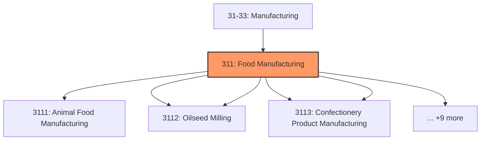
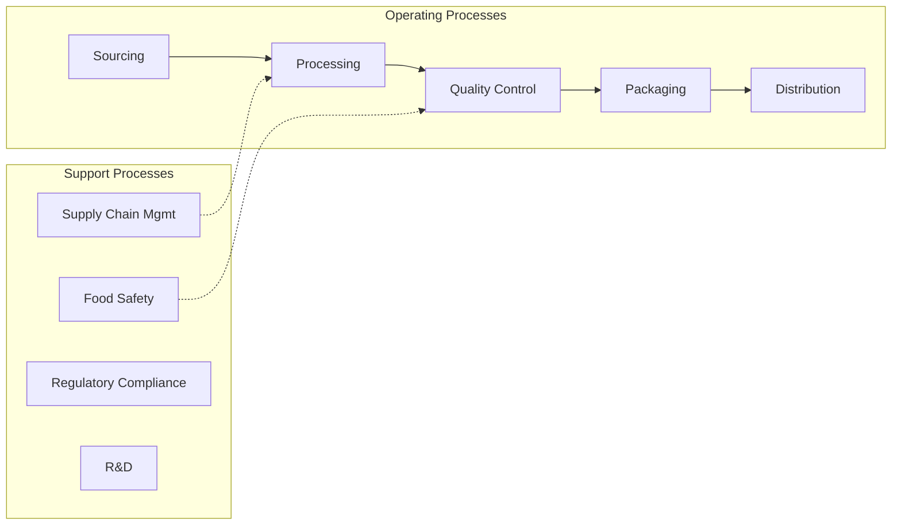

# Food Manufacturing

> Industries in the Food Manufacturing subsector transform livestock and agricultural products into products for intermediate or final consumption.

## Overview

Food Manufacturing represents an important category within the U.S. Manufacturing sector (NAICS 31-33). This subsector encompasses establishments primarily engaged in food manufacturing.

Industries in the Food Manufacturing subsector transform livestock and agricultural products into products for intermediate or final consumption. The industry groups are distinguished by the raw materials (generally of animal or vegetable origin) processed into food products. The food products manufactured in these establishments are typically sold to wholesalers or retailers for distribution to consumers, but establishments primarily engaged in retailing bakery and candy products made on the premises not for immediate consumption are included. Establishments primarily engaged in manufacturing beverages are classified in Subsector 312, Beverage and Tobacco Product Manufacturing.

## Industry Hierarchy

## Key Statistics

| Metric | Value |
|--------|-------|
| NAICS Code | 311 |
| Level | Subsector |
| Child Industries | 14 |

## Sub-Industries

| Industry | Code | Description |
|----------|------|-------------|
| [Animal Food Manufacturing](./AnimalFoodManufacturing/) | 3111 | Animal Food Manufacturing |
| [Grain](./Grain/) | 3112 | This industry group comprises establishments primarily engaged in milling flour  |
| [Oilseed Milling](./OilseedMilling/) | 3112 | This industry group comprises establishments primarily engaged in milling flour  |
| [Sugar](./Sugar/) | 3113 | This industry group comprises (1) establishments that process agricultural input |
| [Confectionery Product Manufacturing](./ConfectioneryProductManufacturing/) | 3113 | This industry group comprises (1) establishments that process agricultural input |
| [Vegetable Preserving](./VegetablePreserving/) | 3114 | This industry group includes (1) establishments that freeze food and (2) establi |
| [Specialty Food Manufacturing](./SpecialtyFoodManufacturing/) | 3114 | This industry group includes (1) establishments that freeze food and (2) establi |
| [Dairy Product Manufacturing](./DairyProductManufacturing/) | 3115 | This industry group comprises establishments that manufacture dairy products fro |
| [Animal Slaughtering](./AnimalSlaughtering/) | 3116 | Animal Slaughtering |
| [Processing](./Processing/) | 3116 | Processing |
| [Seafood Product Preparation](./SeafoodProductPreparation/) | 3117 | Seafood Product Preparation |
| [Packaging](./Packaging/) | 3117 | Packaging |
| [Bakeries](./Bakeries/) | 3118 | This industry group comprises establishments primarily engaged in one of the fol |
| [Tortilla Manufacturing](./TortillaManufacturing/) | 3118 | This industry group comprises establishments primarily engaged in one of the fol |

## Related Occupations

- [Industrial Production Managers](/occupations/Management/IndustrialProductionManagers) - Plan and coordinate production activities
- [First-Line Supervisors of Production Workers](/occupations/Production/FirstLineSupervisorsOfProductionAndOperatingWorkers) - Supervise production floor operations
- [Quality Control Inspectors](/occupations/QualityControlInspectors) - Inspect products for defects and compliance
- [Food Scientists and Technologists](/occupations/Science/FoodScientistsAndTechnologists) - Develop food products and processes
- [Food Batchmakers](/occupations/Production/FoodBatchmakers) - Set up and operate food processing equipment

## Core Business Processes

## Industry Value Chain

```mermaid
graph LR
    subgraph Inputs["Inputs"]
        I1["Agricultural Products"]
        I2["Packaging Materials"]
        I3["Processing Equipment"]
    end

    subgraph Primary["Primary Activities"]
        A1["Inbound Logistics"]
        A2["Manufacturing Operations"]
        A3["Quality Assurance"]
        A4["Outbound Logistics"]
    end

    subgraph Outputs["Products"]
        O1["Processed Foods"]
        O2["Beverages"]
        O3["Prepared Meals"]
    end

    subgraph Customers["Markets"]
        C1["Retailers"]
        C2["Food Service"]
        C3["Distributors"]
        C4["Export Markets"]
    end

    Inputs --> Primary --> Outputs --> Customers
```

## Regulatory Environment

Manufacturing operations in this industry are subject to various federal, state, and local regulations:

- **OSHA Regulations**: Workplace safety standards, machine guarding, hazard communication
- **EPA Requirements**: Air emissions, water discharge, hazardous waste management
- **FDA Regulations**: Food safety (FSMA), labeling requirements, facility registration
- **USDA Inspection**: Meat, poultry, and egg products inspection
- **State Health Departments**: Local food safety requirements
- **State/Local Requirements**: Zoning, permits, and local environmental regulations

## Technology & Innovation

The food manufacturing industry is experiencing significant technological advancement:

- **Industry 4.0**: Connected manufacturing, IoT sensors, and real-time monitoring
- **Automation & Robotics**: Automated production lines and robotic assembly
- **Data Analytics**: Predictive maintenance, quality analytics, and process optimization
- **Food Safety Technology**: Blockchain traceability, rapid testing, and smart packaging
- **Sustainable Processing**: Energy-efficient equipment, waste reduction, and water recycling
- **Sustainability**: Carbon reduction, circular economy, and green manufacturing
- **Digital Twin**: Virtual replicas for simulation and optimization

---

*Source: NAICS 311 - Food Manufacturing*
